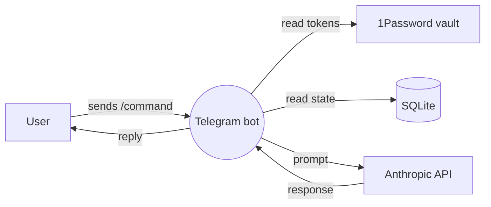

# Claude Toolkit — Skills Knowledge Bundle

This single file bundles 52 development skills (design, planning, review, quality, research).
Upload it as **Knowledge** to a ChatGPT Custom GPT, or add it to a Project's files.
Each section is one skill: when to use it, then its full instructions.
Skills tagged **[CLI-only]** assume a local terminal and won't fully apply in ChatGPT.

==============================================================
## Skill: a11y-audit
**When to use:** Accessibility audit against WCAG 2.1 AA. Two modes — pre-build planning (design intent) or post-build verification (existing component/page). Extends /style-check with depth.


# Accessibility Audit

WCAG 2.1 AA compliance check. Use at design time (intent) AND at audit time (verification). `/style-check` covers the lighter pass against your workspace UX style guide; this one goes deeper into WCAG specifics.

Sources: WCAG 2.1 (W3C), WebAIM accessibility checklist, A11y Project, Deque University guides, Inclusive Components by Heydon Pickering.

---

## Modes

| Mode | When | What it does |
|---|---|---|
| **plan** (default for new work) | Before writing components/screens | Walks WCAG criteria as design questions, produces an a11y checklist for the feature |
| **audit** | After build, before deploy | Scans code for known patterns, flags violations |

Use `/a11y-audit plan <feature>` or `/a11y-audit audit <path>`.

---

## WCAG 2.1 — the four principles (POUR)

Every check maps to one of:

| Principle | Means | Examples |
|---|---|---|
| **P**erceivable | User can perceive the info | Contrast, alt text, captions |
| **O**perable | User can interact | Keyboard nav, no time traps, sufficient touch targets |
| **U**nderstandable | User can comprehend | Predictable behavior, clear errors |
| **R**obust | Works with assistive tech | Valid HTML, ARIA correctness |

---

## Stages 1–4 — POUR checklists

> **Reference:** the full WCAG 2.1 AA checklists for Stages 1–4 (Perceivable, Operable, Understandable, Robust) are in `references/a11y-checklist-ref.md` — read it before working through any stage.

---

## Stage 5 — Audit tooling (if mode == audit)

Run automated checks alongside manual review. Automated catches ~30% of issues — humans needed for the rest.

```bash
# axe-core via CLI (Node-based)
npx @axe-core/cli https://yourapp.com

# Lighthouse a11y category
npx lighthouse https://yourapp.com --only-categories=accessibility --output=json --output-path=./lighthouse-a11y.json

# Pa11y
npx pa11y https://yourapp.com

# For local dev (no live URL):
# Install browser extension: axe DevTools, WAVE, or use Lighthouse in DevTools
```

For each tool output, group findings by severity:
- **Critical** (legal/compliance risk, blocks users with assistive tech): fix before deploy
- **Serious** (significant barrier, fix this week)
- **Moderate** (annoying, fix this sprint)
- **Minor** (nice-to-have)

---

## Stage 6 — Manual checks the tools can't do

Automated tools miss these — must be manually verified:

- [ ] **Keyboard-only walkthrough** — unplug mouse, navigate the entire feature with Tab/Enter/Space/Esc
- [ ] **Screen reader test** — VoiceOver (Cmd+F5 on Mac) or NVDA (Windows), navigate the feature
- [ ] **Zoom test** — Cmd+Plus to 200%, check no content lost
- [ ] **High contrast mode** — Mac: System Settings → Accessibility → Display → Increase Contrast
- [ ] **Touch test** — actual phone, not just narrow window
- [ ] **Slow connection** — DevTools throttle to Slow 3G, confirm loading states show

---

## Stage 7 — Report

```markdown
# A11y Audit: <feature/page>

**Date:** YYYY-MM-DD
**Standard:** WCAG 2.1 AA
**Mode:** plan | audit
**Auditor:** <you>

## Summary
- <N> critical issues
- <N> serious issues
- <N> moderate issues
- <N> minor issues

## Critical (block deploy)

### <Issue 1>
- WCAG criterion: 1.4.3 Contrast (Minimum)
- Location: button.submit in src/components/Submit.tsx
- What's wrong: button text contrast is 3.2:1 against background
- How to fix: change button background from #777 to #595959 OR text from #fff to a darker base

## Serious / Moderate / Minor
[same format]

## Manual checks passed
- [x] Keyboard walkthrough
- [x] VoiceOver navigation
- ...

## Open questions
- ...
```

Save audits to `docs/a11y/YYYY-MM-DD-<feature>.md`.

---

## Cost control

- Audit mode reads HTML/JSX/CSS — cap at 20 files per run, prioritize entry points
- Plan mode is a checklist walk, low token use
- For full-site audits, run per page/route in separate sessions

---

## Integration

- Pulls from: `/feature-design` (a11y considered at design time), `/component-design` (component-level a11y already partially covered)
- Hands off to: TASKS.md (fix items by severity), `/decision-record` (capture a11y trade-offs if any)
- Related: `/style-check` (overlaps on visual identity), `/mobile-audit` (overlaps on touch targets)

---

## Anti-patterns to flag

- **`outline: none` without replacement** — kills keyboard focus indicator
- **Placeholder-as-label** — disappears on focus, screen readers don't always announce
- **`<div onclick>` instead of `<button>`** — loses keyboard, focus, role for free
- **Color as the only signal** — red text without an icon, "click the green button" instructions
- **Tiny touch targets** — under 44×44 px on mobile
- **`aria-label` that doesn't match visible text** — confuses screen readers
- **Modals without focus trap** — keyboard users escape to background
- **Skip links missing** — keyboard users tab through every nav item on every page
- **Hover-only tooltips** — keyboard/touch users never see them
- **Auto-playing media with audio** — disorienting and accessibility-failing
- **Generic link text** ("click here") — screen reader users browse by link list

### Reference — a11y-checklist-ref

# a11y-audit reference material — WCAG 2.1 AA checklists

---

## Stage 1 — Perceivable

### 1.1 Text alternatives
- [ ] Every `` has `alt` attribute
  - Decorative: `alt=""` (NOT missing — present-but-empty)
  - Informative: describes content/function in context
  - Functional (logo in link): describe destination, not visual
- [ ] Every `<svg>` has `<title>` or `aria-label`
- [ ] Icons have accessible names (aria-label) or paired text
- [ ] No important info conveyed through image of text

### 1.2 Time-based media (skip if no video/audio)
- [ ] Video has captions
- [ ] Audio has transcript
- [ ] Auto-playing video has no audio OR plays under 3 seconds

### 1.3 Adaptable
- [ ] Semantic HTML used (h1/h2/.../nav/main/article/aside/section/header/footer)
- [ ] Heading hierarchy correct: one `<h1>` per page, no skipping levels (h1 → h3 is wrong)
- [ ] Tables use `<th scope="...">` when they're real tables
- [ ] Form fields have associated `<label>` (`for` attribute matching field `id`)
- [ ] Reading order makes sense without CSS (visual order = DOM order, generally)

### 1.4 Distinguishable
- [ ] **Text contrast ≥ 4.5:1** against background (3:1 for text ≥ 18pt or 14pt bold)
- [ ] **UI component contrast ≥ 3:1** (button borders, focus indicators, form field borders)
- [ ] Color is NEVER the only signal (error state needs icon + text, not just red)
- [ ] Text resizable to 200% without loss of content/functionality
- [ ] No fixed text inside images (allows zoom + screen reader access)
- [ ] Page works at 320px width zoomed to 400% (= 1280px content at base zoom)
- [ ] Line spacing ≥ 1.5× font size, paragraph spacing ≥ 2× font size (for text content)

---

## Stage 2 — Operable

### 2.1 Keyboard accessible
- [ ] ALL functionality available via keyboard alone (Tab, Shift+Tab, Enter, Space, arrows, Escape)
- [ ] Tab order is logical (matches visual order)
- [ ] No keyboard trap (can always Tab/Esc out of any control)
- [ ] Visible focus indicator on every focusable element (NEVER `outline: none` without replacement)
- [ ] Custom controls re-implement keyboard model of native (e.g. custom listbox = arrow keys + Enter)
- [ ] Skip link to main content for keyboard users

### 2.2 Enough time
- [ ] No session timeout < 20 hours without warning + extend option
- [ ] No auto-refresh that disorients (or has pause/stop)
- [ ] Animations under 5 seconds OR pause/stop control
- [ ] No content that flashes > 3 times/second (seizure risk)

### 2.3 Seizures and physical reactions
- [ ] No flashing > 3 times/second
- [ ] Animation can be disabled via `prefers-reduced-motion`

```css
@media (prefers-reduced-motion: reduce) {
  *, *::before, *::after {
    animation-duration: 0.01ms !important;
    transition-duration: 0.01ms !important;
  }
}
```

### 2.4 Navigable
- [ ] Page has a descriptive `<title>` (unique per page)
- [ ] Headings describe content of section
- [ ] Link text describes destination (NEVER "click here", "read more")
- [ ] Multiple ways to find pages (nav + search + sitemap, etc.)
- [ ] Current location indicated (active nav item, breadcrumb)

### 2.5 Input modalities
- [ ] **Touch targets ≥ 44×44 px** (WCAG 2.5.5 AAA, but workspace standard)
- [ ] Click target larger than visible button is OK; smaller is not
- [ ] No motion-only activation (shake-to-undo needs alternative)
- [ ] No drag-only operation (drag-and-drop needs click alternative)

---

## Stage 3 — Understandable

### 3.1 Readable
- [ ] `<html lang="en">` (or whatever language)
- [ ] Language changes in text marked with `lang` attribute
- [ ] Reading level appropriate to audience (avoid jargon; explain on first use)

### 3.2 Predictable
- [ ] Focus doesn't trigger context change (a select focus shouldn't navigate)
- [ ] Input doesn't trigger context change without warning (typing in search shouldn't auto-navigate)
- [ ] Navigation is consistent across pages
- [ ] Identical components labeled identically (don't call the same button "Save" and "Submit")

### 3.3 Input assistance
- [ ] Errors identified (which field, what's wrong)
- [ ] Error message text describes the problem AND how to fix
- [ ] Error message announced to screen readers (`aria-live="polite"` for soft, `assertive` for blocking)
- [ ] Labels visible on focus (NOT placeholder-as-label — placeholder disappears on focus)
- [ ] Help text associated via `aria-describedby`
- [ ] For legal/financial/data-modification actions: confirm step before commit
- [ ] Auto-complete attributes on common fields (`autocomplete="email"`, `autocomplete="name"`, etc.)

---

## Stage 4 — Robust

### 4.1 Compatible
- [ ] Valid HTML (no duplicate IDs, properly nested tags)
- [ ] ARIA used only when semantic HTML doesn't suffice
- [ ] ARIA roles match the implementation behavior
- [ ] Live regions used for dynamic updates (`aria-live`)
- [ ] Status messages announced (`role="status"`, `role="alert"`)

### Common ARIA anti-patterns to flag
- `role="button"` on `<a>` — use `<button>` instead
- `<div onclick>` — replace with `<button>`
- `aria-hidden="true"` on focusable elements — they'll be hidden but reachable, very confusing
- Missing `aria-label` on icon-only buttons
- `aria-label` on elements with visible text (redundant, may confuse screen readers)

==============================================================
## Skill: add-cicd
**When to use:** [CLI-only] Scaffold GitHub Actions CI/CD workflows when asked to set up CI, add GitHub Actions, automate testing, or configure deployment pipelines for this project.


Scaffold GitHub Actions CI/CD workflows for this project. Do the following steps in order:

---

**1. Detect stack**

Read `package.json`, `pyproject.toml`, `go.mod`, `Cargo.toml`, `requirements.txt` to identify:
- Language and runtime version
- Test command (`scripts.test` in package.json, etc.)
- Build command (`scripts.build` in package.json, etc.)
- Package manager: check for `pnpm-lock.yaml` → pnpm, `yarn.lock` → yarn, `bun.lockb` → bun, else npm

Also detect frontend framework:
- `vite.config.*` → Vite (static output: `dist/`)
- `next.config.*` → Next.js
- Neither → assume API / backend service

Report: "Stack: [X] | Package manager: [X] | Output: [X]"

---

**2. Detect deployment target**

Check for these config files in the project root:
- `vercel.json` → Vercel
- `netlify.toml` → Netlify
- `fly.toml` → Fly.io
- `railway.toml` or `railway.json` → Railway
- `render.yaml` → Render
- `.github/workflows/deploy*` already exists → note it

If none found, ask the user:
> "No deployment config detected. Where does this project deploy?
> A) Vercel  B) Netlify  C) Fly.io  D) Railway/Render (auto-deploy)  E) GitHub Pages  F) Skip CD for now"

Wait for the answer before continuing.

---

**3. Create .github/workflows/ directory**

```bash
mkdir -p .github/workflows
```

---

**4. Write ci.yml**

Always create this. Adapt to detected stack:

**Node.js (npm):**
```yaml
name: CI
on:
  push:
    branches: [main, dev]
  pull_request:
    branches: [main, dev]

jobs:
  test:
    runs-on: ubuntu-latest
    steps:
      - uses: actions/checkout@v4
      - uses: actions/setup-node@v4
        with:
          node-version: 20
          cache: npm
      - run: npm ci
      - run: npm test
      - run: npm run build
```

**Node.js (pnpm):**
```yaml
name: CI
on:
  push:
    branches: [main, dev]
  pull_request:
    branches: [main, dev]

jobs:
  test:
    runs-on: ubuntu-latest
    steps:
      - uses: actions/checkout@v4
      - uses: pnpm/action-setup@v3
        with:
          version: 9
      - uses: actions/setup-node@v4
        with:
          node-version: 20
          cache: pnpm
      - run: pnpm install --frozen-lockfile
      - run: pnpm test
      - run: pnpm build
```

**Python:**
```yaml
name: CI
on:
  push:
    branches: [main, dev]
  pull_request:
    branches: [main, dev]

jobs:
  test:
    runs-on: ubuntu-latest
    steps:
      - uses: actions/checkout@v4
      - uses: actions/setup-python@v5
        with:
          python-version: '3.12'
          cache: pip
      - run: pip install -r requirements.txt
      - run: python -m pytest -q
```

**Go:**
```yaml
name: CI
on:
  push:
    branches: [main, dev]
  pull_request:
    branches: [main, dev]

jobs:
  test:
    runs-on: ubuntu-latest
    steps:
      - uses: actions/checkout@v4
      - uses: actions/setup-go@v5
        with:
          go-version: stable
      - run: go test ./...
      - run: go build ./...
```

If the project has no test script, omit the test step and add a comment:
`# TODO: add npm test once tests are written`

---

**5. Write cd.yml (based on deployment target)**

**A — Vercel:**
```yaml
# Vercel auto-deploys via GitHub integration — no workflow needed.
# Connect at: https://vercel.com/new → import this repo.
# Production deploys on push to main. Preview deploys on PRs automatically.
```
Create `.github/workflows/cd-notes.md` with this note instead of a workflow file.

**B — Netlify:**
Same as Vercel — GitHub integration handles it. Create notes file.

**C — Fly.io:**
```yaml
name: Deploy
on:
  push:
    branches: [main]

jobs:
  deploy:
    runs-on: ubuntu-latest
    steps:
      - uses: actions/checkout@v4
      - uses: superfly/flyctl-actions/setup-flyctl@master
      - run: flyctl deploy --remote-only
        env:
          FLY_API_TOKEN: ${{ secrets.FLY_API_TOKEN }}
```
Note: user must add `FLY_API_TOKEN` to GitHub repo secrets.

**D — Railway / Render:**
```yaml
# Railway/Render auto-deploys via GitHub integration — no workflow needed.
# Railway: https://railway.app → new project → deploy from GitHub repo.
# Render: https://render.com → new service → connect GitHub repo.
# Both deploy on push to main automatically.
```
Create notes file.

**E — GitHub Pages (static sites):**
```yaml
name: Deploy
on:
  push:
    branches: [main]

permissions:
  contents: read
  pages: write
  id-token: write

jobs:
  build:
    runs-on: ubuntu-latest
    steps:
      - uses: actions/checkout@v4
      - uses: actions/setup-node@v4
        with:
          node-version: 20
          cache: npm
      - run: npm ci
      - run: npm run build
      - uses: actions/upload-pages-artifact@v3
        with:
          path: dist/

  deploy:
    needs: build
    runs-on: ubuntu-latest
    environment:
      name: github-pages
      url: ${{ steps.deployment.outputs.page_url }}
    steps:
      - uses: actions/deploy-pages@v4
        id: deployment
```
Note: enable GitHub Pages in repo Settings → Pages → Source: GitHub Actions.

**F — Skip CD:**
Skip this step, note it in summary.

---

**6. Write architecture.yml**

Always create this if `docs/` exists or if the project has a `scripts/gen-architecture.ts`:

```yaml
name: Architecture
on:
  push:
    branches: [main]

jobs:
  docs:
    runs-on: ubuntu-latest
    steps:
      - uses: actions/checkout@v4
      - uses: actions/setup-node@v4
        with:
          node-version: 20
          cache: npm
      - run: npm ci
      - run: npm run docs:architecture
        continue-on-error: true
      - uses: stefanzweifel/git-auto-commit-action@v5
        with:
          commit_message: "docs: regenerate architecture diagram"
          file_pattern: "docs/**"
```

If no `docs:architecture` script exists, skip this workflow and note it.

---

**7. Summary**

Print:
```
CI/CD scaffolded

Files written:
  .github/workflows/ci.yml        — runs tests + build on push/PR to main and dev
  .github/workflows/cd.yml        — <description or "notes file only">
  .github/workflows/architecture.yml — <written or skipped>

Required setup:
  - [ ] <any GitHub secrets to add>
  - [ ] <any GitHub settings to enable (Pages, etc.)>
  - [ ] <GitHub integration to connect (Vercel/Netlify/Railway)>

Next: git add .github/ && git push — CI will run on first push.
```

==============================================================
## Skill: add-tasks
**When to use:** [CLI-only] Extract and write actionable tasks from the current conversation into TASKS_CURRENT.md — use when wrapping up a session, after a planning discussion, or when asked to capture next steps or to-dos.


Review the current conversation and extract actionable tasks into two categories: system/build tasks (things to code or configure) and user tasks (things the user needs to do or decide). Then write them to a TASKS_CURRENT.md file in the project root.

Do the following steps in order:

**1. Read context**
- Read the project's TASKS.md if it exists to understand the original task list
- Read memory files from the project memory directory if available
- Scan the recent conversation for decisions made, features discussed, issues raised, and things mentioned as "next steps"

**2. Extract tasks**

Identify two types:

**System/build tasks** — things that need to be coded, configured, or built. Examples:
- New pages or features to build
- Bugs or UX issues noted during conversation
- Data enrichment work
- Infrastructure or deployment tasks

**User tasks** — things the user needs to do, decide, or provide. Examples:
- Testing something and reporting back
- Providing research data or documents
- Making a product/design decision
- Accessing external systems (Railway, API keys, etc.)

**3. Write TASKS_CURRENT.md**

Write to `TASKS_CURRENT.md` in the project working directory with this format:

```markdown
# Current Tasks
_Last updated: <today's date>_

## System / Build Tasks

- [ ] <task> — <brief reason or context>
- [ ] <task> — <brief reason or context>

## User Tasks

- [ ] <task> — <brief reason or context>
- [ ] <task> — <brief reason or context>
```

Rules:
- Be specific — "Build Gaps & Opportunities page showing 51 gaps ranked by severity" not "improve gaps"
- Include the reason/context so future-Claude understands why
- Mark already-completed items with [x] if clearly done
- Keep it to genuinely actionable tasks — not observations or notes
- If TASKS_CURRENT.md already exists, update it (preserve completed items, add new ones, remove stale ones)

**4. Confirm**
Tell the user what was written and give a brief summary of the task counts.

==============================================================
## Skill: agents
**When to use:** [CLI-only] List all available Claude Code agent types and when to use each — invoke when asked about agents, subagents, which agent to use, or how to parallelise tasks.


List all available Claude Code agent types and explain when to use each one. Do the following steps in order:

**1. Print the built-in agent catalogue**

These are the agent types available via the `Agent` tool (subagent_type parameter):

---
**Built-in Claude Code Agents:**

| Agent type | Best for | When NOT to use |
|---|---|---|
| `general-purpose` | Multi-step research, open-ended tasks, writing code across multiple files | Simple single-file reads or edits |
| `Explore` | Fast codebase exploration — finding files by pattern, searching keywords, answering "how does X work?" questions | Writing or editing files |
| `Plan` | Designing implementation strategies before coding — returns step-by-step plans, identifies files, trade-offs | Executing code (it can't write files) |
| `claude-code-guide` | Questions about Claude Code CLI, Claude API, Anthropic SDK, MCP servers, hooks, settings | General coding questions |
| `statusline-setup` | Configuring the Claude Code status line | Anything else |

---

**2. List project-specific custom skills**

Run the `/skills` command (or list files in `~/.claude/commands/`) to show all slash-command skills available for this project.

**3. Explain when to use agents vs direct tools**

Use an **agent** when:
- The task requires more than 3-4 tool calls (searching + reading + editing multiple files)
- Work can be done independently of current context (e.g. auditing a content pack while you write tests)
- You want to parallelise: send two agents in parallel for two independent sub-tasks
- The task is exploratory and may require multiple rounds of grep/glob

Use **direct tools** (Read, Grep, Glob, Edit) when:
- You know exactly which file to read or edit
- The task is a single focused operation
- You need the result immediately to inform the next step

**4. Parallelisation patterns**

Common patterns where multiple agents should be launched simultaneously:

```
# Content + tests in parallel
Agent(Explore): "audit content packs for duplicates"
Agent(general-purpose): "write tests for round engine"

# Research + plan in parallel
Agent(Explore): "find all socket event names"
Agent(Plan): "design the new game scaffold"

# Multiple audits in parallel
Agent(socket-audit skill): game A handlers
Agent(content-audit skill): game A content pack
```

**5. Print a quick-reference card**

---
**Quick Reference — Which agent for which task?**

| Task | Use |
|---|---|
| "Where is X defined?" | Explore (quick) |
| "How does feature Y work across multiple files?" | Explore (thorough) |
| "Write tests for module Z" | general-purpose |
| "Plan how to refactor the auth system" | Plan |
| "How do I configure MCP servers?" | claude-code-guide |
| "Audit all content packs" | /content-audit skill |
| "Audit socket handlers" | /socket-audit skill |
| "Review code architecture and suggest splits" | /arch-review skill |
| "Run type-check and lint at the same time" | Two Bash tool calls in parallel |
| "Write game A tests AND game B tests" | Two general-purpose agents in parallel |

---

Keep it concise. This is a reference card, not a tutorial.

==============================================================
## Skill: api-design
**When to use:** Design an API surface (REST/GraphQL/RPC/bot commands) before writing code. Covers resources, verbs, errors, pagination, versioning, contract-first vs code-first.


# API Design

Design the *shape* of an API surface before writing handler code. The goal is to lock the contract (endpoints, payloads, errors) so backend + frontend + future-you all share the same mental model.

Applies to:
- HTTP REST APIs (Express, FastAPI)
- GraphQL schemas
- gRPC / Protobuf interfaces
- **Telegram bot command surfaces** (your most common case)
- Internal Python/TS module APIs (public function signatures)

Sources: Heroku API Design Guide, Phil Sturgeon's *API Design Patterns*, Stripe API style, Google AIPs (API Improvement Proposals).

---

## When to use

| Situation | Use? |
|---|---|
| Adding 3+ new endpoints | YES |
| Adding a new bot command surface (multiple commands) | YES |
| Designing inter-service contracts | YES |
| Versioning an existing public API | YES |
| Adding one endpoint to an existing well-designed API | NO — follow existing conventions |
| Internal helper function | NO — `/refactor` covers naming |

---

## Stage 1 — Frame the API

Ask (or extract from `$ARGUMENTS`):

1. **What's the consumer?** (Web frontend, mobile app, another service, Telegram user, AI agent)
2. **What's the trust boundary?** (Public internet, authenticated user, trusted internal, machine-to-machine)
3. **What are the resources/operations?** (List the nouns + verbs in one sentence each)
4. **What state changes vs reads?** (Read-only operations cluster separately from writes)
5. **What's the cardinality?** (Operations per minute? Per day? Bursty?)
6. **Versioning expectation?** (Breaking change tolerance: zero / low / high)

---

## Stage 2 — Choose the shape

### REST (best for resource-oriented domains)

- Resources are nouns. Operations are HTTP verbs.
- `GET /users/{id}` — read
- `POST /users` — create
- `PATCH /users/{id}` — partial update
- `DELETE /users/{id}` — delete
- `GET /users/{id}/orders` — nested resource
- Avoid verbs in paths (`/getUsers` is wrong; `/users` + GET is right)
- For non-resource ops, use a `/actions` collection or `:verb` suffix: `POST /users/{id}:archive`

### GraphQL (best for read-heavy, varied query needs)

- Schema-first: define types, queries, mutations in `.graphql`
- One endpoint, many operations
- Best when frontend needs flexible joins / projections

### RPC / gRPC (best for service-to-service)

- Methods, not resources
- Strong typing via Protobuf
- Best when both sides are controlled by you

### Telegram Bot Commands (best for chat-driven UX)

- Commands are verbs prefixed with `/` (e.g. `/menu`, `/status <project>`)
- Inline buttons use callback_data prefixed with a namespace (e.g. `orch:menu`)
- Limit top-level commands to ~10 (any more, use sub-menus via inline keyboards)
- Common pattern from your workspace: `/menu` shows hamburger keyboard, `/help` lists commands

### Choosing — quick rubric

| Need | Pick |
|---|---|
| Public web API with browser/curl access | REST |
| Frontend needs flexible projections | GraphQL |
| Internal microservices with shared schema | gRPC |
| User-driven chat interaction | Telegram bot commands |
| AI agent tool calling | Function definitions (OpenAPI-shaped) |

---

## Stage 3 — Lock the conventions

Before any endpoint, decide and document:

### Authentication
- Bearer token in `Authorization` header? Cookie? API key in header?
- Where do scopes live? Tied to user or to token?

### Error envelope (CRITICAL — biggest source of drift)

Pick ONE shape and use it everywhere.

> **Reference:** Error envelope JSON example, status codes table, and pagination patterns are in `references/api-design-ref.md`.

### Filtering, sorting
- `?filter[status]=active&sort=-created_at`
- Document allowed filter/sort fields explicitly
- Default sort = stable (e.g. `-created_at`)

### Timestamps
- ISO 8601 with timezone (`2026-05-20T14:30:00+08:00`)
- Or Unix epoch seconds (`1748774400`). Pick ONE.
- Resources almost always need `created_at` and `updated_at`

### Versioning
- URL versioning: `/v1/users` (simplest, recommended)
- Header versioning: `Accept: application/vnd.app.v1+json` (cleaner but more friction)
- No versioning: only if you control all consumers AND will never break compatibility
- Document deprecation policy (e.g. "v1 supported until 2027-01-01")

---

## Stage 4 — Sketch the surface

Produce a markdown table per resource/command.

> **Reference:** Resource example tables (REST + Telegram bot) and payload examples are in `references/api-design-ref.md`.

---

## Stage 5 — Write it down

Save the design to `docs/api/<service>.md` (create dir if needed). This becomes the contract — implementation must match. Future changes get a new ADR (`/decision-record`) and a versioned update.

For Telegram bots, save to `docs/bot-commands.md` per project.

---

## Stage 6 — Validate before code

Run through these checks BEFORE writing handlers:

- [ ] **Symmetry:** all collections have both list (GET) and create (POST)?
- [ ] **Idempotency:** PUT/DELETE are safe to repeat? POST has idempotency-key support if needed?
- [ ] **Error shape:** every response has a consistent error envelope?
- [ ] **Auth:** every endpoint states its auth requirement explicitly?
- [ ] **Pagination:** every list endpoint has a cursor or explicit "no pagination needed (max N items)" note?
- [ ] **Naming:** snake_case OR camelCase consistently across all payloads (pick one)?
- [ ] **Versioning:** URL/header strategy applied uniformly?
- [ ] **Discoverability:** is there a `/health`, `/v1/`, or schema introspection endpoint?

If any check fails, fix the design BEFORE writing code. Cheaper than retroactive consistency.

---

## Cost control

- Reads existing project docs to learn conventions — cap at 5 files
- Output is markdown design doc, not implementation
- For very large APIs (20+ endpoints), split into multiple `/api-design` runs by resource cluster

---

## Integration

- Pulls from: `/feature-design` (when planning surfaces a new API contract)
- Hands off to: `/schema-design` (if backed by a database), `/tdd` (implementation), `/threat-model` (security review of the surface)
- Outputs feed: `/decision-record` (capture API choice as ADR), implementation tasks

---

## Anti-patterns to flag

- **Verbs in paths:** `/getUser`, `/createOrder` — use noun + HTTP verb instead
- **Inconsistent error shapes:** half endpoints return `{error: "..."}`, others return `{message: "..."}` — pick one
- **200 OK with `{success: false}`:** use proper status codes
- **Anonymous arrays at top level:** `[{...}]` — wrap in `{items: [...], next_cursor: ...}` for forward compat
- **No request_id:** debugging is misery without it
- **Versioning by feature flag instead of URL/header:** invisible to consumers, breaks contract

### Reference — api-design-ref

# api-design-ref.md — Reference material for /api-design

---

## Stage 3 — Error envelope JSON example

```json
{
  "error": {
    "code": "validation_failed",
    "message": "email is required",
    "details": [{"field": "email", "issue": "missing"}],
    "request_id": "req_abc123"
  }
}
```

- `code` is machine-parseable (snake_case enum, stable contract)
- `message` is human-readable, can change
- `details` is optional, structured
- `request_id` is required for support/debugging

Document the full enum of `code` values. Treat as a versioned contract.

---

## Stage 3 — Status codes table

| Code | Meaning |
|---|---|
| `200` | OK with body |
| `201` | Created (return resource in body) |
| `204` | No Content (success, no body — DELETE) |
| `400` | Bad Request (validation, malformed) |
| `401` | Unauthorized (no/bad credentials) |
| `403` | Forbidden (auth ok, not allowed) |
| `404` | Not Found |
| `409` | Conflict (state collision, idempotency mismatch) |
| `422` | Unprocessable Entity (semantic validation) |
| `429` | Rate Limited |
| `500` | Server Error (your bug) |
| `503` | Service Unavailable (upstream down) |

---

## Stage 3 — Pagination patterns

- **Cursor-based** (recommended): `?cursor=xxx&limit=20` returns `{items, next_cursor}`. Stable under writes.
- **Offset/limit**: `?offset=40&limit=20`. Simple but breaks if data shifts.
- **Page-number**: `?page=3`. Almost always cursor-or-offset in disguise.

---

## Stage 4 — Resource example tables and payload examples

```markdown
## Resource: User

| Method | Path | Purpose | Auth | Status |
|---|---|---|---|---|
| POST | /v1/users | Create user | none (public signup) | 201 / 400 / 409 |
| GET | /v1/users/{id} | Get one user | owner or admin | 200 / 401 / 403 / 404 |
| PATCH | /v1/users/{id} | Update fields | owner | 200 / 400 / 401 / 404 |
| DELETE | /v1/users/{id} | Soft-delete user | owner | 204 / 401 / 404 |
| GET | /v1/users/{id}/orders | List user's orders | owner or admin | 200 (cursor) / 401 |

### Payloads

POST /v1/users (request):
{
  "email": string (required, RFC 5322),
  "name": string (required, 1-100 chars)
}

POST /v1/users (response 201):
{
  "id": "usr_abc123",
  "email": "...",
  "name": "...",
  "created_at": "2026-05-20T14:30:00+08:00"
}
```

For Telegram bot commands, use a similar table:
```markdown
| Command | Args | Purpose | Output |
|---|---|---|---|
| /menu | — | Main menu | Message + inline keyboard |
| /status <project> | required | Project deep-dive | Message |
```

==============================================================
## Skill: arch-review
**When to use:** Review codebase architecture for modularisation opportunities and Claude context efficiency — use when the project feels bloated, files are getting large, or before a major refactor.


Review the codebase architecture to identify modularisation opportunities and reduce context wastage when working with Claude. Do the following steps in order:

**Note:** This skill checks macro-level structure (modules, boundaries, file organization). For micro-level performance optimization (algorithms, data structures, hot paths), run `/optimize` after this.

**0. Detect stack first**

Run `/stack-detect` (or manually detect) to identify the project's tech stack. This determines:
- Which file extensions to scan (`.js`/`.jsx` for Node, `.py` for Python, `.ts`/`.tsx` for TypeScript, etc.)
- Which tools are applicable (eslint vs ruff, vitest vs pytest, tsc vs mypy)
- Which pre-commit hooks make sense (don't add tsc for JSX projects)

Use the detected stack for all subsequent steps.

**1. Find large files**

List all source files (excluding node_modules, dist, .git, migrations, generated files) and their line counts. Flag any file over 300 lines as a modularisation candidate.

Auto-detect the right find command based on stack:
- **Node.js/JSX**: `find . -name "*.js" -o -name "*.jsx" | grep -v "node_modules\|dist\|\.git" | xargs wc -l | sort -rn | head -20`
- **TypeScript**: `find . -name "*.ts" -o -name "*.tsx" | grep -v "node_modules\|dist\|\.git" | xargs wc -l | sort -rn | head -20`
- **Python**: `find . -name "*.py" | grep -v "__pycache__\|\.git\|venv\|\.venv" | xargs wc -l | sort -rn | head -20`
- **Go**: `find . -name "*.go" | grep -v vendor | xargs wc -l | sort -rn | head -20`

**2. Identify agent opportunities**

For each large file, identify which functions/sections are logically independent and could be delegated to a Claude subagent without needing the full file context. Flag these patterns:
- Functions that only read (no writes) — good for Explore agents
- Functions that write to a single output file — good for isolated write agents
- Test suites that are independent of each other — can run in parallel agents
- Data files or content packs — can be audited without full codebase context
- Pure data (no logic) vs data + functions — pure data files rarely need splitting

**3. Map coupling hotspots**

Find files that are imported by many others (high fan-in). These are hardest to refactor but most important to understand.

Auto-detect the right grep based on stack:
- **JS/JSX/TS/TSX**: `grep -rh "from ['\"]" --include="*.js" --include="*.jsx" . | grep -v node_modules | sed "s/.*from ['\"]//;s/['\"].*//" | grep "^\." | sort | uniq -c | sort -rn | head -15`
- **Python**: `grep -rh "from \|import " --include="*.py" . | grep -v __pycache__ | sort | uniq -c | sort -rn | head -15`

**4. Suggest splits**

For each file over 300 lines, suggest a concrete split:
- What logical groupings exist?
- What would each new file's responsibility be (one-sentence description)?
- Which Claude agent type is best suited to work on each part independently?
- For pure data files: is splitting worth it? (Often no — cross-validation tests are more valuable than splitting data)

Generic agent mapping (adapt to project):

| File type | Best agent | Why |
|---|---|---|
| Pure data files (JSON, constants) | content-audit or Explore | Self-contained, read-only |
| UI components (React, Vue) | react-auditor or general-purpose | Isolated per component |
| API routes / handlers | general-purpose | Needs context of data layer |
| Test files | general-purpose (parallel) | Independent per test suite |
| Configuration / scripts | general-purpose | Usually small, rarely split |
| Large view components | general-purpose | Split into sub-components |

**5. Identify what can be parallelised**

List tasks that could be sent to multiple Claude agents simultaneously (no data dependencies between them).

**6. Check pre-commit / CI alignment**

Verify that pre-commit hooks and CI config match the detected stack:
- JSX project should NOT have `tsc --noEmit` hook
- Python project should NOT have eslint
- If `.pre-commit-config.yaml` exists, flag mismatches with detected stack

**7. Print a summary**

Format:
---
**Stack detected:** [e.g., Vite + React (JSX), no TypeScript]

**Files over 300 lines (modularisation candidates):**
- `file.js` (N lines) — suggested split: [description]

**Highest coupling (imported by most files):**
- `file.js` — imported by N files

**Agent parallelisation opportunities:**
- [Task A] + [Task B] can run simultaneously using two agents

**Pre-commit / CI mismatches:**
- [any hooks that don't match the stack]

**Top 3 recommended refactors (highest impact on Claude context efficiency):**
1. [specific refactor with new file names]
2. ...
3. ...
---

**8. Regenerate architecture docs**

If `docs/architecture.md` exists, update the Mermaid diagrams and key files table to reflect any new files found.

If `scripts/gen-architecture.ts` or equivalent exists, flag it for the user to run rather than running automatically.

Note: architecture docs use **Mermaid** (not draw.io). Diagrams render natively in GitHub.

**IMPORTANT: Always branch before executing refactors.** Use `git checkout -b refactor/<name>` before making changes. Verify the split files are valid before replacing the original.

Keep it actionable. Focus on what reduces the number of lines Claude must read to complete a typical task.

==============================================================
## Skill: build-mode
**When to use:** [CLI-only] Toggle pre-approved build permissions on/off for this project — run after /pre-approve to activate narrow permissions, or to clear them at end of session. Use /build-mode on|off|status.


Toggle build-mode permissions for the current project. Sets narrow, pre-approved permissions in `.claude/settings.local.json` (gitignored, per-machine only).

**Usage:**
- `/build-mode on` — reads the PERMISSION RULES from the most recent `/pre-approve` output in the conversation, writes them to `.claude/settings.local.json` as `permissions.allow` entries
- `/build-mode off` — clears all `permissions.allow` entries from `.claude/settings.local.json`, restoring default prompt-for-everything behaviour

Do the following steps in order:

**If argument is "on":**

1. Scan the current conversation for the most recent `PERMISSION RULES` code block (generated by `/pre-approve`).
2. If no permission rules found, stop and say: "No permission rules found. Run `/pre-approve` first to generate the rules."
3. Read `.claude/settings.local.json` if it exists (may not exist yet).
4. Parse the permission rules into an array of strings.
5. Write `.claude/settings.local.json` with the permission rules as `permissions.allow`:

```json
{
  "permissions": {
    "allow": [
      "Edit(/src/data/tool-registry.js)",
      "Write(/src/data/tool-registry.js)",
      "Bash(npm test*)"
    ]
  }
}
```

6. Preserve any existing settings in the file (merge, don't overwrite).
7. Print: "Build mode ON — [N] permission rules active. These apply only to this machine (settings.local.json is gitignored). Run `/build-mode off` when done."

**If argument is "off":**

1. Read `.claude/settings.local.json`.
2. Remove the `permissions.allow` array (set to empty array `[]`).
3. Preserve any other settings in the file.
4. Write the file back.
5. Print: "Build mode OFF — all build permissions cleared. Tool calls will prompt for approval again."

**If no argument or argument is "status":**

1. Read `.claude/settings.local.json`.
2. If `permissions.allow` has entries, list them and say: "Build mode is ON with [N] rules."
3. If empty or missing, say: "Build mode is OFF."

**Safety notes:**
- NEVER write to `.claude/settings.json` (shared, committed to git) — ONLY use `.claude/settings.local.json`
- NEVER add blanket allows like `Edit`, `Write`, or `Bash` without path/command restrictions
- Always show the user exactly what permissions are being set before writing
- The `off` command should be run after merging to main or at end of session

==============================================================
## Skill: code-quality
**When to use:** [CLI-only] Run a combined dead-code, complexity, and lint check — use before a PR, when code feels messy, or when asked to audit code quality, find unused code, or check complexity.


Run a combined code quality check: dead code detection, complexity analysis, and linting. Produces a unified report.

This skill runs `/dead-code`, `/complexity`, and `/lint` in sequence. For individual checks, use those skills directly.

---

## Step 1 — Dead Code Detection

Find unused code in the current project:

**1a. Run vulture (Python projects only)**

Check if this is a Python project (requirements.txt or .py files exist).
If yes, check: `vulture --version`. If not installed, run `pip3 install vulture`.

Run:
```bash
vulture . --min-confidence 80 --exclude "tests,node_modules,.venv,__pycache__" 2>&1
```

Parse vulture output — it reports unused imports, functions/methods, variables, classes, and unreachable code. Group by type and sort by confidence (highest first).

Note: vulture may flag false positives for framework entry points (decorators, callbacks). These are handled below.

**1b. Unused imports**
Grep for import statements and check if the imported name appears anywhere else in the file:
- Python: look for `import X` or `from X import Y` where `Y` never appears in the file body (cross-reference with vulture output if available)
- JS/TS: look for `import { X }` where `X` is unused

**1c. Unused functions and variables**
- Find all function/method definitions
- Check if each is called anywhere in the codebase (not just the same file)
- Flag any that have zero references outside their definition
- Skip: `__init__`, `main`, test functions, anything decorated with `@app.route`, `@handler`, `@callback` etc. (framework entry points)

**1d. Unused files**
- Find all `.py` / `.js` / `.ts` files
- Check if each is imported or referenced anywhere
- Flag files with no inbound references (excluding entry points like `main.py`, `index.js`)

**1e. Commented-out code**
Grep for large blocks of commented-out code (3+ consecutive comment lines that look like code, not documentation).

**1f. `.bak` and temp files**
Check for any `.bak`, `.tmp`, `.old` files in the project root or src directories.

---

## Step 2 — Complexity Analysis

**Complexity:** run `/complexity` and include its report here.

---

## Step 3 — Clean Code checks (Martin)

Beyond linting, check the *human-readable* qualities that ruff/eslint don't catch.

**3.0a. Function size (Clean Code Ch. 3)**

Find functions that exceed Clean Code's "small" guideline:
- Python: > 30 lines (excluding docstring + blank lines)
- JS/TS: > 50 lines

```bash
# Python: list functions and their line counts
grep -nE "^(def |async def |    def |    async def )" *.py src/**/*.py 2>/dev/null
```

For each oversized function, suggest: "Extract Function" (see `/refactor`).

**3.0b. Naming check**

Flag bad names — these often signal design problems:

| Anti-pattern | Example | Fix |
|---|---|---|
| Single-letter (outside loops) | `def f(d, t):` | Use intent-revealing name |
| Type encoded in name | `user_dict`, `total_int` | Drop the type suffix |
| Generic words | `data`, `info`, `manager`, `handler`, `processor` | Replace with what it actually does |
| Misleading abbreviations | `usr`, `acct`, `cfg` (when `user`, `account`, `config` are 1-2 chars longer) | Spell it out |
| Boolean without `is_/has_/can_` prefix | `def admin(self):` | Rename to `is_admin` |
| Negated booleans | `not_ready`, `disabled` | Prefer positive form (`ready`, `enabled`) |

```bash
# Quick scan: variables/params that are 1-2 chars (excluding loop vars i, j, k, x, y)
grep -nE "(def |fn |function )[a-z_]+\([a-z]{1,2},|^\s+[a-z]{1,2}\s*=" src/**/*.py 2>/dev/null | head -20
```

**3.0c. Comment audit (Clean Code Ch. 4)**

Scan for *bad* comments (signal unclear code, not helpful documentation):

- Comments that explain *what* the next line does (instead of *why*)
- Commented-out code
- Misleading or stale comments (mentions code that no longer exists)
- TODO/FIXME with no date or owner

Don't flag good comments: docstrings, license headers, `# noqa`/`# type: ignore` with reason, `# Why:` blocks explaining business reason.

**3.0d. Magic numbers**

```bash
grep -nE "(\=|\>|\<|\* |/ |\+ )\s*[0-9]{2,}" src/**/*.py 2>/dev/null | grep -vE "(test_|conftest|__init__)" | head -10
```

Flag numeric literals > 1 (excluding 0, 1, -1, 100, common HTTP codes). Suggest: extract to a named constant.

---

## Step 4 — Lint

**4a. Check ruff is available (Python)**
Run `ruff --version`. If not installed, run `pip install ruff` first.

**4b. Run linting**
```
ruff check . --statistics
```
If a `src/` or specific package directory exists, target that instead of `.`.

**4c. Run format check (no changes, dry-run)**
```
ruff format --check .
```

**4d. Interpret results**
Group findings by rule category:
- `E`/`W` — PEP 8 style errors/warnings
- `F` — pyflakes (unused imports, undefined names)
- `I` — import order
- `S` — security (if ruff-bandit rules enabled)
- `UP` — pyupgrade (outdated Python syntax)
- `B` — flake8-bugbear (likely bugs and design issues)

---

## Unified Report

```
## Code Quality Report

### Dead Code
- Files safe to delete: N
- Functions safe to remove: N
- Unused imports: N
- Commented-out code blocks: N
- .bak/.tmp/.old files: N

### Complexity
Stack: <Python|Node.js>
Average complexity: <score> (Grade <X>)

| Function | File:Line | Score | Grade | Action |
|---|---|---|---|---|
| ... | ... | ... | C | Simplify |

Top 3 refactoring priorities:
1. <function> in <file> — complexity <N>, suggest: <specific action>
2. ...
3. ...

### Clean Code (Martin)
- Functions over 30 lines (Python) / 50 lines (JS): N
- Suspicious names (single-letter, generic, type-encoded): N
- Bad comments (what-comments, commented-out code, stale TODOs): N
- Magic numbers: N

Top 3 Clean Code issues:
1. <function or var> at <file:line> — <issue>, suggest: <Extract Function | Rename | Replace with constant>

### Lint
- Total issues by category: ...
- Files with most issues: ...
- Must-fix: any F821 (undefined name) or F401 (unused import)
- Auto-fixable format issues: N (run `ruff format .`)

### Overall Verdict
- Dead code: PASS / WARN / FAIL
- Complexity: PASS / WARN / FAIL
- Clean Code: PASS / WARN / FAIL
- Lint: PASS / WARN / FAIL
- Combined: PASS / WARN / FAIL

### Suggested next skill
- High Clean Code findings → run `/refactor` for named transformations
- Untested complex code → run `/seams` then `/refactor`
- Adding new behavior → run `/tdd`
```

Note: flag issues, don't auto-fix. Let the user decide what to change.

**Pre-commit integration:** For Python projects, radon can be added as a pre-commit hook to block commits introducing high-complexity code. See `.pre-commit-config.yaml`.

==============================================================
## Skill: commit-status
**When to use:** [CLI-only] Show today's pre-commit skill check results and commit readiness — use when about to commit, or to check whether /pre-commit skills have passed for the current branch.


Show the current commit log state for this project. Do the following steps in order:

**1. Check for commit log**

Run:
```bash
python3 ~/.claude/hooks/commit-log.py --cwd . --cmd show
```

If the output is "No commit log for today." or "Commit log is from a previous day", print that message and stop.

---

**2. Print the output**

Print the result exactly as returned. It shows all commit blocks for today with:
- Status (in-progress / committed)
- Branch
- Each skill state (○ not-run / ⟳ running / ✓ passed / ✗ failed / ? pending-user)
- Test state
- Notes (if any)

---

**3. Interpret the state**

After the raw output, add a one-line verdict:

- All skills passed, tests passed, status committed → `All clear — ready to commit.`
- Any skill not-run → `Run /pre-commit to check skills before committing.`
- Any skill failed → `Fix reported issues, re-run failed skills, then retry commit.`
- Any skill pending-user → `Resolve pending-user items, update commit-log.md to passed, then retry.`
- Status in-progress → `Commit in progress — skills not yet all resolved.`

==============================================================
## Skill: compact-context
**When to use:** Use when context is getting full, before /clear, or to save a handoff summary. Triggers on "compact context", "save handoff", "context full", "summarise session".


Manage the Claude Code context window by summarising what matters and preparing a clean handoff. Do the following steps in order:

**1. Estimate context usage**
Estimate how full the context window is based on conversation length and any large files read this session. Use this to decide the action:

| Usage estimate | Recommended action |
|---|---|
| < 50% | Note it, no action needed unless user asked |
| 50–70% | Run `/compact` in-place to compress, then continue |
| 70–85% | Run `/compact`, save handoff notes, advise user to `/clear` soon |
| > 85% | Save handoff notes immediately, tell user to `/clear` now |

Default trigger threshold: **70%**. If the current task involves large files, deep context, or multi-step work in progress, treat the threshold as 60% instead.

**2. Summarise current work**
Write a concise summary of:
- What was being worked on in this session (task, file, goal)
- What was completed
- What is still in progress or blocked
- Any decisions made that aren't yet reflected in code or docs

**3. Check memory**
Check if any of the following should be saved to memory before context is cleared:
- New project decisions or context not already in CLAUDE.md or docs/
- User preferences or feedback that changed how you worked
- Any reference pointers (external systems, URLs, IDs) that will be needed again

Save any new memories to the project memory folder following the memory format (frontmatter with name, description, type), then update MEMORY.md index.

**4. Surface a handoff prompt**
Print a ready-to-paste prompt the user can use to start the next session cleanly. It should include:
- Current branch and last commit
- What was in progress
- What to do next (the immediate next step)
- Any blockers or decisions needed

Format it as a code block so it's easy to copy.

**5. Final advice**
Tell the user clearly:
- Estimated context usage %
- Whether to `/compact` in-place, `/clear` now, or continue
- If clearing: confirm memories and handoff prompt are saved first

==============================================================
## Skill: complexity
**When to use:** [CLI-only] Analyse cyclomatic and cognitive complexity, flag functions that need simplification. Use when code feels hard to follow, before refactoring, or standalone (not via /code-quality).


For a combined check (dead code + complexity + lint), use `/code-quality`.

Analyse code complexity and flag functions that need simplification. Do the following steps in order:

**1. Detect stack**

- `requirements.txt` or `pyproject.toml` → Python
- `package.json` → Node.js / TypeScript
- Report: "Detected stack: [X]"

---

## Python complexity analysis

**2a. Check radon is available**

Run `radon --version`. If not installed, run `pip install radon` first.

**3a. Cyclomatic Complexity**

```bash
radon cc . -a -s -n C --exclude "tests,node_modules,.venv,__pycache__"
```

Flags: `-a` = average, `-s` = show score, `-n C` = only show grade C or worse (complexity >= 11).

Grading scale:
- **A** (1-5): simple, low risk
- **B** (6-10): moderate, acceptable
- **C** (11-15): complex, should simplify
- **D** (16-20): very complex, must refactor
- **E** (21-30): extremely complex, high bug risk
- **F** (31+): unmaintainable

**4a. Maintainability Index**

```bash
radon mi . -s --exclude "tests,node_modules,.venv,__pycache__"
```

Flag any file with MI below 20 (grade C or worse).

**5a. Halstead metrics (optional)**

```bash
radon hal . --exclude "tests,node_modules,.venv,__pycache__" 2>&1 | head -40
```

Note files with high difficulty scores (>30).

---

## Node.js / TypeScript complexity analysis

**2b. Check eslint is available**

Run `npx eslint --version` or `pnpm exec eslint --version`.

**3b. Complexity via eslint**

Run eslint with the complexity rule **layered on top of the project's own
config** (so the TS parser is already wired — raw espree can't parse TS types):
```bash
# Adjust the path(s) to your source dir(s): src/ — or client/src/ server/ for a monorepo
npx eslint --rule '{"complexity": ["warn", 10]}' src/ 2>&1
```

This flags any function with cyclomatic complexity > 10. This is the eslint
equivalent of `radon cc` (cyclomatic only).

> **eslint 9+/flat-config note:** do NOT use `--no-eslintrc` or `--ext` — both
> were removed in flat config and the command will error
> (`Invalid option '--eslintrc'`). Layering `--rule` onto the project config (as
> above) is the correct approach and reuses the project's TS parser. `--plugin`
> still works (used in 4b).

**4b. Cognitive Complexity (the practical MI-equivalent for TS)**

`radon mi` (Maintainability Index) has no clean TypeScript port — the JS tools
that compute MI (escomplex et al.) parse JavaScript, not TS *types*. The modern,
TS-native equivalent is **cognitive complexity** (SonarSource's metric: counts how
hard code is to *follow* — nesting, breaks in flow — not just paths). It is
usually more actionable than MI/Halstead.

```bash
# Layers onto the project config (reuses its TS parser); adjust src/ as needed
npx eslint \
  --plugin sonarjs \
  --rule '{"sonarjs/cognitive-complexity": ["warn", 15]}' \
  src/ 2>&1
```

If the plugin isn't installed it will error — install once with
`pnpm add -D eslint-plugin-sonarjs` (or `npm i -D`), then re-run.

Thresholds (SonarSource defaults):

- **≤ 15** — acceptable
- **16–25** — review, consider simplifying
- **> 25** — refactor; the function is hard to reason about

**5b. Maintainability Index + Halstead (optional — true radon `mi`/`hal` parity)**

Only worth running if you specifically need MI/Halstead numbers for a TS/JS project.
See `references/complexity-ref.md` for the full escomplex + sucrase script.

**6b. File size check**

Find all source files over 300 lines:
```bash
find src/ -name "*.ts" -o -name "*.tsx" -o -name "*.js" -o -name "*.jsx" | xargs wc -l | sort -rn | head -20
```

Flag files over 300 lines as candidates for splitting.

**7b. Function length check**

Search for functions longer than 50 lines. These are candidates for extraction.

---

## Module depth analysis (Ousterhout — *A Philosophy of Software Design*)

Beyond cyclomatic complexity, check the *cognitive load* per module. Ousterhout's principle: **modules should be deep** — small, simple interfaces hiding substantial implementation.

A "shallow module" is the opposite: a module whose interface is nearly as complex as its implementation. Shallow modules force callers to know internal details.

**6a. Interface vs implementation ratio**

For each module (file), measure:
- **Interface size** — public functions + public class methods + their parameter counts
- **Implementation size** — total lines of code (excluding blanks/comments)
- **Depth ratio** = implementation_lines / interface_complexity

```bash
# Python: count public defs and their params per file
grep -nE "^(def |class )[a-z]" src/**/*.py | head -30
```

Flag modules where:
- Many public functions (> 8) for a small file (< 200 lines) — suggests **shallow module**, interface bloat
- Few public functions (≤ 3) but very large file (> 500 lines) — suggests **deep module** (good!)

**6b. Pass-through code**

Look for functions that just delegate to another function with the same parameters. This is a hallmark of shallow modules — the indirection adds no value.

```bash
# Find one-line functions that just call another
grep -A1 "^def " src/**/*.py | grep -B1 "return.*(.*)" | head -10
```

If `def foo(x, y): return bar(x, y)` exists with no transformation, flag it.

**6c. Information leakage**

A module leaks information when its interface forces callers to know internal data structure / file format / encoding. Heuristic: search for functions that return raw dicts/tuples instead of named objects.

```bash
grep -nE "def [a-z_]+\([^)]*\) -> (dict|tuple|list)" src/**/*.py | head -10
```

Suggest: replace dict returns with dataclass / named tuple where the structure has meaning.

**6d. Over-eager configuration**

Functions with many optional parameters often signal a missing abstraction. If a function has 5+ keyword args with defaults, the caller has to know all of them to use it well.

Suggest: introduce Parameter Object (per `/refactor`) or split into multiple intent-revealing functions.

---

## Summary (both stacks)

```
## Complexity Analysis

Stack: <Python|Node.js>

### Cyclomatic Complexity
| Function | File:Line | Score | Grade | Action |
|---|---|---|---|---|
| ... | ... | ... | C | Simplify |
| ... | ... | ... | D | Must refactor |

### Cognitive Complexity (TS only — how hard to follow)
| Function | File:Line | Cognitive | Action |
|---|---|---|---|
| ... | ... | 18 | Review |
| ... | ... | 27 | Refactor |

### File-level metrics
| File | Lines | Maintainability | Action |
|---|---|---|---|
| ... | ... | B (45) | OK |
| ... | ... | C (18) | Review |

> Python MI from `radon mi`; TS MI from the optional escomplex pass (5b). If the
> escomplex pass wasn't run, report cognitive complexity (4b) as the TS
> maintainability signal instead.

### Average complexity: <score> (Grade <X>)

### Top 3 refactoring priorities
1. <function> in <file> — complexity <N>, suggest: <specific action>
2. <function> in <file> — complexity <N>, suggest: <specific action>
3. <function> in <file> — complexity <N>, suggest: <specific action>

### Module depth (Ousterhout)
- Shallow modules (interface-heavy, few internals): N
- Deep modules (small interface, rich implementation): N
- Pass-through functions (no value-add): N
- Functions returning raw dicts/tuples: N
- Functions with > 4 optional params: N

### Verdict
- PASS: Average complexity A-B, no functions above D, modules well-balanced
- WARN: Some C-grade functions, or some shallow modules
- FAIL: D+ functions exist OR average complexity is C+ OR many shallow modules

### Suggested next skill
- High complexity → `/refactor` (Extract Function, Replace Conditional with Polymorphism)
- Shallow modules → `/refactor` (Inline Function, Extract Class to consolidate)
- Both → run `/code-quality` for full picture
```

**Pre-commit integration:** For Python projects, radon can be added as a pre-commit hook to block commits introducing high-complexity code. See `.pre-commit-config.yaml`.

### Reference — complexity-ref

# complexity-ref — Node.js MI/Halstead via escomplex + sucrase

Referenced from `/complexity` step 5b. Run this only when you specifically need Maintainability Index / Halstead numbers for a TypeScript/JavaScript project (not just cyclomatic or cognitive complexity).

Because `typhonjs-escomplex` parses JS (not TS types), transpile first with sucrase (fast, type-stripping), then analyse the emitted JS:

```bash
npx --yes typhonjs-escomplex --version >/dev/null 2>&1 || pnpm add -D typhonjs-escomplex sucrase
node --input-type=module <<'EOF'
import escomplex from 'typhonjs-escomplex';
import { transform } from 'sucrase';
import { readFileSync, readdirSync, statSync } from 'node:fs';
import { join, extname } from 'node:path';

function walk(dir, out = []) {
  for (const e of readdirSync(dir)) {
    const p = join(dir, e);
    if (e === 'node_modules' || e.startsWith('.')) continue;
    if (statSync(p).isDirectory()) walk(p, out);
    else if (['.ts', '.tsx', '.js', '.jsx'].includes(extname(p))) out.push(p);
  }
  return out;
}

const rows = [];
for (const f of walk('src')) {
  try {
    const js = transform(readFileSync(f, 'utf8'), {
      transforms: ['typescript', 'jsx'],
    }).code;
    const r = escomplex.analyzeModule(js);
    rows.push({ f, mi: r.maintainability.toFixed(1) });
  } catch { /* skip files sucrase/escomplex can't parse */ }
}
rows.sort((a, b) => a.mi - b.mi);
console.log('Maintainability Index (lower = worse; <65 review, <50 refactor):');
for (const { f, mi } of rows.slice(0, 20)) console.log(`  ${mi}\t${f}`);
EOF
```

MI scale (escomplex, 0–171; comparable to radon's 0–100 after normalisation):
flag files **< 65** for review, **< 50** for refactor.

> **Exclude data files.** MI penalises file *length* heavily, so large content/
> data/fixture files (big arrays/objects, no logic) score "unmaintainable" and
> drown out real offenders. Skip them in `walk()` (add the dir name to the
> exclude check, e.g. `e === 'content'`) and ignore `*.test.*`. For data-heavy
> repos, function-level cyclomatic (3b) + cognitive (4b) are the trustworthy
> signals; per-file MI is mostly noise.

==============================================================
## Skill: component-design
**When to use:** Design a UI component's API before writing code. Props shape, state vs derived, composition, slots, controlled vs uncontrolled, and empty/error/loading state checklist.


# Component Design

Design the *shape* of a UI component before writing JSX/TSX. The goal is to lock the props API and the state model so the component is reusable, testable, and doesn't grow accidental coupling.

Applies to: React, Vue, Svelte, Astro components, Web Components. Examples here use React, but the principles transfer.

Sources: Kent C. Dodds on component design, *Refactoring UI* (Adam Wathan + Steve Schoger), React docs on "Thinking in React", Brad Frost's *Atomic Design*.

---

## When to use

| Situation | Use? |
|---|---|
| New component that other components will use | YES |
| Component with > 4 props | YES |
| Component that handles user input | YES |
| Component that fetches/displays remote data | YES |
| One-off layout wrapper used in one place | NO |
| Bug fix to existing component | NO |

---

## Stage 1 — Frame the component

Ask:

1. **What does it do?** (One sentence. If it takes more, split the component.)
2. **What's its single responsibility?** (Display? Input? Layout? Behavior trigger? Mix is a smell.)
3. **Who renders it?** Where in the tree?
4. **How many times will it appear on one screen?** (0..1, 0..N, exactly 1)
5. **Does it own state, or is it pure presentational?**

If the answer to "what does it do" needs "and" — split. e.g. "Shows the user's name AND lets them edit it" → split into `UserName` + `UserNameEditor`.

---

## Stage 2 — Decide the API shape

### Props vs Context vs Composition

| When | Use |
|---|---|
| Direct parent passes data | Props |
| Many descendants need same data, no intermediate cares | Context |
| Parent wants to customize what's inside | Slots / children / render props |
| Parent doesn't know the structure | Composition (compound components) |

### Controlled vs Uncontrolled

For input components (text fields, toggles, etc.):

| Pattern | When to use |
|---|---|
| **Uncontrolled** (`defaultValue`) | Form-level state, no per-keystroke logic needed |
| **Controlled** (`value` + `onChange`) | Parent needs to validate, transform, or react per change |
| **Hybrid** (`defaultValue` + `onChange`) | Common for inputs that mostly self-manage but report changes |

Default to controlled — it's more flexible. Add uncontrolled mode if forms become noisy.

### Compound components (advanced)

For components with related parts (like `Select` with `Option`):

```jsx
<Select value={...} onChange={...}>
  <Select.Option value="a">A</Select.Option>
  <Select.Option value="b">B</Select.Option>
</Select>
```

Use when:
- Parts are tightly coupled but parent wants to choose which/order
- Avoids props explosion (`options={...}`, `renderOption={...}`)

---

## Stage 3 — Sketch the props

Write a TypeScript interface (even if your project is JS — the type sketch forces clarity):

> **Reference:** TypeScript Props interface example for this stage is in `references/component-design-ref.md`.

Naming rules:
- Booleans: `isX`, `hasX`, `canX` — never `loading`/`disabled` alone (use `isLoading`, `isDisabled`)
- Callbacks: `onX` (DOM-style), never `handleX`
- Multi-state: enum string union, not multiple booleans
- Variants: limited set, not arbitrary CSS overrides
- Required vs optional: lean toward required; make optional only if there's a sensible default

---

## Stage 4 — State model

For each piece of state in this component, classify:

| Class | Examples | Where it lives |
|---|---|---|
| Server state | User's profile, list of orders | TanStack Query / SWR / lifted to parent + props |
| URL state | Current page, filters, search query | URL params (router) |
| Form state | Input values, validation errors | useState or react-hook-form |
| UI state | Modal open, accordion expanded | useState |
| Derived | "Has unsaved changes" computed from form vs initial | Computed inline, NOT state |

**Default to deriving, not storing.** If a value can be computed from existing state/props, don't store it separately.

---

## Stage 5 — The states checklist (CRITICAL — most-forgotten step)

Every component that displays data must handle ALL of these. Sketch each:

> **Reference:** States table (11 rows) and interactive state notes for this stage are in `references/component-design-ref.md`.

If you can't describe what the user sees in any state, the design isn't done.

---

## Stage 6 — Composition examples

For each major prop/state combination, sketch how it's used. ASCII or pseudo-JSX:

> **Reference:** Composition pseudo-JSX examples for this stage are in `references/component-design-ref.md`.

If a use case feels awkward (lots of conditional props, mutually exclusive booleans), refactor the API.

---

## Stage 7 — Accessibility

For a11y requirements, run `/a11y-audit plan <component>` after this stage.

---

## Stage 8 — Write the design doc

Save to `docs/components/<ComponentName>.md`:

> **Reference:** Doc template for this stage is in `references/component-design-ref.md`.

---

## Stage 9 — Validate before coding

- [ ] Single responsibility (Stage 1 description in one sentence)
- [ ] No more than 7 props (8+ is a smell — extract sub-components or use composition)
- [ ] All booleans use `is/has/can` prefix
- [ ] All callbacks named `onX`
- [ ] Every displayed state has a sketch
- [ ] Every interactive state (hover/focus/active/disabled) considered
- [ ] Accessibility checklist confirmed
- [ ] No mutually exclusive boolean props (use enum union instead)
- [ ] Slot/composition pattern chosen over render props where possible

---

## Cost control

- Reads neighbour components to infer conventions — cap at 5
- Output is design doc, not implementation
- For a large form/page, design as a composition of sub-components, each via `/component-design`

---

## Integration

- Pulls from: `/feature-design` (UI feature → component sketch)
- Hands off to: `/tdd` (implementation), `/a11y-audit` (post-build verification), `/style-check` (visual identity check), `/responsive-design` (layout planning if needed)
- Outputs feed: `/decision-record` (capture component API choices)

---

## Anti-patterns to flag

- **God components** — `<UserDashboard />` doing fetching, layout, business logic, and rendering
- **Boolean props for state machines** — `isLoading + isError + isSuccess + isIdle` (4 booleans, 16 combos, most invalid)
  - Fix: single `status: 'idle' | 'pending' | 'error' | 'success'`
- **Anonymous render props** — `<Foo render={(x) => ...} />` when composition would do
- **Skipping empty/error/loading state** — only the happy path designed
- **`disabled` without explanation** — user needs to know WHY (tooltip, helper text)
- **`children` as the only API** — no docstring on what children should be
- **CSS classes leaking** as props (`className="text-red-500"`) instead of variant enum
- **Prop drilling 3+ levels** — sign you need Context or composition

### Reference — component-design-ref

# component-design-ref.md

Reference material for `/component-design`. Loaded on demand by the skill.

---

## Stage 3 — TypeScript Props interface example

```typescript
interface Props {
  // Data
  user: User;                          // required, the entity
  orders?: Order[];                    // optional, omit if not needed

  // State
  isLoading?: boolean;                 // boolean for binary states
  status?: 'idle' | 'pending' | 'error' | 'success';  // enum for multi-state

  // Behavior callbacks (name as event: onX, never handleX)
  onSubmit?: (data: FormData) => void;
  onCancel?: () => void;

  // Customization (slots)
  header?: ReactNode;
  emptyState?: ReactNode;

  // Variants (not "themes" — specific design system options)
  size?: 'sm' | 'md' | 'lg';
  variant?: 'primary' | 'secondary' | 'ghost';

  // Accessibility
  'aria-label'?: string;
  'aria-describedby'?: string;
}
```

---

## Stage 5 — States checklist table (all 11 rows)

| State | Trigger | What user sees |
|---|---|---|
| **Initial / first-use** | Component renders with no data ever | Onboarding hint, "Add your first X" CTA |
| **Loading** | Fetch in progress | Skeleton / spinner / progress; not blank |
| **Empty** | Loaded successfully but zero items | Friendly empty state with action |
| **Partial** | Some data, more loading | Show what's there, indicator for more |
| **Error** | Fetch failed | Specific message + retry button |
| **Success** | Data loaded, items exist | The main state — usually all you draw first |
| **Stale** | Showing cached, refresh failed | Show data + subtle "couldn't update" warning |
| **Saving** | Mutation in progress | Disable inputs, show pending indicator |
| **Saved** | Mutation succeeded | Brief confirmation, return to normal |
| **Validation error** | Input invalid | Inline error per field, focus first error |
| **Permission denied** | Auth ok but action not allowed | Clear "you don't have access" — different from generic error |

For an interactive component, also:
- **Hover** — visual change for discoverability
- **Focus** — keyboard focus ring (a11y required)
- **Active / pressed** — touch/click feedback
- **Disabled** — visually distinct, NOT just lower opacity (a11y)

---

## Stage 6 — Composition pseudo-JSX examples

```
// Standard use
<UserCard user={user} />

// Loading state (parent fetches)
<UserCard isLoading />

// With custom action area
<UserCard user={user} actions={<Button>Edit</Button>} />

// Error state — replace, not append
<UserCard error="Failed to load" onRetry={refetch} />
```

---

## Stage 8 — Doc template

```markdown
# Component: UserCard

## Purpose
Single-line description.

## Where used
- src/pages/Profile.tsx
- src/pages/Admin.tsx (with `compact` variant)

## Props

[TypeScript interface from Stage 3]

## States

| State | Trigger | Visual |
|---|---|---|
| ... | ... | ... |

## Composition

[Examples from Stage 6]

## Accessibility

[Checklist results from Stage 7]

## Open questions

- ...
```

==============================================================
## Skill: decision-record
**When to use:** Capture an Architecture Decision Record (ADR) for a significant decision — context, options considered, decision, consequences. Lives in docs/adr/.


# Decision Record (ADR)

Architecture Decision Records capture *why* you made a choice — not just what you did. Future-you (or a teammate / a learner reading your project) reads the ADR to understand the constraints and trade-offs that led to the current code.

Based on Michael Nygard's ADR template (ThoughtWorks Technology Radar, 2011), still the de-facto standard.

---

## When to write an ADR

| Trigger | Write ADR? |
|---|---|
| Picked a database (Postgres vs SQLite vs DuckDB) | YES |
| Picked an architecture pattern (monolith vs microservices) | YES |
| Picked a deploy target (VPS vs Vercel vs Railway) | YES |
| Picked a library where alternatives existed | YES if non-trivial |
| Reversed an earlier decision (e.g. "we removed Redis") | YES — reverse-ADR |
| Renamed a function | NO — too small |
| Added a feature | NO — that's `/feature-design` |
| Fixed a bug | NO — that's a commit message + maybe `/postmortem` |

**Rule of thumb:** if you'd struggle to answer "why did we do this?" 6 months later, write an ADR.

---

## Stage 1 — Determine the decision

From `$ARGUMENTS` or ask the user:
- What's the decision? (short title, e.g. "Use Coolify on Hetzner instead of Railway")
- Is this a new decision, or are you reversing/superseding an existing one?

If reversing, locate the existing ADR (`grep -r "<old decision>" docs/adr/`) and reference its number.

---

## Stage 2 — Determine the next ADR number

Check `docs/adr/` directory:

```bash
mkdir -p docs/adr
ls docs/adr/*.md 2>/dev/null | grep -oE "[0-9]{4}" | sort -n | tail -1
```

Next number = max + 1, zero-padded to 4 digits. If empty: start at `0001`.

---

## Stage 3 — Gather context

Before writing, gather:

1. **What problem are we solving?** (the forcing function — why now?)
2. **What constraints apply?** (cost, time, existing stack, team size)
3. **What options did you consider?** (at least 2; ideally 3+)
4. **For each option:**
   - Pros (what it does well)
   - Cons (what it does poorly)
   - Cost (effort to implement, ongoing cost to maintain)
5. **What did you decide?** (the chosen option)
6. **Why this option over the others?** (the key trade-off)
7. **What are the consequences?** (positive AND negative — be honest about the downsides you're accepting)
8. **What does this NOT decide?** (often forgotten — scope clarification)

Don't invent answers. If you don't know an option's cons, write "unknown" rather than fabricating.

---

## Stage 4 — Write the ADR

Save to `docs/adr/NNNN-<kebab-case-title>.md`:

```markdown
# ADR-NNNN: <Title>

**Status:** Accepted
**Date:** YYYY-MM-DD
**Deciders:** <user name>
**Supersedes:** <ADR-XXXX, if reversing — else omit>

## Context

<2-3 sentences: the situation that forced this decision. Include relevant constraints (budget, deadline, existing tech, team skills). What problem are you solving?>

## Decision Drivers

- <constraint 1, e.g. "must run within $25/mo budget">
- <constraint 2, e.g. "deploy via git push, no manual steps">
- <constraint 3, e.g. "must support websockets for realtime features">

## Options Considered

### Option A — <name>

**Pros:**
- <specific benefit>

**Cons:**
- <specific drawback>

**Cost:**
- Setup: <hours/days>
- Ongoing: <monthly $ or ops time>

### Option B — <name>

**Pros:**
- <...>

**Cons:**
- <...>

**Cost:**
- <...>

### Option C — <name>

<...>

## Decision

We chose **Option <X>** because <one-sentence key reason>.

## Consequences

**Positive:**
- <what we gain>
- <...>

**Negative (accepted trade-offs):**
- <what we give up — be honest>
- <ongoing maintenance burden>
- <vendor lock-in / portability concerns>

**Neutral:**
- <changes that aren't strictly better or worse>

## What This Does NOT Decide

- <related question deliberately left open>
- <future decision deferred>

## Related

- ADR-XXXX (if related)
- Spike: docs/spikes/<file> (if a spike informed this)
- Issue: <github issue if any>

## Revisit Conditions

We should revisit this decision if:
- <condition that would change the calculus, e.g. "monthly cost exceeds $50">
- <e.g. "we add a 4th service that needs the same infra">
```

---

## Stage 5 — Status lifecycle

ADR statuses:
- **Proposed** — under discussion, not yet acted on
- **Accepted** — decision made, in effect
- **Deprecated** — no longer recommended, but still in use somewhere
- **Superseded by ADR-XXXX** — replaced by a newer decision

When superseding, update the OLD ADR's status to `Superseded by ADR-NNNN` and reference the new one.

Never delete ADRs. They're a historical record.

---

## Stage 6 — Confirm

Print:
```
ADR created: docs/adr/NNNN-<title>.md
Status: Accepted
Decision: <one-line summary>

If you want to share or teach from this decision, reference it directly.
Future related changes should reference this ADR number.
```

---

## How this hooks into other skills

**`/feature-design` should suggest writing an ADR when:**
- Stage 3 (Lock Decisions) produces a decision with downstream consequences
- A decision involves picking a library, framework, or service from > 1 alternative
- A decision involves architecture (monolith/services, sync/async, where data lives)

**`/wrap-up` should remind you to write an ADR when:**
- CLAUDE.md was edited (architecture-level change)
- A new dependency was added in package.json / requirements.txt
- A new external API was added to project-status.yaml

**`/postmortem` should reference relevant ADRs when:**
- An incident traces back to a decision documented in an ADR
- The postmortem may trigger a new ADR (reverse decision)

---

## Cost control

- ADRs are short — 200-400 words each. Don't bloat.
- Don't write ADRs for trivial decisions (premature documentation = noise).
- For your projects: aim for 3-8 ADRs per project total. If you have 20 ADRs, you're recording too much.

---

## For your teaching/sharing project

ADRs are excellent teaching content — they show *thinking*, not just *outcome*. When sharing a project:
- Link to the ADR folder
- Highlight 2-3 ADRs that illustrate non-obvious trade-offs
- Use them to demonstrate "here's how I reasoned about X"

Newcomers learn more from "why we picked this" than from the resulting code.

==============================================================
## Skill: deps-audit
**When to use:** [CLI-only] Audit dependencies for CVEs, unpinned versions, ghost imports, license risks, and env var hygiene. Use before deploy or when adding new packages.


Audit project dependencies and environment variables for security, pinning, and hygiene. Do the following steps in order:

---

## Part A — Dependency Audit

**1. Detect package manager**
Check for: `requirements.txt`, `pyproject.toml`, `package.json`, `pnpm-lock.yaml`

**2. Pinning check**
For Python `requirements.txt`:
- Flag any dependency using `>=`, `~=`, or no version specifier — these can silently pull breaking changes
- Flag any dependency pinned to `==` (good) vs unpinned (bad)
- Print pinning score: X/Y packages properly pinned

For Node `package.json`:
- Flag `^` or `~` version prefixes on security-sensitive packages (auth, crypto, sessions)
- Check if `package-lock.json` or `pnpm-lock.yaml` exists (required for reproducible builds)

**3. CVE scan**
For Python: run `pip-audit` if available (`pip3 install pip-audit`):
```bash
pip-audit -r requirements.txt --desc 2>&1
```
If pip-audit is not installed, install it first. If it finds vulnerabilities:
- CRITICAL/HIGH → must fix before deploy
- MEDIUM → fix before org deployment
- LOW → track, fix when convenient

Also run `safety` if available (`pip3 install safety`):
```bash
safety check -r requirements.txt 2>&1
```
Safety uses a different vulnerability database — running both catches more.

If neither is available, fall back to `pip list --outdated` and flag anything >2 major versions behind.

For Node: run `npm audit --json` or `pnpm audit`.

**4. Ghost dependency check**
Scan source files for `import X` statements. For each imported package:
- Check it appears in `requirements.txt` / `package.json`
- Flag any that are imported but not declared (works on dev machine by accident, breaks in prod)

**5. License audit**
If `pip-licenses` is available (`pip install pip-licenses`):
```
pip-licenses --format=table --order=license
```
Flag: GPL, LGPL, AGPL — these have copyleft requirements that affect commercial org deployment.
OK for commercial use: MIT, Apache-2.0, BSD, ISC, PSF.

---

## Part B — Environment Variable Audit

**6. Find all env var references**
Search for every `os.getenv(`, `os.environ[`, `process.env.` in source files (exclude tests):
```
grep -rn --include="*.py" --include="*.ts" --include="*.js" \
  -E "os\.getenv\(|os\.environ\[|process\.env\." \
  --exclude-dir={tests,node_modules,.venv}
```

For each match, record:
- Variable name
- Has default fallback? (`os.getenv("KEY", "default")` vs `os.getenv("KEY")`)
- Where it's used (module, purpose)

**7. Classify each variable**
- **Required + no fallback** — app crashes if missing (e.g. `os.getenv("DB_URL")` with no default)
- **Required + empty fallback** — silently broken (e.g. `os.getenv("API_KEY", "")` — passes startup but fails at runtime)
- **Optional with sensible default** — safe
- **Optional with no fallback** — may cause AttributeError downstream

**8. Check .env.example**
- Does `.env.example` exist?
- Does it list every required variable found in step 6?
- If `.env.example` is missing, generate one based on the vars found:

```
# Generated by /deps-audit
TELEGRAM_BOT_TOKEN=          # Required. Get from @BotFather
ANTHROPIC_API_KEY=           # Required. https://console.anthropic.com
GEMINI_API_KEY=              # Optional. https://aistudio.google.com — falls back to Claude
GROQ_API_KEY=                # Optional. https://console.groq.com — used as last-resort LLM
TAVILY_API_KEY=              # Required. https://app.tavily.com
```

**9. Startup validation check**
Check if the app validates required vars at startup (before doing any work). If not, suggest adding a validation block like:
```python
REQUIRED = ["TELEGRAM_BOT_TOKEN", "TAVILY_API_KEY"]
missing = [k for k in REQUIRED if not os.getenv(k)]
if missing:
    raise SystemExit(f"Missing required env vars: {', '.join(missing)}")
```

---

## Summary

- Pinning: X/Y pinned
- CVEs: list any found (CRITICAL/HIGH first)
- Ghost deps: list any found
- License risks: list any copyleft deps
- Env vars: total referenced, required with no fallback, silently broken empty defaults
- .env.example: present / missing / outdated
- Startup validation: present / missing
- Verdict: Clean / Warnings / Blockers found

==============================================================
## Skill: diff-review
**When to use:** [CLI-only] Review staged git changes for bugs, privacy issues, debug leftovers, and missing tests before committing. Use before /pre-commit or when asked to review a diff.


Review staged changes before running pre-commit checks. Do the following steps in order:

**1. Get staged diff**

```bash
git diff --staged
git diff --staged --stat
```

If nothing is staged, print "Nothing staged — run `git add` first." and stop.

**2. Review for obvious issues**

Scan the diff for:

**Bugs:**
- Array/object mutations on state variables (`state.push(`, `state[i] =`)
- Missing `await` on async calls
- Off-by-one errors in loops or slice indices
- Returning inside a loop when the intent looks like it should continue
- Conditional that will always be true or always false

**Privacy (project-specific):**
- Free-text fields (company name, URL, product names, workflow descriptions) being passed to `localStorage.setItem` or storage wrappers
- Any new field added to a session/library save object — flag for privacy review

**Debug leftovers:**
- `console.log(`, `console.error(`, `debugger`
- Commented-out code blocks (more than 2 lines)
- TODO/FIXME comments introduced in this diff

**Test coverage:**
- Source files changed but no corresponding test file in the diff
- Flag each untested source file by name

**3. Report**

```
Diff Review — <N> files changed, <+X/-Y> lines

Bugs: N found
  - <file>:<line> — <description>

Privacy flags: N found
  - <field> added to <storage key> — verify against allowed-fields list

Debug leftovers: N found
  - <file>:<line> — <type>

Missing test updates: N files
  - <filename> changed but no test file in diff

Verdict: CLEAN / WARN / BLOCK
```

- `CLEAN` — nothing found
- `WARN` — debug leftovers or missing tests only (non-blocking)
- `BLOCK` — bugs or privacy violations found

**4. If BLOCK**

List the specific lines to fix. Do not proceed to `/pre-commit` until the blocking issues are resolved.

**5. If CLEAN or WARN**

Print: "Ready for /pre-commit"

==============================================================
## Skill: explain
**When to use:** Explain a file, function, or concept in plain language for a non-technical audience. Use when asked to explain code, "what does X do", or when writing for non-developers.


Explain a file, function, or concept for a non-technical audience. Do the following steps in order:

**1. Identify the target**
Use `$ARGUMENTS` if provided (e.g. `/explain ai.py` or `/explain analyze_theme_responses`).
If no argument, ask what to explain.

**2. Read the target**
Read the file or locate the function. Understand what it does before writing the explanation.

**3. Write the explanation**
Tailor to a non-technical reader:
- No jargon without definition
- Use analogies where helpful
- Focus on *what it does* and *why it exists*, not *how* the code works
- If there are risks or limitations, mention them plainly

Structure:
- **What it is**: one sentence
- **What it does**: 2–4 sentences, plain language
- **Why it matters**: how it affects users or the product
- **Limitations or risks** (if any): what could go wrong or what it doesn't cover

**4. Optional: technical addendum**
If the user seems technical (based on conversation context), add a brief technical note at the end covering implementation details.

Keep the explanation under 200 words for the non-technical section.

==============================================================
## Skill: fact-check
**When to use:** Fact-check data files for hallucinated claims, unsourced estimates, and stale figures. Classifies every data point as VERIFIED, ESTIMATE, or UNVERIFIED.


# Fact Check (Data Source Audit)

Scan data files for hallucinated claims, unsourced estimates, and stale data. Classifies every data point as VERIFIED, ESTIMATE, or UNVERIFIED. Flags hallucination risks.

## Classification system

Every data point in the system falls into one of three tiers:

- **VERIFIED** — backed by a URL, official source, or scraped data. Trustworthy.
- **ESTIMATE** — reasonable approximation, clearly marked as such in code (comment, `basis` field, or `estimate` field). Acceptable as long as it's labelled.
- **UNVERIFIED** — specific dollar amount, percentage, or regulatory claim with no source and no "estimate" marker. Hallucination risk. Must be either verified, marked as estimate, or removed.

The goal is zero UNVERIFIED items. Estimates are fine — hallucinations pretending to be facts are not.

## Steps

**1. Scan upgrade-paths for opportunity costs**

Read all area files in `src/data/upgrade-paths/` (excluding index.js, dependencies.js). For each file:
- Find every `annualLoss` field. Classify:
  - VERIFIED: has a `source` or `basis` field, or a comment citing a reference
  - ESTIMATE: has an `estimate` field that provides reasoning (e.g., "8-12 hrs/month at $25/hr")
  - UNVERIFIED: bare dollar amount with no `estimate`, `source`, or `basis` — **flag as hallucination risk**
- Find every `monthlyCost` field. Cross-check against `pricingActual` in `src/data/tool-registry.js`. Flag mismatches.
- Count and report: X verified, Y estimates, Z unverified

**2. Scan tool-registry for pricing accuracy**

Read `src/data/tool-registry.js`:
- Flag tools where `pricingSource` is "estimated" — acceptable but note them
- Flag tools where `pricingAsOf` is older than 6 months from today — **stale, may be wrong**
- Flag tools with no `pricingActual` field — **unverified pricing**
- For tools with `pricingSource: "manual"` or `"scraped"`, classify as VERIFIED

**3. Scan sector data for regulatory claims**

Read `src/data/sg-sectors.js`:
- For each sector's `regs` array:
  - VERIFIED: has a URL field or references a specific act/regulation by name
  - ESTIMATE: general guidance (e.g., "food safety training required")
  - UNVERIFIED: specific penalty amounts, thresholds, or deadlines with no source — **hallucination risk** (e.g., "$5,000 fine" with no reference to the actual act)
- For `commonPitfalls`: classify enforcement examples as VERIFIED (cites case/agency) or UNVERIFIED

**4. Scan constants for magic numbers**

Read `src/data/sg-constants.js`:
- Flag any dollar amount, percentage, or threshold (e.g., CPF rates, salary thresholds, penalty amounts)
- VERIFIED: has an inline comment citing the source (e.g., `// MOM.gov.sg as of 2025`)
- UNVERIFIED: bare number with no comment — **hallucination risk for regulatory figures**

**5. Verify verifiable claims (where possible)**

For items classified as VERIFIED that include a URL:
- Use WebFetch to check if the URL returns 200 (not 403/404)
- If URL is dead, downgrade to UNVERIFIED and flag: "source URL broken"
- Skip .gov.sg URLs that are known to block bots (note in report)

For regulatory dollar amounts (CPF rates, EP salary thresholds, GST rate):
- Cross-check against known current values if you have them
- Flag any that look outdated (e.g., EP salary threshold changed in 2025)

**6. Generate fix suggestions**

For each UNVERIFIED item, suggest one of:
- **Add source:** "Add `// Source: [url]` comment" — if you can find the actual source
- **Mark as estimate:** "Add `basis: 'estimated from industry average'`" — if the number is reasonable but can't be sourced
- **Remove or replace:** "This figure appears fabricated" — if the number is suspiciously specific with no basis

**7. Print report**

```
## Source Audit Report

### Tier Summary
- VERIFIED: X items (backed by source/URL)
- ESTIMATE: X items (marked as approximations)
- UNVERIFIED: X items (hallucination risk — needs action)

### Hallucination Risks (UNVERIFIED)
<file:line — field — value — suggested fix>
...

### Stale Data
<file:line — field — value — last verified date — "older than 6 months">
...

### Broken Source URLs
<file:line — URL — HTTP status>
...

### Estimates (acceptable, for awareness)
<file:line — field — value — basis>
...

### Verified Items (no action needed)
Total: X items across Y files
```

Keep the report actionable. UNVERIFIED section first — those need immediate attention. Estimates section is informational only.

**8. If `--fix` argument is provided**

For each UNVERIFIED item where the fix is "mark as estimate":
- Add an inline comment: `// estimate — [basis]`
- This converts UNVERIFIED → ESTIMATE, which is acceptable

Do NOT auto-fix items that need actual source verification. Only mark clearly reasonable approximations as estimates.

==============================================================
## Skill: feature-design
**When to use:** Structured feature/build discussion — scope, architecture, decisions, then lock a plan before writing code


# Feature Design Discussion

Use this skill when you have a new feature, build, or significant change to think through before writing code. It structures the conversation into four stages: context, options, decisions, and a locked plan.

## Stage 1 — Understand the Context

Read any relevant existing files to understand current state before asking questions. Then ask:

1. What is the **goal** of this feature? What user problem does it solve?
2. Who uses it and in what context (personal tool, shared tool, production)?
3. What already exists that this connects to or replaces?
4. Are there any **hard constraints** (API limits, storage, hosting, budget, timeline)?

## Stage 2 — Map the Options

For each significant decision point, present 2–3 concrete options with honest trade-offs:

- Label each option (A / B / C)
- State the key trade-off in one line per option
- **Estimate cost/effort per option** (Pragmatic Programmer: "good-enough software"):
  - Build effort: hours/days to implement
  - Maintenance cost: monthly $ + ongoing ops time
  - Reversibility: easy / moderate / hard to change later
- Give a recommendation with a reason — explicitly weighing value vs. cost
- Do NOT ask the user to choose yet — present first, then ask

Format each option:
```
### Option A — <name>
**Trade-off:** <one-line summary>
**Cost:** Build ~Xh, maintain ~$Y/mo, reversibility: easy/moderate/hard
**Pros:** <2-3 specific benefits>
**Cons:** <2-3 specific drawbacks>
```

## Stage 3 — Lock Decisions

Go through each open decision and get explicit answers:

- Confirm or override each recommendation
- Note any decisions that have downstream consequences
- Flag anything that would need to change if a decision is reversed later

Once all decisions are confirmed, summarise them in a **Locked Decisions** block:

```
LOCKED DECISIONS
----------------
[Decision area]: [Choice made] — [one-line reason]
```

**Decision Record check:** for each locked decision, ask:
- Is this a significant architectural choice (library/framework/service/pattern)?
- Did we consider alternatives that someone might revisit later?
- Would future-you struggle to remember WHY in 6 months?

If yes to any — flag it as **ADR-worthy**. Print: "Suggest running `/decision-record <title>` after Stage 4 to capture: <list of ADR-worthy decisions>." 

Don't auto-create the ADR — the user invokes `/decision-record` separately. This keeps cost low and gives the user the choice.

## Stage 4 — Write the Plan

After locking decisions, produce:

1. **Feature spec** — what it does, what it does NOT do
2. **Implementation order** — sequenced steps, each independently deliverable
3. **Files to create / modify** — with brief reason for each
4. **Open questions** — anything still unclear that will need a decision during implementation
5. **Pre-implementation design skills** — before writing code, check if any apply:

   *Backend / contracts:*
   - 3+ new endpoints OR new bot command surface OR inter-service contract → `/api-design`
   - 2+ new tables OR significant schema restructuring → `/schema-design`
   - New service handling user data / external API credentials / public endpoint → `/threat-model`

   *Frontend / UI:*
   - New UI component with > 4 props OR user input OR remote data display → `/component-design`
   - New page/feature needing responsive layout across phone+desktop → `/responsive-design`
   - Anything shareable / public-facing → `/a11y-audit plan <feature>` at design time

   *Exploratory:*
   - "Can this approach work?" question with unknown answer → `/spike` first to learn before designing

6. **Implementation skill routing** — once design is locked, for each step:
   - New pure function (parser, validator, business rule) → `/tdd`
   - Modifying untested existing code → `/seams` first, then `/tdd` or direct
   - UI / styling / glue → direct implementation, no TDD
   - Long parallel work or experimental spike → `/worktree` for isolation

7. **Branch + worktree decision:**
   - Single feature, < 1 day work → feature branch (already standard)
   - Multi-day or experimental → suggest `/worktree <feature-name>` for isolation
   - Multiple parallel ideas → multiple worktrees, one per idea

Ask the user: "Ready to start building, or any changes to the plan?"

Do NOT write any code until the user confirms the plan.

## Arguments

If `$ARGUMENTS` is provided, treat it as the feature name or description and skip the initial "what are we building?" question — jump straight to Stage 1 context questions.

==============================================================
## Skill: format
**When to use:** [CLI-only] Auto-format code in the current project. Use when code style is inconsistent or before committing — "format my code", "run prettier", "fix formatting".


Auto-format code in the current project. Do the following steps in order:

**1. Detect stack**

- `requirements.txt` or `pyproject.toml` → Python
- `package.json` → Node.js / TypeScript
- Report: "Detected stack: [X]"

---

## Python formatting

**2a. Check ruff is available**

Run `ruff --version`. If not installed, run `pip install ruff` first.

**3a. Run format**

```bash
ruff format .
```

**4a. Run import sorting**

```bash
ruff check --select I --fix .
```

**5a. Report changes**

```bash
git diff --stat
```

Show which files were modified and how many lines changed.

---

## Node.js / TypeScript formatting

**2b. Check prettier is available**

Run `npx prettier --version` or `pnpm exec prettier --version`.
If not installed, check `package.json` devDependencies. If missing: `npm install -D prettier`.

**3b. Run format**

```bash
npx prettier --write "src/**/*.{js,jsx,ts,tsx,json,css}" 2>&1
```

Or if pnpm:
```bash
pnpm exec prettier --write "src/**/*.{js,jsx,ts,tsx,json,css}" 2>&1
```

**4b. Run eslint auto-fix (if available)**

```bash
npx eslint --fix src/ 2>&1 || true
```

**5b. Report changes**

```bash
git diff --stat
```

---

## Summary

```
## Format Results

Stack: <Python|Node.js>
Tool: <ruff format|prettier>

Files modified: N
Lines changed: +N / -N

Modified files:
- <file1>
- <file2>
- ...

Next steps:
- Review changes with `git diff`
- Run tests to confirm nothing broke: `pytest` / `pnpm test`
- Commit when ready
```

**Tip:** Use `/lint` to check formatting without applying changes (dry-run mode). Use `/format` to apply fixes.

==============================================================
## Skill: hooks
**When to use:** [CLI-only] Show active Claude Code hooks and explain what each one does. Use when debugging hook behaviour, auditing automation, or after editing settings.json — "what hooks are active", "show my hooks".


Show the current hooks configuration and explain what each hook does. Do the following steps in order:

**1. Read settings files**

Read these files in parallel:
- `~/.claude/settings.json` — global user hooks
- `.claude/settings.json` — project-level hooks (if it exists in the current working directory)
- `.claude/settings.local.json` — local project hooks (if it exists)

**2. Read hook scripts**

For each `"command"` value found in the hooks, if it points to a shell script file (e.g. `~/.claude/hooks/foo.sh`), read that file to understand what it actually does.

**3. Print a summary**

Format the output as:

```
## Active Hooks

### <Event> — <Matcher or "all">
- Command: <command value>
- Timeout: <Ns or "default">
- Source: <which settings file>
- What it does: <1-2 sentence plain-English description of what the script does>

... repeat for each hook ...
```

**4. Explain the hook events**

After listing all hooks, print a brief reference:

```
## Hook Event Reference

PreToolUse   — runs BEFORE a tool call; can block it (exit 2) or modify input
PostToolUse  — runs AFTER a successful tool call
Stop         — runs when Claude finishes a response turn
PreCompact   — runs before context is compacted
PostCompact  — runs after context is compacted
SessionStart — runs once when a session starts
UserPromptSubmit — runs when the user submits a message
```

Only list events that are actually relevant (i.e. used in this config or commonly useful).

**5. Offer next steps**

Remind the user they can:
- Add or edit hooks via `/update-config`
- View hook files directly at `~/.claude/hooks/`
- Use `PreToolUse` on `Bash` to guard commands, `Stop` for end-of-session actions

==============================================================
## Skill: mcp-audit
**When to use:** Audit an MCP server project for correctness, security, and deploy-readiness. Catches the 8 common gotchas that bite when shipping MCP behind a tunnel/proxy (FastMCP DNS-rebinding, hardcoded log paths, port conflicts, etc.). Use before deploying any MCP server, or when an MCP "should work" but doesn't.


# MCP Server Audit

Validates an existing MCP server project against the patterns that actually work in production (lessons from a reference MCP server deploy).

Different from `/security-check` (generic OWASP scan) — this is **MCP-specific**, focused on what makes an MCP server work behind tunnels and with Claude.ai's custom-connector model.

---

## When to use

| Situation | Use? |
|---|---|
| Before first deploy of an MCP server to production | YES |
| MCP "should work" but Claude.ai shows "Couldn't reach the MCP server" | YES |
| After major refactor of auth or transport layer | YES |
| Adding a new MCP server to an existing infra | YES |
| Pure stdio MCP (Claude Desktop only) — no HTTP | Skip the auth/tunnel sections |
| Tool authoring quality (descriptions, schemas) | Use the protocol section here, OR `/style-check` for UX angle |

---

## Audit checklist

For each item: locate the relevant code, decide PASS / WARN / FAIL, explain the *why*. Output as a structured report at the end.

### A. Transport + binding

1. **Bound to 127.0.0.1 (not 0.0.0.0)** — server must bind loopback only; cloudflared or your reverse proxy is the only inbound path
   - Find: `--host`, `host=`, `uvicorn.run`, etc.
   - PASS if explicit `127.0.0.1`; WARN if `0.0.0.0` (open to LAN); FAIL if bound publicly with no proxy

2. **Endpoint path is `/mcp` (streamable HTTP), not `/sse`** — `/sse` is the deprecated transport. Modern FastMCP uses `mcp.streamable_http_app()` which serves `/mcp`.
   - Find: `streamable_http_app`, `sse_app`, custom routes
   - FAIL if docs/configs reference `/sse` as the connector URL (Claude.ai will 404)

3. **FastMCP DNS-rebinding protection is configured for the deploy host** — when `FastMCP()` is bound to `127.0.0.1`, it auto-enables `TransportSecuritySettings` allowing ONLY `127.0.0.1`/`localhost` as Host headers. Tunneled requests arrive with `Host: <public-hostname>` → 421 Misdirected Request.
   - Find: `FastMCP(...)` call, `transport_security=`, `TransportSecuritySettings`
   - PASS if `allowed_hosts` includes the public hostname; FAIL if not set and the server is bound to 127.0.0.1 (which is the right binding anyway — fix by adding `TransportSecuritySettings`, not by changing the bind)
   - Symptom in journal: `WARNING mcp.server.transport_security: Invalid Host header: ...`

4. **Port doesn't collide with common services** — 8080 commonly taken by Docker/Coolify/Traefik. Default to **8082** or a service-specific port.
   - Find: `--port`, `port=`, systemd unit `ExecStart`, cloudflared `service:` URL
   - WARN if port is 8080 or 3000 (common collisions); recommend changing
   - Bonus check: do all three (app code default, systemd unit, cloudflared config) agree on the port? A mismatch is the #1 cause of 502 from CF.

### B. Auth

5. **Auth is appropriate for the consumer model**:
   - **Bearer token** — fine for personal/internal MCP servers, one consumer
   - **OAuth 2.1 with PKCE** — required for Claude.ai Custom Connectors (their backend does server-to-server discovery, no browser cookies). Per MCP 2025 spec.
   - **CF Access / human-in-browser session auth** — WORKS FOR HUMANS, NOT FOR MCP CLIENTS. Claude.ai's MCP backend can't navigate cookie-based 302 redirects. If you see CF Access in front of an MCP server intended for Claude.ai, FLAG IT.
   - **None** — only acceptable if endpoint has no money-burning tools and the URL doesn't matter being leaked

6. **For OAuth servers**: check spec compliance with MCP 2025 auth requirements
   - Has `/.well-known/oauth-authorization-server` (RFC 8414)
   - Has `/.well-known/oauth-protected-resource` (RFC 9728)
   - Has `/.well-known/jwks.json` (for verification by external services)
   - Implements `/register` for Dynamic Client Registration (RFC 7591) — Claude.ai uses this
   - PKCE S256 required (don't accept `plain` method)
   - Token endpoint accepts `authorization_code` grant
   - Bearer middleware returns 401 with `WWW-Authenticate: Bearer realm="..."` header on missing/bad token
   - JWT contains: `iss`, `sub`, `aud`, `iat`, `exp` (all required)
   - RSA keys persisted on disk so tokens survive restart (NOT generated fresh on each startup)

7. **Auth bypass for local dev exists + is loud about it** — `KITCHEN_MCP_DEV=1` or similar env var that skips auth. WARN in startup logs when dev mode is active. NEVER default-on in production.

### C. Configuration + environment

8. **No hardcoded paths under `Path.home()` for runtime files**
   - systemd units commonly set `ProtectHome=true` which makes `/home` unreachable
   - If app crashes with `PermissionError: [Errno 13] Permission denied: '/home/...'` in journalctl → this gotcha
   - PASS if log/data paths read from env var; FAIL if hardcoded `Path.home()` in any imported module

9. **systemd unit follows the hardening pattern**
   - Find: `deploy/systemd/*.service`
   - Required: `User=` non-root, `ProtectHome=true`, `ProtectSystem=full`, `NoNewPrivileges=true`, `PrivateTmp=true`
   - `ReadWritePaths=` includes the dirs the app actually writes (data, logs)
   - `EnvironmentFile=` points to the `.env` file
   - `Restart=on-failure` with `RestartSec=` ≥ 5 (avoid restart-loop CPU burn)

10. **`.env.example` lists EVERY env var the app reads** — grep the codebase for `os.environ.get(` / `os.getenv(` and cross-check against `.env.example`. Missing docs = silent prod failures.

### D. Tunnel + DNS (if behind Cloudflare Tunnel)

11. **cloudflared config is in `/etc/cloudflared/config.yml`, NOT `/root/.cloudflared/config.yml`** — `cloudflared service install` reads from `/etc`. Edits to `/root/.cloudflared/` look like they work but the systemd service ignores them.
    - Document this in the deploy README; check that install.sh references the right path

12. **DNS uses CNAME to `<UUID>.cfargotunnel.com`, not an A record** — `cloudflared tunnel route dns ...` creates the right record, but a leftover A record from a prior nginx setup will conflict
    - Document the conflict + how to resolve in the deploy README

13. **Port consistency** — cloudflared's `service:` URL must match the app's listening port AND the systemd unit's `--port`. A mismatch silently 502s.

### E. Tests + smoke

14. **Has a smoke test script for the live deployed server** — script that hits `/.well-known/*`, `/healthz`, /register, validates `/mcp` returns 401 + WWW-Authenticate. Use as post-deploy gate.
    - Look for: `scripts/smoke_test*.py`, `scripts/smoke.sh`, etc.
    - FAIL if no smoke test — easy to add, high value

15. **Has unit tests for auth components** (if non-trivial auth)
    - JWT roundtrip, PKCE verification, bearer middleware behavior
    - FAIL if OAuth/bearer code exists with zero tests

16. **MCP protocol introspection** — at minimum, a test that lists tools and verifies each has a name, description, and inputSchema
    - LLMs choose tools by description; missing/empty descriptions = degraded tool use

17. **install.sh idempotency** — running install.sh twice should not break things
    - Common bug: `chown` only inside the `[ ! -d ]` block → manual-pre-clone case leaves files owned by root
    - chown should happen unconditionally

### F. Tool quality (LLM-facing)

18. **Every `@mcp.tool()` has a non-trivial docstring** — that docstring IS the tool description shown to the LLM. "Lists dishes" is too thin; "Lists curated dishes in the user's kitchen corpus. Call this first when the user asks about cooking, recipes, or what to cook." is right.

19. **Input schemas are typed** — use Python type annotations + pydantic models for inputs. FastMCP auto-generates schemas from these.

20. **Errors are surfaced to the LLM** — custom exception classes that produce clean messages, not stack traces. Look for `_= (Error1, Error2, ...)` style surfacing or explicit try/except in tool bodies.

---

## Output format

After running all checks, output a structured report:

```markdown
# MCP Audit — <project>

## Summary
- PASS: <count>
- WARN: <count>
- FAIL: <count>

## Critical (fix before deploy)
1. <issue> — <location> — <fix>

## Warnings
1. <issue> — <location> — <suggestion>

## Passes (for the record)
- <item>: <how verified>

## Reference architecture
For a working example with all of these in place, see `<your-reference-mcp-project>/` (especially `kitchen_mcp/oauth.py`, `kitchen_mcp/server.py:70-95` for TransportSecuritySettings, and `deploy/README.md` for the deploy walkthrough).
```

---

## Common gotchas (deeper context)

These are documented at `<your Claude memory dir>` with full diagnosis + fix patterns. Read that file as input when running the audit — it has the actual symptom→cause→fix mappings from the a reference MCP server deploy.

---

## What this skill does NOT cover

- Generic security (use `/security-check`)
- Code quality / dead code (use `/code-quality`)
- Performance / profiling (use `/perf`)
- Dependency vulnerabilities (use `/deps-audit`)
- Secrets in code or git history (use `/secrets-scan`)

Layer this skill ON TOP of those for an MCP-specific audit.

==============================================================
## Skill: mcp-scaffold
**When to use:** Bootstrap a new MCP server project with battle-tested defaults — OAuth 2.1 or bearer auth, FastMCP transport-security configured, systemd + cloudflared templates, smoke test, unit tests. Saves you from the 8 gotchas /mcp-audit catches.


# MCP Server Scaffold

Generates a new MCP server project pre-wired with the patterns that took a reference MCP server a marathon session to discover. Companion to `/mcp-audit` (which catches problems in existing code).

---

## When to use

| Situation | Use? |
|---|---|
| New MCP server, even just for personal use | YES |
| You'll deploy it behind a tunnel (CF / Tailscale / nginx) | YES |
| Pure stdio MCP (Claude Desktop only, no HTTP) | Skip OAuth, use the lightweight stdio template |
| Forking an existing MCP for a tweak | Use the existing repo, run `/mcp-audit` instead |
| MCP wrapping a workplace API | YES — but get internal infra review on the auth choice first |

---

## Before scaffolding — decisions to lock

Walk the user through these. **Don't generate code until all are answered.**

### 1. Project name + location
- `<name>` — used for package name (`<name>_mcp`), repo name, systemd service name, etc.
- Convention: lowercase, hyphens for project, underscores for Python package
- Target dir: usually `~/claude/<name>/`

### 2. Transport
- **stdio only** — Claude Desktop local use, no deploy. Smallest scope. Skip auth, tunnels, OAuth entirely.
- **HTTP behind a tunnel** — accessible from Claude.ai web + mobile + other clients. Need auth.
- **Both** — same codebase serves stdio and HTTP via `--transport` flag (a reference MCP server pattern, recommended)

### 3. Auth (HTTP transport only)
- **Bearer token** — simplest. One static token, set in `.env` and pasted into Claude.ai connector. Fine for single-user personal MCP.
- **OAuth 2.1 with PKCE** — required by MCP 2025 spec; supports multi-user, mobile-friendly, real per-user identity. ~500 lines of code. Use if you'll ever have more than one user or want production-grade auth.
- **No auth** — only if the endpoint has nothing sensitive. Don't pick this for anything that spends money or holds private data.

### 4. Upstream IdP (if OAuth)
- **GitHub** — easiest, you probably have an account, supports Passkeys
- **Google** — wider audience, Passkeys via Google account settings
- **Microsoft** — if your work uses M365
- **DIY email PIN** — no external dep but you implement the email flow
- For v1: pick one, add others later (Phase 2 work)

### 5. Hosting target
- **Hetzner / DigitalOcean / similar VPS** — assume Ubuntu 24.04
- **Cloudflare Tunnel** — recommended (no inbound ports)
- **Custom (Tailscale-only, etc.)** — adjust the deploy templates accordingly
- **Local-only (Claude Desktop stdio)** — skip the deploy layer entirely

### 6. Default port
- Avoid 8080 (Docker/Traefik), 3000 (common Node default)
- Suggest **8082** as a sensible default if hosting on a shared box

---

## Scaffold structure

Generate this layout (omit deploy/* if stdio-only):

```
<name>/
├── README.md                            # what it does + how to run (stdio + HTTP)
├── CLAUDE.md                            # project-specific build rules
├── TASKS.md                             # build backlog
├── USER_ACTIONS.md                      # post-session log
├── project-overview.yaml                # workspace metadata standard
├── pyproject.toml                       # deps + project.scripts entry point
├── requirements.txt                     # for pip-tools / readability
├── .env.example                         # documented env vars
├── .gitignore                           # standard Python + .env + data/*
├── .pre-commit-config.yaml              # ruff + bandit + detect-secrets + pytest
├── .secrets.baseline                    # detect-secrets baseline
├── .github/workflows/ci.yml             # run tests on push/PR
├── <name>_mcp/                          # the MCP server package
│   ├── __init__.py
│   ├── __main__.py                      # `python -m <name>_mcp`
│   ├── server.py                        # FastMCP instance + main()
│   ├── oauth.py                         # OAuth 2.1 server (if HTTP+OAuth picked)
│   └── logging_mw.py                    # tool-call logger middleware
├── deploy/                              # (skip if stdio-only)
│   ├── README.md                        # step-by-step VPS walkthrough
│   ├── install.sh                       # idempotent installer
│   ├── systemd/<name>-mcp.service       # ProtectHome=true + ReadWritePaths
│   └── cloudflared/config.yml.example   # port 8082, 10min keep-alive
├── scripts/
│   └── smoke_test_mcp.py                # post-deploy gate (7-check)
└── tests/
    ├── test_server.py                   # MCP protocol introspection
    ├── test_oauth.py                    # auth unit tests (if OAuth)
    └── test_smoke.py                    # local smoke (skip if CI runs the script)
```

---

## Critical files — what each must contain

### `<name>_mcp/server.py` — FastMCP instance

> **Reference:** the TransportSecuritySettings snippet for this file is in `references/mcp-scaffold-ref.md` — read it when you reach this step.

**Why each piece matters:** see `/mcp-audit` checklist items 1-3.

### `<name>_mcp/oauth.py` (if OAuth) — reference implementation

For a complete RS256 + GitHub OAuth implementation, copy from a reference MCP server:
```bash
cp <your-reference-mcp-project>/kitchen_mcp/oauth.py <name>_mcp/oauth.py
```
Then adapt:
- Rename references from "kitchen_mcp" → "<name>_mcp"
- Update the `OAUTH_ALLOWED_GITHUB_USERS` env var name if you want per-project naming
- Path-prefix the OAUTH_KEY_DIR default to your project

### `deploy/systemd/<name>-mcp.service`

> **Reference:** the full systemd unit file template is in `references/mcp-scaffold-ref.md` — read it when you reach this step.

**Important:** any log/data path the app writes MUST be under `/opt/<name>/data/` (or whatever's in `ReadWritePaths=`). Never `Path.home() / ".something"` — that crashes under `ProtectHome=true`.

### `.env.example`

Document **every** env var the code reads.

> **Reference:** the `.env.example` template with all required vars is in `references/mcp-scaffold-ref.md` — read it when you reach this step.

### `scripts/smoke_test_mcp.py`

Copy + adapt from a reference MCP server:
```bash
cp <your-reference-mcp-project>/scripts/smoke_test_mcp.py scripts/
```
Change `DEFAULT_BASE_URL` to your project's deployed URL.

### `deploy/install.sh` — idempotency rule

> **Reference:** the idempotency snippet and explanation are in `references/mcp-scaffold-ref.md` — read it when you reach this step.

### `deploy/README.md` — the actual gotchas to document

> **Reference:** the five required gotchas for the deploy README are in `references/mcp-scaffold-ref.md` — read it when you reach this step.

---

## Execution flow when this skill is invoked

1. **Gather inputs** — walk user through the 6 decisions above. Don't write files until all are answered. Save them as variables.

2. **Confirm scope** — list what will be generated and roughly the line count. Get explicit go-ahead.

3. **Generate files** — write each file. Substitute the project name and other variables. Skip deploy/* if stdio-only.

4. **Run sanity checks** —
   - `python -m py_compile <name>_mcp/*.py` (syntax)
   - `pip install -e .` works (deps resolve)
   - `python -m <name>_mcp --help` runs (entry point wired)
   - Smoke test script syntax-checks
   - Stub tests exist

5. **Don't auto-commit** — show the user the file tree, ask if they want a commit + initial push. Respect the workspace `[allow-direct]` token convention for the initial-bootstrap commit.

6. **Next steps for the user** — explicit list:
   - Set up GitHub OAuth App (if OAuth) — provide the URL + the fields
   - Create the `.env` from `.env.example` with real values
   - Run `/mcp-audit` once after first deploy to verify everything
   - Configure the Claude.ai connector with the right URL

---

## Reference architecture

Working example with every pattern correctly implemented:
- `<your-reference-mcp-project>/`
- Key files: `kitchen_mcp/server.py:70-95` (transport security), `kitchen_mcp/oauth.py` (OAuth 2.1 server), `deploy/README.md` (gotcha-documented walkthrough), `scripts/smoke_test_mcp.py` (post-deploy gate)

When in doubt about a generated piece of code, diff against the a reference MCP server equivalent.

---

## What this skill does NOT do

- **Doesn't write your actual MCP tools** — that's the unique-to-your-project code. The skill scaffolds the *server*, not the *tools*.
- **Doesn't set up the GitHub OAuth App, CF Tunnel, or DNS** — those are dashboard actions. The skill outputs a README that walks the user through them.
- **Doesn't deploy** — only generates the artifacts. User runs the deploy manually.

### Reference — mcp-scaffold-ref

# mcp-scaffold reference material

---

## server.py — TransportSecuritySettings snippet

```python
from mcp.server.fastmcp import FastMCP
from mcp.server.transport_security import TransportSecuritySettings

# Derive Host/Origin allowlist from OAUTH_BASE_URL so HTTP transport behind
# Cloudflare Tunnel passes FastMCP's DNS-rebinding protection.
import os
from urllib.parse import urlparse

_oauth_base = os.environ.get("OAUTH_BASE_URL", "").strip().rstrip("/")
_transport_security: TransportSecuritySettings | None = None
if _oauth_base:
    _public_host = urlparse(_oauth_base).netloc
    _transport_security = TransportSecuritySettings(
        enable_dns_rebinding_protection=True,
        allowed_hosts=[
            _public_host, f"{_public_host}:*",
            "127.0.0.1:*", "localhost:*", "[::1]:*",
        ],
        allowed_origins=[
            _oauth_base, "https://claude.ai",
            "http://127.0.0.1:*", "http://localhost:*", "http://[::1]:*",
        ],
    )

mcp = FastMCP("<name>", transport_security=_transport_security, instructions="...")
```

**Why each piece matters:** see `/mcp-audit` checklist items 1-3.

---

## systemd unit file template

```ini
[Unit]
Description=<name> MCP server (HTTP)
After=network.target
Wants=network-online.target

[Service]
Type=simple
User=<service-user>
Group=<service-user>
WorkingDirectory=/opt/<name>
EnvironmentFile=/opt/<name>/.env
ExecStart=/opt/<name>/.venv/bin/python -m <name>_mcp --transport http --host 127.0.0.1 --port 8082
Restart=on-failure
RestartSec=5

# Hardening — note ProtectHome=true means /home is invisible to the process
NoNewPrivileges=true
ProtectSystem=full
ProtectHome=true
PrivateTmp=true
ReadWritePaths=/opt/<name>/data

[Install]
WantedBy=multi-user.target
```

**Important:** any log/data path the app writes MUST be under `/opt/<name>/data/` (or whatever's in `ReadWritePaths=`). Never `Path.home() / ".something"` — that crashes under `ProtectHome=true`.

---

## .env.example template

Document **every** env var the code reads. At minimum:

```
# Required for the app's primary work (replace with your actual deps)
# ANTHROPIC_API_KEY=sk-ant-...

# Required on the VPS — systemd ProtectHome=true blocks /home access
<NAME>_LOG_DIR=/opt/<name>/data/logs

# Required for HTTP transport (OAuth or bearer)
OAUTH_BASE_URL=https://<name>.<your-domain>
OAUTH_GITHUB_CLIENT_ID=
OAUTH_GITHUB_CLIENT_SECRET=
OAUTH_ALLOWED_GITHUB_USERS=your-gh-username

# Local dev escape hatch — skip OAuth (NEVER set in prod)
# KITCHEN_MCP_DEV=1
```

---

## deploy/README.md — gotchas list

At minimum, the README must call out:

1. `cloudflared service install` reads `/etc/cloudflared/config.yml`, NOT `/root/.cloudflared/config.yml`
2. Port must match in 3 places: systemd `--port`, cloudflared `service:`, app default
3. CNAME for the tunnel, not an A record (delete leftover A records first)
4. systemd `ProtectHome=true` means logs go to `/opt/<name>/data/`, not home
5. Restart cloudflared with full `stop` + `start`, not `restart` (sometimes doesn't reload ingress)

---

## deploy/install.sh — idempotency snippet

```bash
# Clone if missing
if [ ! -d "${INSTALL_DIR}" ]; then
    sudo git clone "${REPO_URL}" "${INSTALL_DIR}"
fi
# ALWAYS chown — fixes the case where someone pre-cloned as root
sudo chown -R "${SERVICE_USER}:${SERVICE_USER}" "${INSTALL_DIR}"
```

Common bug: putting `chown` inside `[ ! -d ]` so pre-clone case leaves files root-owned, then `git pull --ff-only` as the service user fails with "dubious ownership". **Chown unconditionally.**

==============================================================
## Skill: memory-review
**When to use:** [CLI-only] Audit and clean stale memory files across all projects. Use periodically or when memories feel outdated — "review my memories", "clean up stale memory", "memory audit".


Audit and clean stale memory files across all projects. Do the following steps in order:

**1. Find all memory directories**

```bash
find ~/.claude/projects -name "MEMORY.md" | sort
```

For each, note the project path it belongs to.

---

**2. For each project memory**

Read `MEMORY.md` and all linked memory files in the same directory.

For each memory entry assess:

**Is it still accurate?**
- `project` type memories decay fast — check if the described state still matches reality (e.g. a feature listed as "not yet built" may now be built)
- `feedback` type memories should persist unless the user's preference has clearly changed
- `user` type memories should persist unless the described role/knowledge has changed
- `reference` type memories — check if the referenced system/URL is still relevant

**Is it still load-bearing?**
- Would losing this memory cause Claude to repeat a mistake or miss important context?
- If it describes something already obvious from the current codebase, it's redundant

**Is it specific enough to be useful?**
- Vague memories like "user prefers simple solutions" are already in CLAUDE.md — redundant here
- Useful memories are specific: "don't mock the database", "land on Step 4 after archetype load"

---

**3. Categorise each memory**

- `KEEP` — accurate, specific, load-bearing
- `UPDATE` — mostly accurate but needs a small edit
- `STALE` — describes a state that no longer exists
- `REDUNDANT` — already covered by CLAUDE.md or obvious from the codebase

---

**4. Apply changes**

- For `UPDATE`: edit the memory file with the correction
- For `STALE` or `REDUNDANT`: remove the entry from `MEMORY.md` and delete the file
- For `KEEP`: no action

---

**5. Report**

```
Memory Review

Project: <project-name>
  KEEP:       N memories
  UPDATED:    N memories — <list of what changed>
  REMOVED:    N memories — <list of what was removed and why>

Project: <project-name>
  ...

Total: N kept, N updated, N removed
```

If no changes were needed: "All memories current — no action taken."

==============================================================
## Skill: mobile-audit
**When to use:** Audit a web app for mobile compatibility issues — touch targets, iOS zoom, viewport, hover-only interactions, socket reconnect. Use before shipping or after adding new pages — "mobile audit", "check mobile UX".


Audit a web app for mobile compatibility issues. Focuses on touch, layout, performance, and input UX on real phones.

Use `$ARGUMENTS` as the target directory if provided (e.g. `client/src`). Default: `client/src`.

---

**Check 1 — Viewport and safe areas**

Read `index.html` (or the main HTML entry point):
- Does `<meta name="viewport">` include `width=device-width, initial-scale=1`?
- Does it include `viewport-fit=cover` for notched phones (iPhone X+)?
- Are safe area insets applied for bottom bars? Search for `safe-area-inset` or `env(safe-area-inset-bottom)` in CSS/Tailwind:
  ```
  grep -rn "safe-area" client/src/ --include="*.tsx" --include="*.css"
  ```
- Flag if bottom action buttons (CTAs, fixed footbars) don't account for home indicator on iPhone.

---

**Check 2 — Touch target sizes**

Search all `.tsx` files for interactive elements: `<button`, `<a `, `onClick`, `onTouchStart`.

For each one, check if it has an explicit size class. Flag any that likely fall below 44×44px:
- Tailwind classes `h-6`, `h-7`, `h-8`, `w-6`, `w-7`, `w-8` on clickable elements → likely too small
- Icon-only buttons with no explicit size → flag for manual check
- Grid items that are tappable (e.g. Codenames 5×5 word grid) → check if `py-2 px-1` gives enough height at small screen sizes

Report pattern: `file:line — element description — likely size (e.g. ~32px) — fix suggestion`

---

**Check 3 — iOS input zoom**

iOS Safari zooms in when a focused `<input>` has `font-size < 16px`. This is jarring in a party game.

Search for all `<input` elements:
```
grep -rn "<input" client/src/ --include="*.tsx"
```

For each input, check if a `text-sm` or `text-xs` class is applied without an explicit `text-base` override. These map to 14px and 12px respectively — both trigger iOS zoom.

Also check: does any input use `type="number"` without `inputMode="numeric"`? The number keyboard on iOS is less ergonomic than the numeric pad.

---

**Check 4 — Hover-only interactions**

Search for `hover:` Tailwind classes on interactive elements that have no touch/active equivalent:
```
grep -rn "hover:" client/src/ --include="*.tsx" | grep -v "active:\|focus:"
```

Flag any `hover:` on elements where the hover state communicates something critical (e.g. hover to reveal, hover to see button label). Pure visual polish hovers (color change) are fine.

Also check: any `onMouseEnter`/`onMouseLeave` handlers with no `onTouchStart` equivalent.

---

**Check 5 — Scroll and overflow**

Search for fixed-height containers that might clip content on small screens:
```
grep -rn "h-screen\|min-h-screen\|overflow-hidden" client/src/ --include="*.tsx"
```

Flag patterns like `h-screen overflow-hidden` on game pages — on iPhone with browser chrome visible, `100vh` is taller than the visible area, causing content to be clipped below the fold.

Check: does the app use `dvh` (dynamic viewport height) or `svh` anywhere? If not, `h-screen` may be unreliable on mobile browsers.

---

**Check 6 — Performance — image loading**

Search for ` — add text-base (16px) to prevent iOS zoom

### Check 4 — Hover-only
🟡 file:line — hover:bg-primary on word card — add active:bg-primary for touch feedback

### Check 5 — Scroll/overflow
🟡 N pages use h-screen — consider switching to h-[100dvh] for mobile browser compatibility

### Check 6 — Images
🟡 ImageQuiz: external URLs (Wikipedia) — may be slow on mobile data, consider caching

### Check 7 — Animations
🟢 No layout-triggering transitions found
🟡 animate-pulse used in N places simultaneously

### Check 8 — Socket reconnect
🔴 No visibilitychange listener — players who switch apps will silently drop from games

### Check 9 — Keyboard + inputs
🟡 Codenames: fixed header + clue input on same page — test that keyboard doesn't obscure Submit button

### Summary
- 🔴 Critical (breaks experience): N
- 🟡 Warning (degrades experience): N
- 🟢 OK: N

### Priority fixes
1. ...
2. ...
```

==============================================================
## Skill: motion-pipeline
**When to use:** Plan a motion graphics production pipeline — landing hero, explainer, preview, social shorts, onboarding — from one master asset to many derived outputs. Use before commissioning or producing any motion content.


# Motion Pipeline

Plan motion graphics production *before* opening After Effects, Rive, Descript, or paying a studio. The goal is to lock the intent, choose the right tool per layer, and design one **master asset** that derives every surface you need.

Applies to: landing hero animations, explainer videos, App Store / Play Store preview videos, social shorts (Reels / TikTok / LinkedIn), in-product onboarding sequences.

Sources: *Animation at Work* (Rachel Nabors), Disney's 12 principles of animation, Lottiefiles best practices, Apple HIG motion guidelines, Stripe / Linear / Vercel landing-page case studies.

---

## When to use

| Situation | Use? |
|---|---|
| About to commission a studio (Hyperframe-tier) | YES — saves $1–5K in revisions |
| Producing in-house explainer or social content | YES |
| Adding motion to a landing page (hero, scroll-triggered) | YES |
| Designing in-product onboarding with animation | YES |
| Single micro-interaction (button hover, toast slide-in) | NO — use `/motion-brief` instead |
| Bug fix to existing animation | NO |

---

## Stage 1 — Frame the intent

Answer in one sentence each:

1. **What concept does the motion convey?** (Not "looks nice" — name the idea. e.g. "data flowing through a pipeline", "AI assembling a workflow from parts")
2. **What emotion should the viewer feel?** (Curiosity? Confidence? Delight? Urgency?)
3. **What action should follow?** (Sign up? Read more? Try the product?)
4. **What's the one thing they should remember?** (If they only watch 3 seconds.)

If the concept needs a paragraph to explain, the motion will fail. Sharpen until it fits one sentence.

---

## Stage 2 — Pick surfaces

Which of these do you need? Mark each:

| Surface | Format | Duration | Where it plays | Sound? |
|---|---|---|---|---|
| Landing hero | Loop, no audio | 8–15s | Above the fold on homepage | No |
| Full explainer | Linear, VO + music | 60–90s | `/about`, sales page, YouTube | Yes |
| App Store preview | Linear, no VO (captions only) | 15–30s | App Store listing | Optional |
| Social short (vertical) | Linear, hook + payoff | 15–60s | Reels, TikTok, LinkedIn, X | Yes |
| Social short (horizontal) | Linear | 15–60s | YouTube Shorts, LinkedIn | Yes |
| Onboarding sequence | Per-step segments | 5–15s each | In-product, post-signup | No |
| Email GIF | Loop, ≤ 5MB | 3–8s | Marketing emails | No |
| Conference / talk intro | Linear | 5–10s | Keynote bumpers | Yes |

Pick 2–4. More than 4 and you're spreading thin.

---

## Stage 3 — Choose the production pattern

| Pattern | When to use | Pro | Con |
|---|---|---|---|
| **Single master → derive** | You need 3+ surfaces sharing the same concept | One production, many outputs (70% cost saving) | Master must be designed for all crops upfront |
| **Bespoke per surface** | Surfaces tell different stories | Each is optimized | 3–5× the work |
| **Hybrid** | Master for landing + explainer, bespoke for social | Balances quality and effort | Need discipline on what's shared vs. unique |

Default: **Single master → derive**, unless surfaces have genuinely different messages.

---

## Stage 4 — Pick the toolchain (per layer)

A motion piece has up to four layers. Pick one tool per layer.

> **Reference:** tool-comparison tables for all four layers are in `references/motion-pipeline-ref.md` — read it when you reach this step.

Write each chosen tool as a row in your brief. If a layer is empty, that's a gap.

---

## Stage 5 — Script + storyboard the master

### Script first
Write the VO/caption script as plain text **before** any visual work. Constraints:

- **Speed:** ~150 words per minute spoken. A 60s explainer = ~150 words MAX.
- **Hook (first 3s):** state the problem or promise. Not "Hi, we're [brand]."
- **Beats:** 1 idea per 5–10s. Don't cram.
- **CTA (last 5s):** one clear action.

### Then storyboard
Sketch one frame per beat. Doesn't need to be art — boxes and labels are fine.

> **Reference:** storyboard template with example beats is in `references/motion-pipeline-ref.md` — read it when you reach this step.

Lock the storyboard before animating. Animation is expensive; rewrites are cheap on paper.

---

## Stage 6 — Design the master for derivation

The master timeline must be built so cuts are cheap. Two rules:

### Rule 1 — Composition crops
Frame every shot so it works in three aspect ratios:

```
┌────────────────────────────┐  16:9 (landing, explainer, YT)
│       ┌────────────┐       │
│       │            │       │  1:1 (Instagram, LinkedIn feed)
│       │   SAFE     │       │
│       │   AREA     │       │  9:16 (Reels, TikTok, Stories)
│       │            │       │
│       └────────────┘       │
└────────────────────────────┘
```

Keep titles, key visuals, and CTAs in the **safe area** (center vertical strip). Background can extend into the wider crop.

### Rule 2 — Chapter markers
Build the timeline as labeled chapters, not one continuous flow:

```
ch1_hook        (0–3s)
ch2_problem     (3–10s)
ch3_concept     (10–25s)
ch4_feature_a   (25–33s)
ch4_feature_b   (33–41s)
ch4_feature_c   (41–50s)
ch5_cta         (50–60s)
```

Then derivatives become recipes:

| Output | Recipe |
|---|---|
| Landing hero | ch3 only, looped, no audio |
| Full explainer | ch1–ch5 all |
| App Store preview | ch1 + ch4_a + ch4_b + ch5 (skip problem) |
| Social short | ch1 (hook) + best feature + ch5 (CTA), vertical crop |
| Onboarding step 1 | ch4_feature_a only, autoplay on signup |

---

## Stage 7 — Output checklist (per surface)

Before publishing, verify:

### Performance
- [ ] Web hero ≤ 500 KB (Lottie) or ≤ 2 MB (looping video)
- [ ] Use `prefers-reduced-motion` to disable or freeze hero
- [ ] Lazy-load below-fold motion
- [ ] Video uses `poster` attribute (don't show blank frame)
- [ ] 60fps on a mid-range laptop (test on throttled CPU)

### Accessibility
- [ ] Captions on any video with VO (SRT or burned-in for social)
- [ ] `aria-label` describes the animation's purpose for screen readers
- [ ] No critical info conveyed by motion alone
- [ ] Flashing < 3Hz (epilepsy safety)
- [ ] Pause/play control if video is > 5s and autoplaying

### Format / delivery
- [ ] Landing hero: WebM (VP9) + MP4 (H.264) fallback, or Lottie JSON
- [ ] Social: MP4 H.264, 30/60fps, captions burned-in
- [ ] App Store: per Apple/Google spec (15–30s, no narration, captions OK)
- [ ] Email GIF: ≤ 5MB, ≤ 8s, ≤ 20 frames
- [ ] Onboarding: Lottie (vector, scales) or short MP4

### Brand
- [ ] Logo bumper start/end (1–2s)
- [ ] Color palette matches design tokens (`~/claude/design-tokens.yaml`)
- [ ] Typography matches site (or close approximation in motion-safe font)

---

## Stage 8 — Cost + time estimate

Sketch a budget table before starting.

> **Reference:** solo/AI-first and commissioned-tier budget tables are in `references/motion-pipeline-ref.md` — read it when you reach this step.

Decide before starting which tier you can afford.

---

## Stage 9 — Validate before producing

- [ ] Concept fits in one sentence (Stage 1)
- [ ] 2–4 surfaces picked (Stage 2)
- [ ] Single-master pattern OR justified bespoke split (Stage 3)
- [ ] One tool chosen per layer (Stage 4)
- [ ] Script written, ≤ 150 words for a 60s piece
- [ ] Storyboard locked, beats labeled
- [ ] Master designed with safe area + chapter markers (Stage 6)
- [ ] Derivative recipes mapped per surface
- [ ] Output checklist understood (Stage 7)
- [ ] Budget realistic for tier (Stage 8)

If any item is "not yet," do not start production.

---

## Output

Save the brief to `docs/motion/<project-or-feature>.md`.

> **Reference:** the full brief template (all sections) is in `references/motion-pipeline-ref.md` — read it when you reach this step.

---

## Integration

- Pulls from: `/feature-design` (feature → motion need), `/visual-mock` (static UI before motion overlays)
- Pairs with: `/motion-brief` (single-asset deep brief), `/motion-audit` (post-build perf/a11y check)
- Hands off to: `/component-design` (in-product motion components), `/responsive-design` (landing hero responsive behavior)
- Outputs feed: `/decision-record` (capture motion strategy ADR), `/a11y-audit` (verify reduced-motion + captions)

---

## Anti-patterns to flag

- **No script, just vibes** — animation drives the message; without a script, viewers don't know what to feel
- **Building each output from scratch** — 5× the work for negligible quality gain over single-master pattern
- **Ignoring safe-area crops** — master is 16:9-only, then social cuts amputate the logo
- **Hero animation > 2 MB** — kills Lighthouse score, hurts SEO
- **Ignoring `prefers-reduced-motion`** — fails WCAG 2.3.3, can trigger vestibular disorders
- **VO without captions** — fails WCAG 1.2.2, also fails on muted autoplay (default on most platforms)
- **Studio commission without locked storyboard** — every revision costs $; lock concept on paper first
- **"We'll add motion later"** — landing without motion in 2026 reads as dated; bake into design phase, not after
- **Tool-driven instead of intent-driven** — "We have Lottie so let's use it" → ends up with unnecessary motion
- **Overproducing onboarding** — in-product motion should be < 1s per step; 10s explainers belong on the landing page, not in the app

### Reference — motion-pipeline-ref

# motion-pipeline reference material

---

## Stage 4 — Toolchain comparison tables

### Layer 1 — Illustration / hero art
| Tool | Best for | Cost |
|---|---|---|
| **Figma** | Static frames you'll animate later | Free–$15/mo |
| **Procreate / Illustrator** | Hand-drawn or vector illustrations | $10 one-time / $20/mo |
| **AI image** (Midjourney, Recraft) | Style exploration, abstract pieces | $10–30/mo |
| **Spline** | 3D scenes (Stripe-style hero objects) | Free–$15/mo |

### Layer 2 — Animation
| Tool | Best for | Output | Skill |
|---|---|---|---|
| **Framer Motion / GSAP** | Code-native scroll/hover animations | In-repo JSX | Code |
| **Rive** | Interactive state machines, small file | `.riv` runtime | Medium |
| **Lottie** (AE + Bodymovin) | Polished autoplay loops, illustrations | JSON | High (AE) |
| **After Effects** | Linear video output, complex comps | `.mp4` / `.mov` | High |
| **Cavalry** | Code-friendly AE alternative, generative | `.mp4` | Medium |
| **Descript** | Transcript-driven explainer/screencast | `.mp4` | Low (AI-first) |

### Layer 3 — Voice / audio
| Tool | Best for | Cost |
|---|---|---|
| **ElevenLabs** | Broadcast-quality AI VO | $5–22/mo |
| **Your own voice + Descript** | Authentic, fast iteration | included in Descript |
| **Hire VO actor** (Voices.com, Voquent) | Final-tier polish | $100–500 per script |
| **Music: Epidemic Sound / Artlist** | Licensed background music | $12–20/mo |

### Layer 4 — Post / derivative cuts
| Tool | Best for |
|---|---|
| **Descript** | Re-cut explainer into shorts via transcript |
| **Submagic / Opus Clip** | Auto-clip long video → vertical with captions |
| **CapCut** | Manual social-short editing, free |
| **DaVinci Resolve** | Color grading, App Store preview polish |

---

## Stage 5 — Storyboard template

```
[0:00–0:03] Hook
  "Builders ship faster when they can see their entire workflow."
  Visual: zoom out from a single code editor → 5 connected services

[0:03–0:10] Problem
  "But most tools show one slice at a time."
  Visual: highlight one slice, others fade

[0:10–0:25] Concept
  "We unify them into one canvas..."
  Visual: slices animate together into a unified view

[0:25–0:50] How it works
  3 features × ~8s each

[0:50–0:60] CTA
  "Try the demo at example.com"
  Visual: logo + URL hold
```

---

## Stage 8 — Cost and time estimate tables

### Solo / AI-first ballpark

| Item | Time | $ |
|---|---|---|
| Script + storyboard | 2–4 hrs | $0 (you) |
| AI voiceover (ElevenLabs, 150 words) | 30 min | <$1 |
| Music license (Epidemic / Artlist) | 30 min | $15/mo prorated |
| AI B-roll (Runway/Pika, 4–6 clips) | 1–2 hrs | $5–20 |
| Animation in Descript / CapCut | 4–8 hrs | $30/mo prorated |
| Derivative cuts (Submagic, 3 outputs) | 1 hr | $15/mo prorated |
| **Total master** | 10–18 hrs | ~$30–60 |

### Commissioned tier (Hyperframe-style)

| Item | Time | $ |
|---|---|---|
| Brief + storyboard prep | 4–8 hrs | $0 |
| Studio production (master + 3 cuts) | 3–6 weeks | $2,000–15,000 |

---

## Stage 9 — Output brief template

Save the brief to `docs/motion/<project-or-feature>.md`:

```markdown
# Motion brief: <name>

## Intent
- Concept: ...
- Emotion: ...
- CTA: ...
- Memorable beat: ...

## Surfaces
[Stage 2 table, rows checked]

## Pattern
Single master → derive (or: bespoke for X, shared for Y)

## Toolchain
[Stage 4 chosen tools]

## Script
[Final VO/caption text]

## Storyboard
[Stage 5 beats with timing]

## Derivative recipes
[Stage 6 chapter map + per-surface recipe]

## Budget
[Stage 8 numbers]

## Open questions
- ...
```

==============================================================
## Skill: perf
**When to use:** Performance check — analyze code for optimization opportunities (static) and run profilers (dynamic). Combines former /optimize + /profile.


# Perf

Two modes in one skill:
- **Analyze (static)** — scan code for known performance anti-patterns (O(n²), N+1, redundant computation, bad data structures)
- **Profile (dynamic)** — run profilers on the live entry point (cProfile, Scalene, node --prof, clinic)

Default runs both. Use `analyze` or `profile` as `$ARGUMENTS` to run just one.

---

## Step 1 — Detect stack

- `requirements.txt` or `pyproject.toml` → Python
- `package.json` → Node.js / TypeScript
- Report: "Detected stack: [X]"

---

## ANALYZE MODE — static patterns

### Python checks

**2a. Algorithmic complexity (HIGH)**

Scan all `.py` files (excluding tests, .venv, __pycache__):
- Nested `for` loops over the same or related collections — O(n²)
- `if x in list` inside a loop — should be `set` for O(1)
- Repeated `.index()` or `.count()` calls inside loops
- List comprehension inside list comprehension on large data

**2b. Redundant computation (HIGH)**
- Same function called multiple times with same args in a scope (cache it)
- `len()` called in every iteration of a loop condition
- Repeated dictionary lookups: `d["key"]["nested"]` used 3+ times → assign once

**2c. Inefficient data structures (MEDIUM)**
- `list` for membership checks → use `set` or `dict`
- Building strings with `+=` in a loop → use `"".join()`
- `dict` when `defaultdict` or `Counter` would simplify
- Sorting just to get min/max → use `min()`/`max()` directly

**2d. I/O and blocking (MEDIUM)**
- Synchronous file/network I/O in async functions
- `requests.get()` in a loop without session reuse
- Opening/closing files in a loop
- Missing `with` statement for file handles

**2e. Database patterns**
- N+1 queries (cursor.execute or ORM `.get()` inside `for`)
- `WHERE` clauses on potentially unindexed columns
- `SELECT *` when only specific columns needed
- Unbounded queries without `LIMIT`

**2f. Memory patterns**
- Loading entire file into memory when streaming would work
- Large list created just to iterate once → generator
- Unbounded global lists/dicts that grow forever

### Node.js / TypeScript checks

**3a. Algorithmic complexity (HIGH)**
- `.find()` or `.filter()` inside `.map()` or `.forEach()`
- `.includes()` on array inside a loop → use `Set`
- Nested array iterations on related data
- `.indexOf()` inside loops

**3b. React-specific (HIGH for UI)**
- Props drilling 3+ levels — consider context/composition
- `useEffect` re-running on every render (missing/broad deps)
- New callbacks in render without `useCallback` (passed to memoized children)
- Inline styles/objects creating new references each render

**3c. I/O patterns (MEDIUM)**
- Sequential `await` calls that could be `Promise.all()`
- `fetch()` in loop instead of batch API
- No request deduplication
- Missing abort controller for cancelled requests

**3d. Bundle optimization**
- Large default imports that could be tree-shaken (`import _ from 'lodash'` → `import debounce from 'lodash/debounce'`)
- Dynamic `import()` candidates
- Images not lazy-loaded

---

## PROFILE MODE — dynamic measurement

### Python profiling

**4a. Find entry point**
- `main.py`, `app.py`, `bot.py`, `server.py` in project root
- `if __name__ == "__main__"` blocks
- Ask user if unclear

**4b. Run cProfile (always available)**
```bash
python3 -m cProfile -s cumtime <entry_point> 2>&1 | head -40
```
- Top 10 functions by cumulative time
- Flag any function taking > 1s cumulative
- Flag any function called > 10,000 times

**4c. Run Scalene (if available)**
```bash
scalene --version 2>/dev/null && scalene --cpu --memory --reduced-profile <entry_point> 2>&1
```
Provides line-level CPU time (Python vs C) + memory allocation per line. If not installed: print `pip install scalene` and skip.

**4d. Memory check with tracemalloc**
```python
import tracemalloc
tracemalloc.start()
import <module>
snapshot = tracemalloc.take_snapshot()
for stat in snapshot.statistics('lineno')[:10]:
    print(stat)
```

### Node.js profiling

**5a. Find entry point** — check `package.json` scripts for `start` / `dev` / `serve`. Look for `index.js`, `server.js`, `app.js`.

**5b. Built-in profiler**
```bash
node --prof <entry_point>
node --prof-process isolate-*.log 2>&1 | head -60
```

**5c. clinic.js (if available)**
```bash
npx clinic --version 2>/dev/null && npx clinic doctor -- node <entry_point>
```

---

## Step 6 — Combined report

```
## Performance Report

Stack: <Python|Node.js|TypeScript>
Mode: <analyze|profile|both>

### Static analysis findings (analyze mode)

HIGH severity:
| Issue | File:Line | Pattern | Suggested fix |
|---|---|---|---|

MEDIUM severity:
| Issue | File:Line | Pattern | Suggested fix |
|---|---|---|---|

### Profile results (profile mode)

CPU hotspots:
| Function | Cumulative time | Calls | File:Line |
|---|---|---|---|

Memory:
| Location | Allocation | File:Line |
|---|---|---|

### Top 3 priorities (combined)
1. <fix with estimated impact>
2. <fix with estimated impact>
3. <fix with estimated impact>

### Verdict
- PASS: No high-severity static issues, no functions > 1s cumulative
- WARN: Some opportunities exist
- FAIL: O(n²) on large data, N+1 queries, or function > 5s cumulative

### Suggested next skill
- HIGH static issues with tests → /refactor (Extract Function, Replace Conditional)
- HIGH static issues without tests → /seams first
- React render perf → /perf-audit (deeper React-specific checks)
```

---

## Cost control

- Profile mode reads runtime output — bounded by `head -40`/`head -60`
- Analyze mode greps codebase — cap results at 30 findings
- For long-running servers (bots, web servers), use `timeout 30` prefix or ask user duration

---

## Related skills

- `/perf-audit` — React/Vite bundle + render-specific checks
- `/arch-review` — module-level structure (different scope)
- `/code-quality` — complexity, dead code, lint
- `/refactor` — apply named transformations to fix the issues found here

==============================================================
## Skill: postmortem
**When to use:** Blameless postmortem after an incident or significant bug. Captures timeline, contributing factors, and concrete action items. Outputs to docs/postmortems/.


# Postmortem

A blameless postmortem captures **what happened, why, and what we'll change** — without assigning blame to individuals. The goal is system-level learning, not punishment.

Based on the Google SRE book (Chapter 15) and Etsy's blameless culture (John Allspaw, 2012). The "Five Whys" technique (Toyota) is used to drive past surface symptoms to root causes.

---

## When to write a postmortem

| Situation | Postmortem? |
|---|---|
| Production outage > 15 min | YES |
| Data loss or corruption | YES |
| Security incident (token leak, vulnerability) | YES |
| Bug that took > 4h to find | YES (the surprise itself is worth capturing) |
| Hotfix to main bypassing normal flow | YES |
| Bot/service crashed and you didn't notice | YES (alerting failed too) |
| Bug fix that took 30 min | NO — commit message is enough |
| Linting issue | NO |
| Plan went smoothly | NO |

**Rule of thumb:** if you said "wait, what?" or "how did that happen?" during the incident, write the postmortem.

---

## Stage 1 — Frame the incident

From `$ARGUMENTS` or ask:

1. **What was the impact?** (specific: "users couldn't login for 2h", "5 records corrupted", "bot offline for 2 days")
2. **When did it start?** (UTC or local timezone — be explicit)
3. **When was it detected?** (often later than start — note the gap)
4. **When was it resolved?** (define "resolved" — temporary fix vs root-fix)
5. **Severity:**
   - SEV-1 (critical, total outage, data loss)
   - SEV-2 (major, degraded service)
   - SEV-3 (minor, single feature broken)
   - SEV-4 (cosmetic, no user impact, but worth learning)

If user can't provide times, run:
```bash
git log --since="2 days ago" --pretty=format:"%h %ci %s" | head -20
```
to reconstruct timeline from commits.

---

## Stage 2 — Reconstruct the timeline

Build an ordered timeline of events. Each entry: timestamp + what happened + who/what observed it.

```bash
# Help reconstruct from git
git log --all --since="<incident_start - 24h>" --pretty=format:"%ci %h %s" | head -50

# Help reconstruct from logs (project-specific)
# - launchd logs: ~/claude/<project>/logs/
# - VPS docker logs: ssh root@... "docker logs <container> --since <start>"
# - orchestrator: ~/claude/claude-orchestrator/orchestrator.log
```

Format:
```
| Time (UTC) | Event |
|---|---|
| 14:00 | Deploy of commit abc123 to main |
| 14:15 | First user reports login failure (Telegram) |
| 14:23 | Bot heartbeat alert fires |
| 14:30 | Investigation begins |
| 14:55 | Root cause identified: env var TYPO_KEY missing |
| 15:00 | Fix deployed: commit def456 |
| 15:05 | Service restored |
```

**Detection gap:** time from start to detection. **Resolution gap:** time from detection to resolution. Both are improvement targets.

---

## Stage 3 — Five Whys (root cause)

Start with the surface symptom and ask "why" five times to drive past it.

Example:
- **Q1:** Why did login fail? **A:** Env var missing in production.
- **Q2:** Why was it missing? **A:** I forgot to add it to Coolify when adding the new feature.
- **Q3:** Why did I forget? **A:** No checklist when promoting from dev to prod.
- **Q4:** Why is there no checklist? **A:** Solo workflow, never formalized.
- **Q5:** Why does this matter now? **A:** Project complexity grew past the point where memory works.

Root cause: **missing deploy checklist for env vars**, not "user typo." This frames the action items to fix the system, not blame the person.

---

## Stage 4 — Contributing factors

Beyond the immediate cause, what else made this worse?

- **Detection delay** — was monitoring missing or too slow?
- **Knowledge gaps** — was the failure mode unfamiliar?
- **Tooling gaps** — did the deploy/recovery tools make it harder?
- **Documentation gaps** — was the system poorly documented?
- **Process gaps** — was there no checklist / review / staging environment?

List 2-4 contributing factors. The goal is to find leverage points where one fix prevents many future incidents.

---

## Stage 5 — What went well

Postmortems are not all blame. Capture what worked:
- Did monitoring catch it quickly?
- Did the rollback go smoothly?
- Did logs make it findable?
- Did anyone make a good call under pressure?

This protects the things that worked.

---

## Stage 6 — Action items (concrete)

Each action item must be:
- **Specific** — "Add a deploy checklist with env vars to verify" not "improve deploys"
- **Owned** — name + date (for solo work, just date)
- **Trackable** — added to TASKS.md as a real task
- **Bounded** — completable, not a vague aspiration

```markdown
| # | Action | Owner | By | Status |
|---|---|---|---|---|
| 1 | Add `pre-deploy-checklist.md` to repo | Jerome | YYYY-MM-DD | PENDING |
| 2 | Add Coolify env var diff alert to /vps | Jerome | YYYY-MM-DD | PENDING |
| 3 | Document the failure mode in MISTAKES.md | Jerome | YYYY-MM-DD | DONE (this session) |
```

**Anti-pattern:** action items like "be more careful" or "review more thoroughly" — these don't change the system. Reject them.

---

## Stage 7 — Write the postmortem

Save to `docs/postmortems/YYYY-MM-DD-<short-name>.md`:

```markdown
# Postmortem: <one-line summary>

**Date:** YYYY-MM-DD
**Severity:** SEV-X
**Author:** <name>
**Status:** Resolved | Mitigated | Ongoing

## Impact

<2 sentences: what users experienced, scope, duration>

## Timeline

| Time (UTC) | Event |
|---|---|
| ... | ... |

**Detection gap:** <minutes>
**Resolution gap:** <minutes>

## Five Whys

Q1: <surface question> A: <answer>
Q2: <next why> A: <answer>
... (continue to Q5)

**Root cause:** <one sentence>

## Contributing Factors

- <factor 1>
- <factor 2>

## What Went Well

- <thing 1>
- <thing 2>

## Action Items

| # | Action | Owner | By | Status |
|---|---|---|---|---|
| 1 | ... | ... | ... | PENDING |

## Related

- Commit(s): <SHA>
- Issue(s): <link>
- ADR(s): <if a decision contributed or was reversed>
- MISTAKES.md entry: <if added>
```

---

## Stage 8 — Hook into MISTAKES.md and TASKS.md

Add a one-line root-cause entry to MISTAKES.md (with postmortem link) and copy action items to TASKS.md as PENDING tasks.

---

## Stage 9 — Confirm

Print:
```
Postmortem written: docs/postmortems/<filename>
Severity: SEV-X
Root cause: <one-line>
Action items added to TASKS.md: N
MISTAKES.md updated: yes/no

Next: complete the action items in priority order to prevent recurrence.
```

---

## Blameless principle (DO NOT skip)

Every postmortem must focus on **systems and processes**, not people. Re-read the document and remove:
- "I should have known better" → "the system didn't surface this"
- "User should have noticed" → "monitoring failed to alert"
- Any phrasing that assigns moral fault to a person

Solo work doesn't escape this — be kind to past-you. The postmortem is for future-you.

---

## Cost control

- Reads commit history, log files, and code — moderate cost
- Use a subagent for deep log analysis if logs are > 1MB
- Cap timeline at 20 events. If more, summarize.

==============================================================
## Skill: pre-approve
**When to use:** [CLI-only] Before starting a build, surface all tool uses and permissions needed for one-go pre-approval. Use when you want to approve all tool calls upfront.


Before starting a build session, surface all tool uses and permissions needed so the user can pre-approve them in one go.

Do the following steps in order:

**1. Review the planned work**
Read TASKS_CURRENT.md (or equivalent) and the current conversation to understand what is about to be built.

**2. List every tool action required**
Group by type:

- **File edits (Edit tool)** — list each file path and briefly what will change
- **New files (Write tool)** — list each file path to be created
- **Bash commands** — list every shell command that will be run (e.g. `npm test`, `mkdir -p`, `npm run build`)
- **File reads (Read/Glob/Grep)** — these are low-risk; mention only if reading sensitive paths
- **External network (WebFetch/WebSearch)** — list if any fetches are planned

**3. Flag anything destructive or irreversible**
Highlight any command that deletes, overwrites without backup, or affects shared state (git push, DB mutations, etc.). Ask for explicit confirmation on those even if the user pre-approves the rest.

**4. Generate permission rules**
Based on the tool actions listed above, generate a `permissions.allow` block that covers EXACTLY what was listed — nothing more. Use the narrowest possible patterns:

- `Edit(/path/to/specific-file.js)` for each file to be edited
- `Write(/path/to/specific-file.js)` for each file to be created
- `Bash(npm test*)` for each bash command pattern
- Use `**` only when a directory of files is involved, never as a blanket allow

Output the block in a fenced code block labelled `PERMISSION RULES`:

```
PERMISSION RULES
Edit(/src/data/tool-registry.js)
Write(/src/data/tool-registry.js)
Write(/src/data/tool-capability-map.js)
Bash(npm test*)
Bash(npx eslint*)
Bash(npx prettier*)
Bash(node -e*)
```

**5. Ask for pre-approval**
Present the full list and permission rules, then say:
> "Approve to activate build mode and start building, or reject to approve each tool call manually."

**6. On approval — build mode ON**
When the user approves (says "approve", "yes", "go ahead", etc.):
1. Read `.claude/settings.local.json` (create with `{"permissions":{"allow":[]}}` if missing)
2. Parse the PERMISSION RULES block from step 4 into a string array
3. Write them into `permissions.allow` in `.claude/settings.local.json` (preserve other keys)
4. Print: "Build mode ON — [N] permission rules active."
5. Immediately start building — no further user action needed

**7. Build with minimal interruptions**
Proceed through all tasks in order. Surface blockers or unexpected errors in a summary at the end rather than interrupting mid-build.

**8. On build complete — build mode OFF**
When all pre-approved tasks are done (or blocked with errors):
1. Run `/wrap-up` to update TASKS.md, USER_ACTIONS.md, and CLAUDE.md
2. Set `permissions.allow` to `[]` in `.claude/settings.local.json` — build mode OFF
3. Print a final summary: what was built, what failed, what needs user action

Full flow:
```
/pre-approve → user approves → build mode ON → build runs → /wrap-up → build mode OFF
```
One approval, zero manual steps after.

==============================================================
## Skill: pre-commit
**When to use:** [CLI-only] Run all pre-commit checks in parallel before committing. Use when ready to commit, or when you want test coverage, security, secrets, privacy, and API checks run together.


Run all pre-commit skill checks in parallel before committing. Do the following steps in order:

**1. Check for active commit block**

Run:
```bash
python3 ~/.claude/hooks/commit-log.py --cwd . --cmd active
```

If empty, there is no active commit block yet. That is fine — the pre-commit hook will create one when `git commit` is run. Proceed anyway.

If a key is returned, note it as ACTIVE_KEY.

---

**2. Launch all five checks in parallel**

Spawn five agents simultaneously using a single message with five Agent tool calls:

```
Agent 1: /test-coverage
Agent 2: /security-check
Agent 3: /secrets-scan
Agent 4: privacy-guard agent
Agent 5: ai-api-auditor agent
```

Wait for all five to complete before proceeding.

---

**3. Record results in commit-log.md**

For the three tracked skills, determine the outcome state:
- No issues found → `passed`
- Issues found but user decision required (e.g. intentional secret, low-severity finding) → `pending-user`
- Blocking issue found → `failed`

If ACTIVE_KEY is known, update each skill field:

```bash
python3 ~/.claude/hooks/commit-log.py --cwd . --cmd set --key ACTIVE_KEY --field SKILL_TEST_COVERAGE --value <state>
python3 ~/.claude/hooks/commit-log.py --cwd . --cmd set --key ACTIVE_KEY --field SKILL_SECURITY_CHECK --value <state>
python3 ~/.claude/hooks/commit-log.py --cwd . --cmd set --key ACTIVE_KEY --field SKILL_SECRETS_SCAN --value <state>
```

`privacy-guard` and `ai-api-auditor` results are reported inline but do not block the commit gate — surface any FAIL verdicts and ask the user to confirm before proceeding.

If ACTIVE_KEY is empty (no active block yet), save the results to memory — the pre-commit hook will create the block on the first `git commit`, and you should update the fields immediately after.

---

**4. Optional refactor candidates (advisory)**

After the five blocking checks above, run `/refactor` in **analysis-only mode** on the staged diff (not the whole codebase, to keep cost low). This is advisory — it never blocks the commit, but surfaces named transformation candidates for next session.

```bash
git diff --cached --name-only | head -10
```

For each staged Python/JS/TS file, run a quick smell scan (Long Method, Duplicate Code, Long Parameter List). Print the top 3 candidates if any. Do NOT block — just inform.

---

**5. Print summary**

```
Pre-commit check complete

  /test-coverage:    <state>
  /security-check:   <state>
  /secrets-scan:     <state>
  privacy-guard:     PASS / FAIL / REVIEW
  ai-api-auditor:    PASS / FAIL

  Refactor candidates: <N> (advisory, see /refactor for details)
```

Then one of:
- All passed → `All checks passed. Safe to commit.`
- Any pending-user → `Resolve pending-user items above, then update commit-log.md to passed before committing.`
- Any skill failed → `Fix the issues above, re-run the failed skill(s), update commit-log.md, then retry the commit.`
- privacy-guard or ai-api-auditor FAIL → Surface the specific violations and ask user to confirm or fix before committing.

---

**6. If any skill failed**

Do NOT proceed to commit. Fix the reported issues, re-run only the failed skill(s), update the relevant field(s) in commit-log.md, then instruct the user to retry.

==============================================================
## Skill: pre-deploy
**When to use:** [CLI-only] Full deployment readiness check — run before deploying to staging or production. Gates cover tests, lint, security, secrets, dependencies, optimization, and hardening.


Full deployment readiness check. Runs all quality and security gates in sequence.

Use `$ARGUMENTS` as the target environment if provided (e.g. `staging`, `production`). Default: production.

---

**Gate 1 — Tests**
Run the test suite:
- Python: `python -m pytest -q`
- Node: `npm test` or `pnpm test`

Result: ✅ All pass / ❌ N failures — STOP if any failures.

---

**Gate 2 — Lint / Type check**
Detect stack first:
- If `tsconfig.json` exists → run `/type-check` (TypeScript: `tsc --noEmit`)
- Else if `pyproject.toml` or `requirements.txt` exists → run `/lint` (Python: ruff)
- Else → skip, print "No tsconfig.json or Python config found — skipping Gate 2"

Result: ✅ No errors / ⚠️ Warnings / ❌ Errors — STOP on errors.

---

**Gate 3 — Security scan**
Detect stack:
- If Python project → run `/security-check` (includes bandit)
- If TypeScript/Node project → run `/socket-audit` (Socket.IO auth and rate limiting checks)
- Both if mixed project

Result: ✅ No HIGH/Critical findings / ❌ Critical findings — STOP on Critical.

---

**Gate 4 — Secrets**
Run `/secrets-scan`.
Result: ✅ No secrets in code or history / ❌ Secrets found — STOP, rotate keys before proceeding.

---

**Gate 5 — Dependencies**
Run `/deps-audit`.
Check:
- Any CRITICAL or HIGH CVEs → ❌ STOP
- Any unpinned dependencies → ⚠️ warn
- Any copyleft licenses (GPL/AGPL) → ⚠️ warn for commercial org deployment

---

**Gate 6 — Optimization check**
Run `/optimize`.
Check:
- No O(n^2) patterns on large data
- No N+1 database queries
- No redundant computations in hot paths
- Sequential awaits that should be parallel

Result: ✅ No HIGH issues / ⚠️ Optimization opportunities / ❌ Performance-critical issues — STOP on HIGH.

---

**Gate 7 — Hardening checks**
Read the main entry point and key modules. Check:

- [ ] No `print()` debug statements in production code paths (use `logging` instead)
- [ ] No `TODO: remove before prod` or `FIXME` comments in critical paths
- [ ] All external HTTP/API calls have timeout parameters set
- [ ] Rate limiting in place if the service is publicly accessible
- [ ] Error messages shown to users don't include stack traces or internal details
- [ ] No `debug=True` in production config

---

**Final verdict**

Print a table:

| Gate | Result | Blocker? |
|------|--------|----------|
| Tests | ✅/❌ | Yes |
| Lint | ✅/⚠️/❌ | Errors only |
| Bandit | ✅/❌ | HIGH only |
| Secrets | ✅/❌ | Yes |
| Deps CVE | ✅/⚠️/❌ | CRITICAL/HIGH |
| Optimization | ✅/⚠️/❌ | HIGH only |
| Hardening | ✅/⚠️ | No |

**Gate 8 — Architecture docs (optional)**
If `scripts/gen-architecture.ts` exists, run `pnpm gen:arch` to regenerate `docs/architecture.md`.
Result: ✅ Regenerated / ⚠️ Script missing — non-blocking.

---

**Overall: READY TO DEPLOY / NOT READY — fix blockers above first**

==============================================================
## Skill: refactor
**When to use:** Smell-driven, test-guarded refactoring (Fowler). Identifies code smells and proposes named transformations that preserve behavior.


# Refactor

Refactoring without breaking behavior. Based on Martin Fowler's *Refactoring* (2nd ed.) — find a smell, apply a named transformation, verify tests still pass.

This skill is **analysis-only by default**. It produces a refactoring plan with named transformations. The user decides what to apply. Use `--apply` to execute the top transformation after confirming.

---

## Step 1 — Determine scope

If `$ARGUMENTS` is a file or directory, focus there. Otherwise, ask the user which file/module to refactor, or scan the whole project.

Run `/code-quality` first if you haven't this session — its output (complex functions, dead code, lint issues) feeds Step 2.

---

## Step 2 — Detect code smells

Scan for these specific smells. Report each with file:line.

**Bloater smells:**
- **Long Method** — function > 30 lines (Python) or > 50 lines (JS/TS)
- **Large Class** — file > 300 lines or class with > 10 methods
- **Long Parameter List** — function with > 4 parameters (excluding `self`)
- **Primitive Obsession** — many primitive args that move together (e.g. always `(start, end, name, type)` together)

**Object-orientation abusers:**
- **Switch Statements** — `if/elif` chains > 4 branches on type/string
- **Refused Bequest** — subclass overrides nearly all parent methods

**Change preventers:**
- **Divergent Change** — single class modified for many unrelated reasons (check git log per file: many distinct concerns in commit messages)
- **Shotgun Surgery** — single concern requires editing many files (check: feature added across > 5 files)

**Dispensables:**
- **Duplicate Code** — same/similar code blocks in 2+ places (>= 6 lines)
- **Dead Code** — already covered by `/code-quality`; reference its output
- **Speculative Generality** — abstract classes / hooks / params with single concrete user
- **Comments** — long comment blocks that explain *what* (sign code is unclear) — Clean Code overlap

**Couplers:**
- **Feature Envy** — method uses another object's data more than its own
- **Inappropriate Intimacy** — class accesses internals of another class

---

## Step 3 — Map smells to named transformations

For each smell, propose ONE named refactoring from Fowler's catalog:

| Smell | Transformation | What it does |
|---|---|---|
| Long Method | Extract Function | Pull a coherent block into a new named function |
| Long Method (returns multiple things) | Split Phase | Separate calculation from output |
| Large Class | Extract Class | Move a cohesive subset of fields/methods into a new class |
| Long Parameter List | Introduce Parameter Object | Bundle related params into a dataclass / dict |
| Primitive Obsession | Replace Primitive with Object | Wrap a primitive in a small class with behavior |
| Switch Statements | Replace Conditional with Polymorphism | Move per-case logic into subclass methods |
| Switch Statements (data) | Replace Type Code with Subclasses | Or with strategy pattern / dispatch dict |
| Duplicate Code (same class) | Extract Function | Pull duplicate into shared method |
| Duplicate Code (across classes) | Pull Up Method | Move to common parent / mixin |
| Feature Envy | Move Function | Move method to the class whose data it uses |
| Speculative Generality | Inline Class / Inline Function | Collapse the abstraction back |
| Comments explaining what | Extract Function (with intent-revealing name) | Replace `// step 3: compute total` with `compute_total()` |
| Divergent Change | Extract Class (per concern) | Split file by what changes together |
| Shotgun Surgery | Move Function / Inline Class | Consolidate the scattered concern |

---

## Step 4 — Test safety check

For each proposed transformation, verify the **safety net**:

```bash
# Find the test file for the target
test_file=$(find . -path '*/test*' -name "test_${target_module}*" -o -name "${target_module}*test*" | head -3)
```

State for each refactoring:
- **TEST EXISTS** — safe to refactor; tests will catch regressions
- **NO TEST** — UNSAFE; recommend `/seams` first to add a characterization test, OR add a test before refactoring

If `--apply` flag is used, BLOCK the apply when NO TEST exists. Force the user to acknowledge the risk explicitly.

---

## Step 5 — Produce the plan

```markdown
## Refactoring Plan — <scope>

### Smells found: <count>

| # | File:Line | Smell | Severity |
|---|---|---|---|
| 1 | src/foo.py:42-95 | Long Method (53 lines) | High |
| 2 | src/foo.py:120-140 | Duplicate Code (with bar.py:88) | Medium |
| ... | | | |

### Proposed transformations

#### 1. Extract Function — `src/foo.py:42-95`
- **Smell:** Long Method (53 lines, complexity 14)
- **Transformation:** Extract lines 60-78 into `_validate_input(payload)`. Extract lines 80-95 into `_persist(record)`.
- **Test coverage:** TEST EXISTS (`test_foo.py::test_process_payment` covers this path)
- **Behavior preserved:** Yes — pure extraction, no logic change
- **Estimated effort:** 5 min

#### 2. Replace Conditional with Polymorphism — `src/foo.py:200-240`
- **Smell:** Switch Statement (6 branches on `event_type`)
- **Transformation:** Create `EventHandler` base class with subclasses `LoginHandler`, `LogoutHandler`, etc. Replace if/elif with handler dispatch.
- **Test coverage:** NO TEST — UNSAFE without seams
- **Recommendation:** Run `/seams` first to add a characterization test, then refactor

### Refactoring order (recommended)

1. ✅ **Safe & high impact:** transformation #1
2. ⚠️ **Needs test first:** transformation #2 — run `/seams`
3. ✅ **Safe & medium impact:** transformation #3
```

---

## Step 6 — Apply (only with `--apply` flag)

If user runs `/refactor --apply`:

1. Pick ONLY the top safe transformation (TEST EXISTS)
2. Run tests first to capture baseline: `python -m pytest -q` or `pnpm test`
3. Apply the transformation via Edit tool
4. Run tests again
5. If tests pass → report success, ask if user wants to apply the next safe transformation
6. If tests fail → revert the change, report what broke

Do NOT apply multiple transformations in one pass. One at a time, verified each step.

---

## Cost control

- This skill reads many files. Use a subagent (`Explore`) for codebase-wide smell detection if scope > 5 files.
- Default to analysis-only. Apply mode is opt-in.
- Cap smell detection at 20 smells per scope to avoid overwhelming output.

---

## Integration

- Pulls from: `/code-quality` output (complexity, dead code, lint)
- Hands off to: `/seams` (when test missing), `/tdd` (when adding new behavior during refactor)
- Used by: `/pre-commit` (in `--check-only` mode to flag candidates)

==============================================================
## Skill: responsive-design
**When to use:** Plan responsive behavior before writing layout code. Breakpoint strategy, mobile-first thinking, fluid type, container queries, content reflow. Pre-build companion to /mobile-audit.


# Responsive Design

Plan how layouts adapt across screen sizes BEFORE writing CSS. `/mobile-audit` checks compatibility after build; this one prevents the problems at design time.

Sources: Ethan Marcotte *Responsive Web Design*, Brad Frost *Atomic Design*, Tailwind responsive design docs, MDN container queries spec, *Refactoring UI* (responsive chapter).

---

## When to use

| Situation | Use? |
|---|---|
| New page with content that needs to work on phone + desktop | YES |
| New component placed in different container sizes (sidebar, modal, full page) | YES |
| Email template (different rendering rules) | YES, but use email-specific patterns |
| Single-purpose modal that's only ever 400px wide | NO — fixed size is fine |
| Admin dashboard that's desktop-only | NO, but document the constraint |

---

## Stage 1 — Frame the layout

Ask:

1. **What's the content?** (List the pieces: headline, image, text body, CTA, sidebar widgets, etc.)
2. **What's the priority order?** (When space is tight, what shows first? What gets hidden?)
3. **Where will users encounter it?** (Phone in landscape? Tablet portrait? Big desktop? All three?)
4. **What's the minimum viable size?** (320px is the standard floor — iPhone SE width)
5. **What's the maximum useful size?** (Long-form text caps around 65ch; full-page hero may scale further)
6. **Is the content shape fixed, fluid, or varies dramatically?** (List of cards vs free-form article)

---

## Stage 2 — Adopt mobile-first as the default

**Why mobile-first** (vs designing for desktop and shrinking):
- Forces hierarchy decisions early (what's important enough for a small screen?)
- Performance budget is tight on mobile (forces lean default)
- Easier to add complexity than remove it
- Tailwind, Bootstrap 5, and modern frameworks default to mobile-first

In CSS terms: base styles apply to small screens; `@media (min-width: ...)` adds rules for larger.

> **Reference:** CSS code blocks (mobile-first vs desktop-first examples) for this stage are in `references/responsive-design-ref.md`.

---

## Stage 3 — Choose your breakpoint strategy

Pick ONE strategy per project. Document in CLAUDE.md.

### Strategy A — Content-based (best practice)

Add breakpoints when the LAYOUT visibly breaks, not at fixed pixel values. Resize the browser; note where the design feels wrong; add a breakpoint there.

Pros: minimal breakpoints, no waste
Cons: hard to remember, drift between developers

### Strategy B — Device-based (most common but flawed)

Match common device widths:
- 320px (iPhone SE) - mobile
- 768px (iPad portrait) - tablet
- 1024px (iPad landscape) - small desktop
- 1280px - standard desktop
- 1536px+ - large desktop

Pros: easy to communicate
Cons: device landscape ≠ width buckets; chases device specs that change

### Strategy C — Tailwind defaults (pragmatic choice)

```
sm: 640px
md: 768px
lg: 1024px
xl: 1280px
2xl: 1536px
```

Pros: matches popular tooling, well-tested
Cons: same as B

**My recommendation for your projects:** Strategy C with content-aware overrides. Use the defaults, but add custom breakpoints when content demands.

---

## Stage 4 — Sketch the layouts

For each major breakpoint, sketch the layout as ASCII or low-fi:

> **Reference:** ASCII layout sketches (mobile and desktop examples) for this stage are in `references/responsive-design-ref.md`.

Sketch at minimum:
- Mobile (320-640px)
- Tablet (640-1024px) — if it differs meaningfully
- Desktop (1024px+)

If tablet looks identical to mobile (just wider), say so explicitly — fewer breakpoints is better.

---

## Stage 5 — Content reflow rules

For each piece of content, decide:

| Decision | Options |
|---|---|
| Stack or stay side-by-side? | Stack on mobile, side-by-side from `md` |
| Hide entirely? | Show on `lg+` only (`hidden lg:block`) |
| Replace with simpler form? | Hamburger menu on mobile, full nav on desktop |
| Reorder? | CSS `order` to move things across breakpoints |
| Scale proportionally? | Use `clamp()` for fluid type/spacing |

**Watch out for:** hiding important content on mobile. If it matters on desktop, it usually matters on mobile too — it just needs to be presented differently.

---

## Stage 6 — Fluid type and spacing

Instead of stepped sizes per breakpoint, use `clamp()` for smooth scaling:

> **Reference:** `clamp()` CSS code blocks for fluid type and spacing for this stage are in `references/responsive-design-ref.md`.

Benefits:
- Fewer breakpoints to maintain
- Smooth transition (no jump at 768px)
- Works for in-between sizes

Use for: type scale, container padding, hero spacing. NOT for: layout direction (stack vs side-by-side — that needs a breakpoint).

---

## Stage 7 — Container queries (where supported)

Container queries respond to the PARENT's width, not the viewport. Modern browsers support them; great for reusable components.

> **Reference:** Container queries CSS code block for this stage is in `references/responsive-design-ref.md`.

Use when:
- Same component placed in sidebar vs main column
- Components shouldn't know about viewport, only their available space

Browser support: Chromium 105+, Safari 16+, Firefox 110+. Safe for most modern projects.

---

## Stage 8 — Lock the constants

Document in CLAUDE.md or design tokens:

> **Reference:** YAML design-token block for this stage is in `references/responsive-design-ref.md`.

---

## Stage 9 — Save the plan

Save to `docs/responsive/<feature>.md`:

> **Reference:** Output template for this stage is in `references/responsive-design-ref.md`.

---

## Stage 10 — Validate before coding

- [ ] Mobile sketch drawn (≤ 640px)
- [ ] Desktop sketch drawn (≥ 1024px)
- [ ] Tablet handled OR explicitly skipped with reason
- [ ] Content hierarchy survives smallest screen (no important content hidden)
- [ ] Touch targets ≥ 44px on mobile considered
- [ ] Fluid scaling chosen for type/spacing where smooth helps
- [ ] Breakpoint strategy documented (which one, why)
- [ ] No fixed pixel widths that won't shrink (`width: 800px` breaks below 800px)

---

## Cost control

- Reads existing layout/CSS files — cap at 8
- ASCII sketches keep output low-token
- For multi-page features, split into one `/responsive-design` per template

---

## Integration

- Pulls from: `/feature-design` (when a UI feature emerges), `/component-design` (component-level layout)
- Hands off to: implementation, `/mobile-audit` (post-build verification), `/a11y-audit` (responsive zoom is a WCAG criterion)
- Related: `/style-check` for visual identity consistency across breakpoints

---

## Anti-patterns to flag

- **Desktop-first CSS** with hand-coded mobile overrides — invert it
- **Fixed pixel widths** that break below the value
- **Hiding important content on mobile** instead of presenting differently
- **Breakpoints at random pixel values** with no rationale
- **Too many breakpoints** (more than 4 is usually overkill)
- **Magic numbers in CSS** (`@media (max-width: 712px)`) instead of named tokens
- **Horizontal scrolling on mobile** — never (except deliberate carousels)
- **Tap targets close together** — accidental taps on adjacent elements
- **Type that's too small on mobile** (< 16px body) — triggers iOS zoom on focus
- **Containers that don't cap** on huge screens — line lengths exceed 90ch are unreadable

### Reference — responsive-design-ref

# responsive-design-ref.md

Reference material for `/responsive-design`. Loaded on demand by the skill.

---

## Stage 2 — Mobile-first CSS code blocks

```css
/* Mobile-first: base = mobile */
.card { padding: 1rem; }

/* Add desktop affordances */
@media (min-width: 768px) {
  .card { padding: 2rem; }
}
```

NOT:
```css
/* Desktop-first (avoid for new work) */
.card { padding: 2rem; }
@media (max-width: 767px) {
  .card { padding: 1rem; }
}
```

---

## Stage 4 — ASCII layout sketches

```
Mobile (< 640px):
┌─────────────┐
│ HEADER      │
├─────────────┤
│ HERO IMG    │
├─────────────┤
│ HEADLINE    │
│ BODY TEXT   │
│             │
│ [CTA BTN]   │
├─────────────┤
│ FOOTER      │
└─────────────┘

Desktop (≥ 1024px):
┌─────────────────────────────────┐
│ HEADER                          │
├──────────────┬──────────────────┤
│ HEADLINE     │                  │
│ BODY TEXT    │   HERO IMG       │
│              │                  │
│ [CTA BTN]    │                  │
├──────────────┴──────────────────┤
│ FOOTER                          │
└─────────────────────────────────┘
```

---

## Stage 6 — Fluid type clamp() code blocks

```css
/* Fluid heading: 1.5rem on mobile, scales to 3rem on large screens */
h1 {
  font-size: clamp(1.5rem, 4vw + 1rem, 3rem);
}

/* Fluid container: 1rem padding on mobile, scales to 4rem */
.container {
  padding-inline: clamp(1rem, 4vw, 4rem);
}
```

---

## Stage 7 — Container queries code block

```css
.card-grid {
  container-type: inline-size;
}

@container (min-width: 600px) {
  .card { display: grid; grid-template-columns: 1fr 1fr; }
}
```

---

## Stage 8 — YAML design-token block

```yaml
# Breakpoints (mobile-first)
breakpoints:
  sm: 640
  md: 768
  lg: 1024
  xl: 1280
  2xl: 1536

# Container max widths per breakpoint
container_max:
  sm: 640
  md: 768
  lg: 1024
  xl: 1280
  2xl: 1400  # cap content width even on huge screens

# Spacing scale (used at all breakpoints, but with different defaults)
spacing:
  base_mobile: 16  # 1rem
  base_desktop: 24

# Type scale endpoints (for clamp())
type:
  body: clamp(1rem, 0.95rem + 0.25vw, 1.125rem)
  h1:   clamp(1.75rem, 1.25rem + 2.5vw, 3rem)
  h2:   clamp(1.5rem, 1.2rem + 1.5vw, 2.25rem)
```

---

## Stage 9 — Output template

```markdown
# Responsive Plan: <feature>

## Layout sketches

### Mobile
[ASCII sketch]

### Tablet
[ASCII sketch — or "same as mobile" / "same as desktop"]

### Desktop
[ASCII sketch]

## Breakpoints used
- mobile → md (768px): stack becomes side-by-side
- md → lg (1024px): sidebar appears
- lg → none beyond: content cap at 1280px

## Content decisions
| Element | Mobile | Tablet | Desktop |
|---|---|---|---|
| Hero image | Below headline | Beside headline (50/50) | Beside headline (60/40) |
| Sidebar nav | Hidden behind hamburger | Hidden behind hamburger | Inline sidebar |
| Footer links | Stacked, full width | 2-column grid | 4-column grid |

## Fluid scaling
- h1 uses `clamp(1.75rem, ..., 3rem)` — no breakpoint needed
- Container padding uses `clamp(1rem, 4vw, 4rem)`

## Container queries
- `.card` adapts based on parent width — fixed for sidebar vs main column

## Min viewport tested
- 320px — must remain usable
- 1920px — content capped, comfortable reading width
```

==============================================================
## Skill: retrospective
**When to use:** [CLI-only] End-of-sprint retrospective based on git history and task state. Use after a sprint or release to review what shipped, what didn't, and what slowed the team down.


Run an end-of-sprint retrospective based on git history and task state. Do the following steps in order:

**1. Get the time range**
If a date range is provided as an argument (`$ARGUMENTS`, e.g. "last 2 weeks"), use it.
Otherwise default to the last 14 days: `git log --since="14 days ago" --oneline`.

**2. What shipped**
Summarise commits into logical features/fixes (group related commits). Focus on user-visible changes.

**3. What didn't ship**
If `docs/tasks.md` exists, list any tasks that were `[in_progress]` or `[pending]` at the start of the period and are still not done.

**4. What slowed us down**
Look for signals in the git log:
- Multiple commits fixing the same thing (reverts, "fix fix", "actually fix")
- Long gaps between commits on the same feature
- Commits with "debug", "temp", "wip" that stayed in for a long time

**5. Format output**

---
**Shipped**
- [bullet list]

**Not shipped / carried over**
- [bullet list or "None"]

**Friction points**
- [patterns that slowed things down]

**One thing to do differently next sprint**
- [single most impactful process change based on the above]
---

==============================================================
## Skill: review-pr
**When to use:** Review a pull request or branch diff for logic bugs, security issues, style, and test coverage. Use before merging — "review PR", "review this branch", "check the diff".


Review a pull request for logic, security, and style issues. Do the following steps in order:

**1. Get the diff**
If a PR number or branch name is provided as an argument (`$ARGUMENTS`), use it.
Otherwise, run `git log main..HEAD --oneline` and `git diff main...HEAD` to review the current branch against main.

**2. Logic review**
- Does the change do what it claims (based on commit messages and PR description)?
- Are there edge cases not handled?
- Are there off-by-one errors, null/undefined risks, or unhandled exceptions?
- Does it introduce any regressions in existing behaviour?

**3. Security review**
- Any new user input that isn't validated or sanitised?
- Any secrets, tokens, or PII that could be exposed?
- Any new external API calls without error handling or timeouts?
- Any SQL/shell injection risks?

**4. Style and maintainability**
- Are new functions/methods appropriately sized (single responsibility)?
- Is anything duplicated that could be reused?
- Are variable names clear?
- Is anything over-engineered for the current need?

**5. Tests**
- Are new code paths covered by tests?
- Are there any obvious missing test cases?

**6. Summary**
Print a structured review:

**Must fix** (blocks merge):
- [list or "None"]

**Should fix** (important but not blocking):
- [list or "None"]

**Optional** (suggestions):
- [list or "None"]

**Overall**: Approve / Request changes / Approve with comments

==============================================================
## Skill: schema-design
**When to use:** Design a database schema before writing migrations. Covers entity modeling, normalization, indexing, migration safety, and SQLite-specific patterns.


# Schema Design

Design data models intentionally rather than discovering them through painful ALTER TABLE iterations. Most of your projects use SQLite — this skill is optimized for that, with notes for Postgres where they differ.

Sources: Martin Kleppmann *Designing Data-Intensive Applications*, Pramod Sadalage *Refactoring Databases*, the SQLite documentation on schema migration patterns.

---

## When to use

| Situation | Use? |
|---|---|
| Adding a new feature with 2+ new tables | YES |
| Adding 1 new table that joins existing ones | YES |
| Significant denormalization or restructuring | YES |
| Adding 1 column to an existing table | NO — write migration directly |
| Renaming a column | NO — straightforward |
| Designing a queue, audit log, or event table | YES (these have specific patterns) |

---

## Stage 1 — Frame the domain

Ask (or extract):

1. **What are the entities?** (Nouns the system tracks. List them.)
2. **What are the relationships?** (1:1, 1:N, N:M between which pairs?)
3. **What's the access pattern?** (Read-heavy? Write-heavy? Both? Time-windowed reads?)
4. **What's the volume?** (Rows after 1 year? 5 years? Sets the indexing strategy.)
5. **What's mutable vs immutable?** (Append-only vs in-place updates change the design.)
6. **What's the consistency requirement?** (Transactional? Eventually consistent?)
7. **Multi-tenant?** (`tenant_id` column needed? Or separate database per tenant?)

---

## Stage 2 — Sketch the entities

For each entity, define:

```
ENTITY: User
PURPOSE: Authenticated person who uses the app
KEY: id (text, ulid or uuid)
ATTRIBUTES:
  - email (text, unique, not null)
  - name (text, not null)
  - created_at (text, ISO 8601, not null)
  - updated_at (text, ISO 8601, not null)
  - deleted_at (text, ISO 8601, nullable)  -- soft delete
RELATIONSHIPS:
  - has_many: Orders (via Order.user_id)
INVARIANTS:
  - email is lowercase
  - deleted_at can only transition null → set, never back
```

Do this for every entity BEFORE writing CREATE TABLE statements.

---

## Stage 3 — Lock conventions (once per project)

These apply uniformly. Decide once, document in CLAUDE.md.

> **Reference:** Full conventions block (primary keys, standard columns, soft delete, timestamps, naming) is in `references/schema-design-ref.md`.

---

## Stage 4 — Normalize, then denormalize on purpose

Default to 3NF:
- **1NF:** atomic values (no comma-separated lists in a column)
- **2NF:** non-key columns depend on the full key (split composite keys when needed)
- **3NF:** no transitive dependencies (no `user.country` AND `user.country_code` derivable from each other)

Then deliberately denormalize ONE of these patterns when justified:

| Denormalization | When to use |
|---|---|
| Cached count (`user.order_count`) | Read-heavy, count is stable, must be kept in sync via trigger or app logic |
| Cached lookup (`order.user_email`) | Avoid join in hot path; accept staleness when user updates email |
| Materialized view (separate table refreshed on schedule) | Complex aggregations queried often |
| JSON column for sparse fields | Many optional attributes, no need to index them |
| Wide table (denormalized join) | Read-heavy, fixed query shape, very rarely written |

Document the denormalization in a comment AND explain how it's kept in sync.

---

## Stage 5 — Index strategy

Indexes speed reads but slow writes and use space. Be deliberate.

### Index every:
- Primary key (automatic)
- Foreign key (queried as filter in joins)
- Columns in WHERE/ORDER BY clauses of common queries

### Don't index:
- Low-cardinality columns alone (e.g. `is_active` with 50/50 split — full scan is faster)
- Columns rarely queried
- Tables under 1000 rows (full scan is fast)

> **Reference:** Composite/partial index recipes and SQLite-specific index notes are in `references/schema-design-ref.md`.

---

## Stage 6 — Migration safety (CRITICAL)

If the table exists in production, follow expand/contract:

### Expand (deploy 1)
- Add new columns (NULLABLE)
- Add new tables
- Add new indexes (CONCURRENTLY in Postgres; SQLite is single-writer so just do it)
- Backfill data
- Deploy code that writes BOTH old and new

### Migrate
- Deploy code that reads from NEW location, falls back to OLD
- Run for >= 1 week to confirm stability

### Contract (deploy 2)
- Drop reads from OLD
- Make NEW columns NOT NULL if needed
- Drop OLD columns / tables / indexes

**Rule:** never combine schema change + code logic change in the same deploy. Two deploys minimum.

> **Reference:** SQLite-specific migration notes (ALTER TABLE limits, create-copy-drop-rename pattern) are in `references/schema-design-ref.md`.

---

## Stage 7 — Write the design doc

Save to `docs/schema/<feature>.md`.

> **Reference:** Full doc template with DDL examples (entities, relationships, access patterns, denormalizations, migration plan) is in `references/schema-design-ref.md`.

---

## Stage 8 — Validate before writing migrations

- [ ] Every query in the access pattern list has an index supporting it
- [ ] All foreign keys have an index (SQLite does NOT auto-index FKs)
- [ ] Every table has created_at + soft delete (if applicable)
- [ ] Every denormalization has a sync mechanism documented
- [ ] Migration is split into safe expand/contract phases if production-affecting
- [ ] PRAGMA foreign_keys is enabled in app code
- [ ] WAL mode considered for write-concurrent SQLite
- [ ] No column called `data`, `info`, `metadata` (those are smells — be specific)

---

## Cost control

- Reads existing migration files / schemas — cap at 5 files
- Output is design doc + DDL, not implementation
- Don't run migrations — just generate the plan

---

## Integration

- Pulls from: `/feature-design` (when data model emerges), `/api-design` (resources usually map to tables)
- Hands off to: `/decision-record` (capture denormalization decisions), implementation (write migration), `/threat-model` (sensitive fields review)
- Related: `/seams` for safely refactoring an existing schema

---

## Anti-patterns to flag

- **Many tables with `metadata` JSON columns** — losing queryability for short-term flexibility
- **No `created_at`** — debugging is misery
- **Hard delete on user-visible data** — irrecoverable mistakes
- **Indexing everything** — write performance dies
- **No foreign key constraints** — invariants drift silently
- **SQLite without `PRAGMA foreign_keys = ON`** — silent reference violations
- **Booleans stored as text** ("yes"/"no") — use INTEGER (0/1)
- **Composite PKs that aren't natural keys** — usually a sign of missing surrogate ID
- **No migration plan for existing production table** — destructive ALTER on first try

### Reference — schema-design-ref

# schema-design-ref.md — Reference material for /schema-design

---

## Stage 3 — Full conventions block

### Primary keys
- **ULIDs or UUIDs as TEXT** for distributed/append-only feel (recommended for new projects)
- **INTEGER PRIMARY KEY AUTOINCREMENT** only if you really need sequential ints
- Avoid composite primary keys unless natural (e.g. `(user_id, role_id)` for a join table)

### Standard columns on every entity
- `created_at` TEXT NOT NULL (ISO 8601 with timezone)
- `updated_at` TEXT NOT NULL
- `deleted_at` TEXT (NULL means active; non-null means soft-deleted)
- For multi-tenant: `tenant_id` TEXT NOT NULL on every tenant-scoped table

### Soft delete vs hard delete
- **Soft delete (deleted_at column)** for: anything user-visible, anything with foreign-key references, audit/compliance needs
- **Hard delete** for: ephemeral logs, session tokens, expired data with retention policy

### Timestamps
- SQLite has no native datetime; store as ISO 8601 TEXT with timezone
- Or INTEGER unix-seconds if you don't need human-readable. Pick ONE per project.

### Naming
- Table names: snake_case, plural (`users`, `orders`, `order_items`)
- Column names: snake_case
- Foreign keys: `<referenced_table_singular>_id` (e.g. `user_id`)
- Booleans: `is_<state>` or `has_<thing>` prefix (e.g. `is_admin`, `has_verified_email`)
- Don't suffix with type (`user_dict`, `name_text` — bad)

---

## Stage 5 — Index-strategy recipes

### Composite indexes
- For `WHERE a = ? AND b = ?`, create `INDEX(a, b)` — order matters: equality columns first, then range
- For `WHERE a = ? ORDER BY b`, create `INDEX(a, b)`

### Partial indexes (Postgres) / WHERE-clause indexes (SQLite 3.8+)
- For "soft-deleted rows" pattern: `CREATE INDEX active_users ON users(email) WHERE deleted_at IS NULL`
- Smaller, faster than indexing all rows when most queries filter out a subset

### SQLite-specific index notes
- Use `WITHOUT ROWID` for tables where the primary key is the natural lookup (saves space, faster lookups)
- Use `INTEGER PRIMARY KEY` (not just `INTEGER` PK) to make it an alias for ROWID
- Enable `PRAGMA foreign_keys = ON;` at connection time (off by default!)
- Use `PRAGMA journal_mode = WAL;` for concurrent readers + one writer

---

## Stage 6 — SQLite-specific migration notes

For SQLite specifically:
- `ALTER TABLE` is limited (can't drop columns until SQLite 3.35, can't rename columns until 3.25)
- For destructive changes: create new table → INSERT INTO new SELECT FROM old → DROP old → RENAME
- Wrap in BEGIN TRANSACTION ... COMMIT

---

## Stage 7 — Design doc template with DDL

Save to `docs/schema/<feature>.md`:

```markdown
# Schema: <feature name>

## Entities

### users
- id (TEXT PK, ULID)
- email (TEXT NOT NULL UNIQUE)
- ...

CREATE TABLE users (
    id TEXT PRIMARY KEY,
    email TEXT NOT NULL UNIQUE,
    created_at TEXT NOT NULL,
    deleted_at TEXT
);
CREATE INDEX users_email_active ON users(email) WHERE deleted_at IS NULL;

### orders
- ...

## Relationships
- users 1:N orders (via orders.user_id)
- orders M:N products (via order_items)

## Access patterns (and supporting indexes)
- "Get user by email (active only)" → users_email_active
- "Get all orders for a user" → orders(user_id, created_at DESC)
- "Get order with line items" → join via PK lookup, no extra index

## Denormalizations
- orders.user_email — kept in sync via app code on email change (not common). Tradeoff: avoid join in hot path.

## Migration plan (expand/contract)
1. (deploy 1) Add tables: users, orders, order_items
2. Backfill from legacy users.csv
3. (deploy 2) Add code reading new tables
4. (deploy 3, later) Drop legacy users.csv reader
```

==============================================================
## Skill: seams
**When to use:** Find seams in untested code (Feathers). Identifies safe injection points to add behavior or characterization tests without changing existing logic.


# Seams — Working with Legacy Code

Based on Michael Feathers' *Working Effectively with Legacy Code*. Definition: **legacy code = code without tests**, regardless of age.

When you need to add behavior to or change untested code, the riskiest option is "edit it directly and hope." A seam is a **place where you can alter behavior without editing the existing code**. This skill finds seams in your target.

---

## When to use this skill

| Scenario | Run /seams? |
|---|---|
| Adding new behavior to a function with no test | YES |
| Modifying a long function you didn't write | YES |
| Refactoring untested code (`/refactor` flagged it as UNSAFE) | YES |
| Function has tests AND you understand it | NO — just edit |
| Function is < 10 lines and pure | Probably NO — write a test directly |

If your gut says "I might break something I can't see," that's the signal. Run `/seams`.

---

## Step 1 — Identify the target

From `$ARGUMENTS` or ask the user:
1. Which function/method/class do you need to change or extend?
2. What behavior do you want to add or modify?
3. Have you tried running `/test-coverage` on this file? (helps confirm "no test")

Read the target. Note:
- Function signature
- All inputs (params, globals, env vars, file reads, network calls, time, randomness)
- All outputs (return value, mutations, side effects)
- Dependencies imported at module level

---

## Step 2 — Catalog seams

Feathers names six seam types. For each, check if it applies to the target:

### 1. Object Seam (most common in OOP)
**What:** A method call on an object you can replace with a test double.
**Find it:** External dependencies (DB clients, HTTP clients, file handles) passed in or instantiated inside the function.
**Test enable:** Pass a fake object in tests.

### 2. Preprocessing Seam (Python: monkeypatch / mock)
**What:** Replace a function or class at import time, before the real code runs.
**Find it:** Direct module-level imports of side-effecting functions (e.g. `from requests import get`).
**Test enable:** `pytest`'s `monkeypatch` or `unittest.mock.patch`.

### 3. Link Seam
**What:** Swap the implementation at import time via a different module file.
**Find it:** Import statements where you could substitute an alternate module (e.g. driven by env var).
**Test enable:** Less common in Python — prefer Object or Preprocessing seam first.

### 4. Subclass Seam
**What:** Override a method by creating a test subclass.
**Find it:** Methods on classes that aren't final — most Python methods qualify.
**Test enable:** Create a test subclass that overrides the side-effecting method to capture calls instead.

### 5. Parameterize Seam (introduce a parameter)
**What:** Add a parameter to make a hidden dependency explicit.
**Find it:** Hardcoded values, `datetime.now()`, `random.choice()`, `os.environ.get()` inside the function.
**Test enable:** Add `param=None` with `param = param or real_call()` — the one safe edit that unlocks tests.

### 6. Extract Method Seam (last resort, requires care)
**What:** Pull a chunk of the function out so you can test it independently.
**Find it:** Complex functions where you can isolate a pure piece (no side effects in the chunk).
**Test enable:** Write a characterization test FIRST (Step 4) before making this edit.

---

## Step 3 — Recommend the cheapest seam

For each seam type that applies, score:
- **Effort:** how invasive is the change to the existing code? (None = best, Refactor needed = worst)
- **Coverage:** how much of the new behavior can you test through this seam?
- **Risk:** chance of breaking existing behavior

Recommend the cheapest seam that gives adequate coverage. Common ranking:

1. Object Seam (already exists) — zero risk, just write the test
2. Preprocessing Seam (monkeypatch) — zero edit to source, test-only change
3. Subclass Seam — small test-only addition
4. Parameterize Seam — one tiny edit to source (default param)
5. Extract Method Seam — only after a characterization test is in place

---

## Step 4 — Characterization test (if needed)

If no seam exists without editing source code, write a **characterization test** first — a test that captures CURRENT behavior, even if that behavior includes bugs.

Steps:
1. Call the function with realistic input
2. Run it, capture the output
3. Write the test asserting that exact output
4. Now you have a safety net — the test fails the moment you change the function

Example:
```python
def test_legacy_calculate_total_characterization():
    """Captures behavior as of <date> — do NOT change without intent."""
    result = calculate_total([{"price": 10}, {"price": 20}], discount=0.1)
    assert result == 27.0  # captured from running the real function
```

This test makes the function safe to refactor with `/refactor`.

---

## Step 5 — Plan output

```markdown
## Seams Analysis — <target function/file>

### Target: `<function signature>` in `<file:line>`

### Hidden dependencies
- <dependency> at line N — <type: non-deterministic / network / env / DB>

### Seams available
| Type | Location | Effort | Test enables |
|---|---|---|---|
| <type> | <symbol> at line N | Zero / Add param / Subclass | <what it unlocks> |

### Recommended order of operations
- [ ] 1. <cheapest seam> — zero risk
- [ ] 2. <next seam if needed> — <one-line summary of edit>
- [ ] 3. Run /refactor or /tdd to add new behavior
```

---

## Step 6 — Hand-off

After analysis, suggest the next skill:
- If new behavior to add → `/tdd` to implement it test-first using the seam
- If cleanup is the goal → `/refactor` (now safe with characterization test)
- If you found multiple untested files → run `/test-coverage` to prioritize which to seam first

---

## Cost control

- Reads target file fully + grep for callers — moderate token cost.
- Cap analysis to ONE function per invocation. If multiple targets, run separately.
- Do NOT auto-write tests — propose them, let the user run `/tdd` to implement.

---

## Integration

- Pulls from: `/test-coverage` (identifies untested functions to target)
- Hands off to: `/tdd` (write tests through the seam), `/refactor` (now safe to apply transformations)
- Used by: `/refactor` blocks unsafe transformations and points here

---

## Anti-patterns

- **Don't add abstractions you won't reuse.** Parameterize Seam is fine for testability. Don't introduce a full DI container for one test.
- **Don't refactor before testing.** That's the failure mode this skill prevents. Write the characterization test first.
- **Don't seam everything.** Only seam the part you need to change. Untested-but-stable code can stay untested if you're not modifying it.

==============================================================
## Skill: secrets-scan
**When to use:** [CLI-only] Scan for exposed secrets, API keys, tokens, or credentials in code and git history. Use when auditing before a commit, deploy, or open-sourcing a repo.


Scan for exposed secrets in code and git history. Do the following steps in order:

**1. Live code scan — grep patterns**
Search all non-test, non-vendor source files for these patterns:

```
# API keys and tokens
grep -rn --include="*.py" --include="*.ts" --include="*.js" --include="*.json" \
  -E "(api_key|api_secret|access_token|secret_key|private_key|auth_token)\s*=\s*['\"][^'\"]{8,}" \
  --exclude-dir={tests,node_modules,.venv,dist}
```

Also grep for provider-specific prefixes that look real:
- `sk-` (OpenAI)
- `tvly-` (Tavily)
- `AIza` (Google)
- `ghp_` or `github_pat_` (GitHub tokens)
- `xoxb-` or `xoxp-` (Slack)
- `SG.` (SendGrid)
- `AC` followed by 32 hex chars (Twilio)
- `key-` in context of `mailgun`

Flag any match where the value is NOT: an env var reference (`os.getenv`, `process.env`), a placeholder (`<your-key>`, `xxx`, `your_`, `REPLACE_ME`), or a test fixture.

**2. .env file audit**
- Check `.env` exists — if so, confirm it's in `.gitignore`
- Check `.env.example` exists — if not, flag it as missing (orgs need this for onboarding)
- Confirm `.env` is not tracked: `git ls-files .env`

**3. Git history scan**
If truffleHog is available (`trufflehog --version`), run:
```
trufflehog filesystem . --no-update --json 2>/dev/null | head -100
```
If not available, run:
```
git log --all --oneline | head -5
git log -p --all --since="6 months ago" -- "*.env" "*.json" 2>/dev/null | grep -E "(api_key|token|secret|password)\s*=" | head -20
```
This catches secrets that were committed then deleted — they still live in git history and can be extracted.

**4. Summary**
🔴 Critical (secrets found in live code): list file:line with redacted value
🔴 Critical (.env committed to git): immediate action required — rotate all keys, purge history
🟡 Warning (suspicious patterns in history): recommend running full truffleHog scan
🟢 Info (.env.example missing): should be created for org onboarding

If clean: print "No secrets found in code or recent history."

**Note for org deployment:** Even if clean now, recommend setting up truffleHog as a pre-commit hook so secrets are caught before they enter the repo: `pip install pre-commit trufflehog` then add to `.pre-commit-config.yaml`.

==============================================================
## Skill: security-check
**When to use:** [CLI-only] Scan for security vulnerabilities — hardcoded secrets, injection flaws, weak auth, insecure deps. Use before deploy or when adding auth/data-handling code.


Scan the codebase for security vulnerabilities. Do the following steps in order:

**1. Hardcoded secrets**
Search for patterns that suggest hardcoded credentials:
- Grep for: `api_key`, `secret`, `password`, `token`, `sk-`, `Bearer` in `.py`, `.js`, `.ts`, `.json` files (excluding test files and node_modules)
- Flag any that appear to contain real values (not placeholders like `<your-key>` or `os.environ`)

**2a. Bandit scan (Python projects only)**
Check if this is a Python project (`.py` files or `requirements.txt` exist). If yes:

Check bandit is available: run `bandit --version`. If not installed, run `pip install bandit` first.

Run scan:
```
bandit -r . -f txt -ll --exclude ./tests,./node_modules,./.venv
```
Flags: `-ll` = medium and high severity only (skip low noise), `-r` = recursive.

Interpret findings by severity:

HIGH severity — must fix before any deployment:
- B102: `exec()` usage
- B103: `chmod` setting permissive permissions
- B105/B106/B107: hardcoded passwords
- B301/B302: pickle deserialisation (arbitrary code execution)
- B320/B602/B603: shell injection via subprocess
- B501/B502: weak TLS/SSL

MEDIUM severity — should fix for org deployment:
- B101: `assert` used for security checks (stripped in optimised builds)
- B110: `try/except/pass` silencing exceptions
- B112: `try/except/continue`
- B311: non-cryptographic random used for security purposes
- B324: weak hash (MD5, SHA1) for security

LOW severity — informational:
- Overly broad exception handling
- Use of `tempfile.mktemp` instead of `mkstemp`

Report bandit summary:
- Count by severity: HIGH / MEDIUM / LOW
- List all HIGH items with file:line
- Deployment verdict:
  - Any HIGH → Not deployable
  - MEDIUM only → Deployable with documented risk acceptance
  - Clean → Security scan passed

**2b. OWASP Top 10 — relevant to this stack**
Check for:
- **Injection**: f-strings or `.format()` used to build SQL queries or shell commands. Flag any `os.system()`, `subprocess` with user input, or raw SQL string building.
- **Broken auth**: hardcoded admin checks, missing auth gates on sensitive routes/handlers
- **Sensitive data exposure**: PII logged to console or stored unencrypted, API keys in error messages
- **Security misconfiguration**: debug mode enabled in production config, overly permissive CORS

**3. Dependency check**
Run `pip list --outdated` (if Python project) or `npm outdated` (if Node project) and flag any packages with known CVEs or that are significantly outdated (>2 major versions behind).

**4. Environment variable audit**
- Check that all secrets are loaded via `os.environ` or a secrets manager, not from committed files
- Verify `.env` files are in `.gitignore`
- Check Railway/deployment env var list if `CLAUDE.md` documents what vars are required

**5. Summary**
Print a prioritised list:
- Critical: exposed secrets, injection vulnerabilities, bandit HIGH findings
- Warning: outdated packages, missing auth checks, bandit MEDIUM findings
- Info: minor improvements

If no issues found, print "No security issues found."

==============================================================
## Skill: skills
**When to use:** [CLI-only] List all available slash commands and what they do. Use when asking "what skills exist", "what commands are available", or "what can I run".


List all available skills (slash commands) and what they do. Do the following steps in order:

**1. Read global skills**
List all `.md` files in `~/.claude/commands/` and read the first non-empty line of each as the description.

**2. Read project skills**
List all `.md` files in `.claude/commands/` (relative to current working directory) and read the first non-empty line of each.

**3. Print a formatted table**

**Global skills** (available in all projects):
| Skill | Description |
|---|---|
| /skill-name | first line of the md file |

**Project skills** (this project only):
| Skill | Description |
|---|---|
| /skill-name | first line of the md file |

Strip the `.md` extension for the skill name. Sort alphabetically within each group.

**4. Usage reminder**
Print at the bottom:
> Type `/skill-name` to run a skill. Skills in `.claude/commands/` override global skills with the same name.

==============================================================
## Skill: spike
**When to use:** Time-boxed exploratory spike (Pragmatic Programmer's tracer bullet). Builds a throwaway prototype to LEARN before committing to a build. Outputs lessons, not production code.


# Spike

A spike is a **time-boxed experiment to answer a specific question** before you commit to a build. The output is *learning*, not production code. Different from `/feature-design` (which assumes you know what to build) and from a normal feature branch (which assumes you'll merge it).

Inspired by *The Pragmatic Programmer*'s "tracer bullets" and Extreme Programming's "spike solution."

---

## When to spike vs. when to feature-design

| Situation | Use |
|---|---|
| "Can this library do X?" | Spike — build the smallest thing that proves yes/no |
| "Will this approach scale?" | Spike — measure with real data |
| "Should I use Postgres or DuckDB for this?" | Spike — build both, compare |
| "I know what to build, just need a plan" | `/feature-design` |
| "How do I solve this bug?" | Just fix it, no spike needed |

**Rule of thumb:** if you can answer the question by reading docs in 15 min, don't spike. If you need to write code to find out, spike it.

---

## Stage 1 — Frame the spike

Ask the user (or extract from `$ARGUMENTS`):

1. **What question are you trying to answer?** (must be answerable yes/no or with a measurement)
2. **What's the time budget?** (default: 2 hours. If > 4 hours, this is probably a real feature — use `/feature-design`)
3. **What's the success criteria?** (specific: "p95 latency < 200ms", "library handles 10k records without OOM")
4. **What does success unlock?** (so you remember why you did this)
5. **What does failure tell you?** (the spike is valuable either way)

If user can't answer #1 in one sentence, the question is too vague — refine it first.

---

## Stage 2 — Build the smallest possible test

Critical principles for spike code:

- **No tests.** Spike code is throwaway. Skip TDD, skip coverage. The whole point is speed.
- **No production-quality.** Hardcoded paths, plaintext secrets in env, no error handling. **Don't commit to main.**
- **Use a worktree.** Run `/worktree spike-<question>` to isolate. When done, the spike branch gets deleted.
- **One file if possible.** Resist the urge to "structure it properly."
- **Fastest path to the answer.** If the library docs have an example, copy it. If a Stack Overflow answer is close, paste and tweak.

The spike is allowed to be ugly. That's the point.

---

## Stage 3 — Run the experiment

Execute the spike code. Capture:

1. **Did it answer the question?** (yes/no)
2. **What was the measured value?** (if applicable: latency, memory, accuracy)
3. **What surprised you?** (the most valuable spike output)
4. **What broke?** (failure modes you didn't expect)
5. **What was harder than expected? Easier?**

If the spike crashes mid-way, that's a result too — record what blew up.

---

## Stage 4 — Write the spike report

Save to `docs/spikes/YYYY-MM-DD-<short-name>.md` (create directory if needed):

```markdown
# Spike: <one-line question>

**Date:** YYYY-MM-DD
**Time budget:** Xh    **Time spent:** Xh
**Status:** Conclusive | Inconclusive | Abandoned

## Question
<the specific question this spike answered>

## Approach
<one paragraph: what was built, what tools/libraries used>

## Result
**Answer:** <yes/no/measurement>

## Surprises
- <thing 1 you didn't expect>
- <thing 2>

## Failure modes
- <case where it broke>

## Recommendation
- <"yes, build this" / "no, abandon" / "yes, but with these constraints">

## What to keep, what to throw away
**Keep (port to real code):**
- <small useful function or pattern>

**Throw away (do NOT port):**
- <hacky workarounds, hardcoded values>

## Code reference
Spike branch: `feature/spike-<name>`
Worktree: `~/claude/.worktrees/<project>-spike-<name>/`
Main file: `<path>`
```

---

## Stage 5 — Decide what's next

Based on the result:

| Result | Next step |
|---|---|
| **Conclusive YES** | Run `/feature-design` to plan the real build, citing this spike. Then `/decision-record` to capture the "why" |
| **Conclusive NO** | Document the dead-end. Future-you will thank present-you when tempted to retry |
| **Inconclusive** | Either extend the time budget once (max 2x) or accept "we don't know" and move on |
| **Abandoned** | Capture why — usually the question was wrong or premature |

---

## Stage 6 — Clean up

a) Run `/worktree clean` — remove the spike worktree if not already deleted.
b) Optionally tag the commit on the spike branch with `spike-archive/<name>` so it's findable later, then delete the branch.
c) If any small useful piece deserves to survive, port it cleanly to a real feature branch (with tests this time).

---

## Anti-patterns

- **Spike that becomes production** — happens when "this is working, why not just merge?" Resist. Spike code lacks tests, error handling, and review. Always rebuild cleanly. *The Pragmatic Programmer*: "tracer bullets are not throwaway prototypes — but they're not production either; they evolve."
- **Spike with no time box** — becomes a feature build without a plan. Set the budget upfront.
- **Spike that doesn't answer the question** — ran out of time, accumulated state, but never measured the thing you were spiking. Re-frame and try again, or abandon.
- **Skipping the report** — the value of the spike is the *learning*. If it's not written down, it's lost.

---

## Cost control

- Default model: `sonnet` (fast for exploratory code)
- For research-heavy spikes (reading multiple docs/articles), use `Explore` agent for the research phase, then return to main session for code
- Cap reading external docs at 3 sources before writing code — if you need more, the question may be too broad

---

## Integration

- Pulls from: `/feature-design` (when planning surfaces unknowns)
- Hands off to: `/feature-design` (after a successful spike, plan the real build), `/decision-record` (capture the lesson), `/worktree clean` (delete spike branch)
- Related: `/explain` if you want to write up the spike for sharing/teaching content

==============================================================
## Skill: stack-detect
**When to use:** [CLI-only] Detect the project's tech stack and list applicable quality/profiling tools and their install status. Use at project start or when setting up tooling.


Identify the current project's tech stack and list applicable quality/profiling tools. Do the following steps in order:

**1. Detect project type**

Check the current directory for these markers:

| Marker | Stack |
|---|---|
| `requirements.txt` or `pyproject.toml` or `setup.py` | Python |
| `package.json` with `typescript` dep or `tsconfig.json` | Node.js + TypeScript |
| `package.json` without TypeScript | Node.js (JavaScript) |
| `Cargo.toml` | Rust |
| `go.mod` | Go |

If multiple markers exist (e.g. Python backend + JS frontend), report both.

**2. Read key config files**

- Python: read `requirements.txt` or `pyproject.toml` for dependencies. Note frameworks (Flask, Django, FastAPI, telegram, etc.)
- Node: read `package.json` for dependencies and scripts. Note frameworks (React, Next.js, Express, etc.)
- Check for existing quality tooling: `.pre-commit-config.yaml`, `ruff.toml`, `.eslintrc*`, `.prettierrc*`, `mypy.ini`, `pyrightconfig.json`

**3. Report applicable tools**

Based on the detected stack, print a table of tools and their status:

### Python projects

| Tool | Purpose | Status |
|---|---|---|
| **ruff** | Lint + format | Installed? Check `ruff --version` |
| **bandit** | Security analysis | Installed? Check `bandit --version` |
| **radon** | Complexity analysis | Installed? Check `radon --version` |
| **mypy** | Static type checking | Installed? Check `mypy --version` |
| **scalene** | CPU + memory profiling | Installed? Check `scalene --version` |
| **vulture** | Dead code detection | Installed? Check `vulture --version` |
| **pytest** | Testing | Installed? Check `pytest --version` |
| **pre-commit** | Git hooks | `.pre-commit-config.yaml` exists? |

### Node.js / TypeScript projects

| Tool | Purpose | Status |
|---|---|---|
| **eslint** | Lint | In devDependencies? |
| **prettier** | Format | In devDependencies? |
| **tsc** | Type check (TS only) | `tsconfig.json` exists? |
| **vitest** / **jest** | Testing | In devDependencies? |
| **clinic** / **0x** | Profiling | Installed globally? |
| **pre-commit** | Git hooks | `.pre-commit-config.yaml` exists? |

**4. Recommend missing tools**

For each tool that is NOT installed/configured, print a one-line install command:

```
Missing tools — install commands:
  pip install ruff bandit radon mypy scalene   # Python
  npm install -D eslint prettier               # Node.js
  pip install pre-commit && pre-commit install  # Git hooks
```

**5. List applicable skills**

Print which Claude Code skills are available for this stack:

- **All projects**: `/lint`, `/dead-code`, `/security-check`, `/secrets-scan`, `/test-coverage`, `/deps-audit`
- **Python**: `/bandit`, `/profile`, `/complexity`
- **Node/TS**: `/type-check`, `/perf-audit`
- **All**: `/pre-commit`, `/commit`, `/diff-review`

**6. Pre-commit status**

Check if `.pre-commit-config.yaml` exists and if pre-commit hooks are installed (`ls .git/hooks/pre-commit`).
Report: "Pre-commit: INSTALLED" or "Pre-commit: NOT CONFIGURED — run `/pre-commit` setup or copy template."

==============================================================
## Skill: status
**When to use:** [CLI-only] Show project status — pending tasks, latest user actions, and architecture alignment flags. Use when resuming work or asking "what's next" or "where are we".


Project status check — tasks, user actions, and architecture alignment. Do the following steps in order:

**1. Read task files**
Look for TASKS.md, TASKS_CURRENT.md in the project root. Read both if they exist. Extract all PENDING tasks (not DONE). Group by priority if labelled.

**2. Read user actions**
Read USER_ACTIONS.md. Show only the most recent dated entry (the one at the top).

**3. Print status**

```
## Pending Tasks
<numbered list of PENDING tasks, or "None" if all done>

## Latest User Actions (<date>)
<built items and any open decisions/next steps from the most recent entry>
```

**4. Staleness review (background)**
Spawn a background agent to do the following:
- Read TASKS.md, USER_ACTIONS.md, and CLAUDE.md (project-level)
- Read the src/ directory structure (one level deep)
- Run `git log --oneline -20` to see recent commits

For each PENDING task, assess:
- **STALE**: task is already done (code exists, merged in recent commits) but not marked complete
- **OUTDATED**: task references files, patterns, or decisions that have since changed
- **SUPERSEDED**: task has been replaced by a different approach already in the codebase
- **OK**: task is still relevant and actionable

For USER_ACTIONS.md, check the 3 most recent dated entries:
- Flag any "Test on your device" items that reference UI/features that have been significantly reworked since that entry (making the test instructions inaccurate)
- Flag any "Decisions needed" that have already been decided (visible in later commits or TASKS.md completed items)
- Flag any "Deploy / setup steps" that are no longer accurate

For architecture alignment, for each PENDING task assess whether it:
- Fits cleanly within the current architecture (no flag needed)
- Requires a new file, module, or pattern not yet present (flag as GAP)
- Conflicts with or changes an existing architectural decision (flag as CHANGE)

The agent should return a combined report. If everything is OK (no stale tasks, no outdated user actions, no architecture flags), return the single string "OK".

**5. Print review findings**
- If the background agent returns "OK": print nothing (suppress this section entirely).
- If it returns findings, print applicable sections:

```
## Staleness Flags
<one line per flagged item: item → STALE/OUTDATED/SUPERSEDED → one sentence explanation>

## User Actions — Needs Update
<one line per flagged item: date + section → reason it needs updating>

## Architecture Flags
<one line per flagged task: task name → GAP or CHANGE → one sentence explanation>
```

Only print sections that have at least one finding. Keep the entire output under 60 lines.

==============================================================
## Skill: style-check
**When to use:** Audit a component or page against the workspace UX style guide — buttons, forms, loading states, error handling, accessibility, and responsive layout.


Audit a component or page against the workspace UX style guide. Do the following steps in order:

**1. Detect stack and load style guides**

- Check for `package.json` → React/Next.js project
- Read `your project's STYLE_GUIDE.md` (workspace UX fundamentals)
- Read project-level `STYLE_GUIDE.md` or `CLAUDE.md` visual style section (if exists)
- Report: "Checking against: workspace UX guide + [project visual guide | no project guide found]"

---

**2. Button behavior audit**

Search all `.jsx` / `.tsx` / `.js` / `.ts` files in `src/` for button elements:
- `<button`, `<Button`, `onClick`

For each button found, check:
- Does it have a loading/disabled state when triggering async actions?
- Does it prevent double-submit? (look for `disabled={loading}` or similar)
- Destructive actions (delete, remove): is the button styled differently from primary?
- Touch target: is there explicit min-height/min-width or padding >= 10px?

Flag buttons missing loading state on async actions as HIGH.

---

**3. Form behavior audit**

Search for `<form`, `<input`, `<select`, `<textarea`, `onSubmit`:

- Labels: are inputs linked to labels via `htmlFor`/`id` or wrapping `<label>`?
- Placeholder-only labels: flag any input where placeholder is the only label (no visible `<label>`)
- Validation: is there error display (`error`, `helperText`, red border)?
- Submit button: does it show loading state during submission?
- Required fields: are they marked with `*` or `required`?

Flag placeholder-only labels as HIGH (accessibility violation).

---

**4. Loading state audit**

Search for async patterns: `fetch(`, `await`, `useEffect`, `useMutation`, `callAI`:

- Is there a loading indicator (spinner, skeleton, "Loading..." text)?
- Are there empty/blank states while data loads?
- For lists: is there an empty state ("No items found") vs loading state?

Flag any async data fetch without a loading indicator as MEDIUM.

---

**5. Error handling audit**

Search for `catch`, `.catch`, `onError`, `error`, `isError`:

- Are errors shown to the user? (not just `console.error`)
- Is the error message user-friendly? (not raw error objects)
- Is there a recovery action (retry button, back link)?

Flag `console.error` without user-facing feedback as MEDIUM.

---

**6. Accessibility audit**

Check all files in scope:

- `

### Findings by severity

HIGH (must fix):
- [ ] <finding> — <file:line>
- ...

MEDIUM (should fix):
- [ ] <finding> — <file:line>
- ...

LOW (consider):
- [ ] <finding> — <file:line>
- ...

### Category breakdown
| Category | Issues |
|---|---|
| Button behavior | N |
| Form behavior | N |
| Loading states | N |
| Error handling | N |
| Accessibility | N |
| Responsive | N |

### Top 3 priority fixes
1. <specific fix with file:line>
2. <specific fix with file:line>
3. <specific fix with file:line>

Verdict: PASS / WARN / FAIL
```

==============================================================
## Skill: subagent-task
**When to use:** Orchestrate parallel subagents for a large task. Split → spawn N agents → synthesize. Use for bulk migrations, multi-project audits, parallel codebase exploration.


# Subagent Task

Standardizes the pattern of using parallel subagents to tackle one large task in less time and with less main-context pollution. Inspired by Superpowers' subagent-driven-development discipline.

The 3-phase pattern:
1. **SPLIT** — decompose the task into N independent subtasks
2. **SPAWN** — launch N subagents in parallel, each with focused scope
3. **SYNTHESIZE** — main agent reads subagent reports and produces a single output

When done right: main context stays clean, work happens in parallel, total time is roughly the longest single subtask not the sum.

---

## When to use

| Situation | Use? |
|---|---|
| Audit pattern across many projects (e.g. "check every project for X") | YES |
| Parallel research on multiple unrelated questions | YES |
| Migration that applies same pattern to many files | YES |
| Code review that touches many files | YES |
| Task where you'd otherwise read 20+ files in main context | YES |
| Sequential task with strong dependencies between steps | NO — use main context |
| Trivial task (< 5 file reads) | NO — overhead not worth it |
| Task that requires the user mid-stream | NO — subagents are autonomous |

---

## Stage 1 — Frame the task

Ask (or extract from `$ARGUMENTS`):

1. **What's the overall goal?** (One sentence.)
2. **Is the work parallelizable?** (Independent units, or sequential dependencies?)
3. **How many subtasks naturally fall out?** (Aim for 3-8 — too few wastes the pattern; too many overwhelms)
4. **What does each subtask produce?** (Concrete artifact: a file, a report, a finding list)
5. **How will you synthesize?** (Diff, merge, summary, decision matrix?)

If the work is sequential (step B depends on step A's result), do NOT use this pattern. Subagents shine on **embarrassingly parallel** problems.

---

## Stage 2 — Split into focused subtasks

Decompose the work. Each subtask MUST be:

- **Self-contained** — runs without needing other subtasks' results
- **Bounded** — limited file reads, clear stopping point
- **Specific** — narrow enough to fit comfortably in a subagent's context
- **Verifiable** — main agent can tell if the output is right

Bad split (too vague):
- "Audit project X"
- "Audit project Y"

Good split (specific):
- "In project X, find all files importing `anthropic` and list each call site with file:line and the model name used"
- "In project Y, find all files importing `anthropic` and list each call site with file:line and the model name used"

Document the split as a list before spawning:

```
SPLIT PLAN — <overall task>
1. <subtask description> → produces <artifact>
2. <subtask description> → produces <artifact>
3. ...
```

---

## Stage 3 — Pick the right subagent type per subtask

See CLAUDE.md §Agent usage for the agent selection rules. Run `/agents` for the full type list.

---

## Stage 4 — Spawn in parallel

Send ALL subagents in a SINGLE message with multiple Agent tool calls. The harness runs them concurrently.

Critical rules for the spawn:

- **Self-contained prompt per subagent** — subagent has no memory of your conversation. Brief like a new colleague.
- **Specify scope breadth** for Explore agents (`quick`, `medium`, `very thorough`).
- **Tell subagent the artifact shape** — what to return, in what format.
- **Cap output length** if you don't need long prose ("report under 200 words").
- **Don't ask subagents to make decisions** that affect other subagents — that's main-agent's job in Stage 5.

Template prompt for a research subagent:
```
You are auditing one specific aspect of one specific project.

PROJECT: <path>
QUESTION: <specific question>
SCOPE: <which files / which patterns to look for>

Return a structured report:
- Findings: list of file:line + one-line description
- Counts: how many matches by type
- Surprises: anything unexpected

Cap response under 300 words.
```

---

## Stage 5 — Synthesize

When subagents return, MAIN agent (you, this conversation):

1. Read each report
2. Note any cross-cutting findings ("these 3 projects all use the same pattern")
3. Produce ONE unified output:
   - A merged report
   - A decision matrix
   - A prioritized backlog
   - Or whatever the original goal needed

The synthesis is where intelligence lives. Subagents do the gathering. Main agent does the *thinking*.

If a subagent failed or returned garbage:
- Don't re-spawn blindly — diagnose why (prompt too vague? scope too wide?)
- Re-spawn with corrected prompt if needed
- Or fall back to main-context execution for that subtask

---

## Stage 6 — Report

Print a one-paragraph summary: overall task, subtask counts (succeeded/partial/failed), key synthesized findings, and suggested next action.

---

## Cost control

- Each subagent has its own context — main context only sees the report
- Cap subagent count at 10 per spawn (>10 gets unwieldy to synthesize)
- For very large tasks, do multiple rounds: spawn 8, synthesize, decide, spawn next 8
- Use `Explore` (cheapest, fastest) when grep-and-report suffices
- Use specialized agents only when their tools genuinely help

---

## Anti-patterns to flag

- **Sequential disguised as parallel** — "subtask 2 needs subtask 1's output" → not actually parallel
- **Subagent making decisions** — main agent decides; subagents gather
- **Vague subagent prompts** — "audit project X" with no specifics → garbage in, garbage out
- **No synthesis step** — just dumping subagent outputs back to user is lazy
- **Reading subagent output as if it's main-context work** — defeats the purpose; main context bloats
- **Too many subagents (15+)** — synthesis becomes the bottleneck
- **Spawning subagents serially instead of in one message** — loses the parallelism gain

---

## Integration

- Pulls from: `/feature-design` (when a large task surfaces)
- Hands off to: depends on synthesis output — usually `/decision-record`, TASKS.md, or direct implementation
- Related: `/agents` lists available subagent types
- Pattern complement: `/spike` for exploratory single-track work; this for parallel multi-track work

==============================================================
## Skill: tdd
**When to use:** Test-Driven Development cycle (Beck). Enforces red → green → refactor before writing implementation code.


# TDD — Test-Driven Development

Based on Kent Beck's *Test-Driven Development by Example*. Three rules, in order:

1. **Red** — Write a failing test that defines the desired behavior
2. **Green** — Write the simplest code that makes the test pass
3. **Refactor** — Clean up the code with the test as your safety net

This is different from `/test-coverage` (which checks AFTER) and `/feature-design` (which plans). TDD is the *implementation discipline itself*.

---

## When to use TDD vs not

**USE TDD when:**
- Adding a new pure function with clear inputs/outputs
- Fixing a bug (regression test FIRST, then fix)
- Building a data transformation, parser, validator
- Implementing an algorithm or business rule

**SKIP TDD when:**
- UI layout / styling (visual feedback loop is faster)
- Exploratory spike to learn an API (write a tracer bullet, then TDD the cleanup)
- Glue code with no logic (e.g. wiring a route to a handler)
- One-off scripts

If unsure, default to TDD for any function with branching logic, math, or string manipulation.

---

## Step 1 — Define the unit under test

Ask the user (or extract from `$ARGUMENTS`):

1. **What's the function/class name?** (e.g. `parse_invoice`, `EventDispatcher`)
2. **What's its single responsibility?** (one sentence — if it can't fit in one sentence, split it)
3. **What's the simplest happy-path example?** (concrete inputs → expected output)
4. **What edge cases matter?** (empty input, error case, boundary)

If the user can't answer #2 in one sentence, stop and run `/feature-design` first.

---

## Step 2 — RED: write the failing test first

Before writing ANY production code:

a) Locate or create the test file (`test_<module>.py` or `<module>.test.ts`)
b) Write the simplest test for the happy path. Use the function name even though it doesn't exist yet.
c) Run the test. Confirm it FAILS — and fails for the right reason (NameError, ImportError, AssertionError on expected output). Not for syntax errors.
d) State the failure: "RED: test fails because `parse_invoice` is not defined."

Test shape:
```python
def test_parse_invoice_extracts_total():
    raw = "Invoice #123\nTotal: $42.50"
    result = parse_invoice(raw)
    assert result.total == Decimal("42.50")
```

**Critical rule:** If the test PASSES on the first run, the test is wrong (it's not actually testing the new behavior). Rewrite it.

---

## Step 3 — GREEN: simplest possible implementation

Write the **fakest, simplest code** that makes the test pass. Even if it's literally `return Decimal("42.50")`.

This feels wrong but it's the discipline:
- It proves the test is hooked up correctly
- It forces you to write more tests (because the fake won't survive case #2)
- It prevents over-engineering

Run the test. Confirm it PASSES.

State: "GREEN: test passes with stub implementation."

---

## Step 4 — Add the next test

Before improving the code, add a SECOND test that the fake won't satisfy:

```python
def test_parse_invoice_handles_different_total():
    raw = "Invoice #456\nTotal: $99.00"
    result = parse_invoice(raw)
    assert result.total == Decimal("99.00")
```

Run. Confirm RED. Now you're forced to write real logic to make BOTH tests pass.

Iterate Step 2-3-4 until the function is fully specified by tests:
- Edge case: empty input
- Edge case: malformed input (raises ValueError)
- Edge case: multiple totals (uses last one? errors? — DECISION)

---

## Step 5 — REFACTOR with test safety

Once tests are green and cover the cases:
- Extract repeated logic into helpers (Extract Function from `/refactor`)
- Rename variables for clarity
- Remove duplication between tests via fixtures
- Run tests after EACH change. If they break, revert.

Do NOT add untested behavior during refactor. If you discover a missing case, write the test first (back to Step 2).

---

## Step 6 — Confirm

```
TDD Cycle Complete — <function_name>

Tests written: <N>
Coverage: happy path + <list edge cases>
Implementation: <line count>
Refactorings applied: <list, or "none">

Next:
- Run /test-coverage to confirm no missing branches
- Run /code-quality to check naming + complexity
```

---

## Anti-patterns (warn the user if you see these)

- **Writing tests after the code** — that's not TDD, that's coverage. Useful but different. Use `/test-coverage` instead.
- **Testing implementation details** — tests should describe behavior, not internal structure. If a refactor breaks a test that didn't change behavior, the test is too tightly coupled.
- **Skipping the RED step** — if you don't see the test fail first, you don't know it's actually testing your code.
- **Multiple assertions per test** — one test, one behavior. Split.
- **Mocking everything** — in this workspace, prefer real dependencies (per the workspace MISTAKES.md "integration tests must hit a real database" rule).

---

## Cost control

- TDD cycles produce many test runs. Cache test invocation if pytest takes > 5s — use `pytest -x --ff` (stop on first fail, fail-first ordering) to keep cycles fast.
- Don't read full test output every cycle. Just the pass/fail summary.

---

## Integration

- Pulls from: `/feature-design` (when you have a plan but need implementation discipline)
- Hands off to: `/test-coverage` (final coverage check), `/refactor` (cleanup with test safety)
- Hook-triggered: a PreToolUse hook on Write/Edit can prompt TDD when creating a new function in src/

==============================================================
## Skill: test-coverage
**When to use:** [CLI-only] Identify untested code paths and suggest test cases. Use when checking coverage gaps, before a PR, or when tests feel thin.


Identify untested code paths and suggest test cases. Do the following steps in order:

**0. Show current test state (from TESTING.md)**

Check if `TESTING.md` exists in the current working directory. If it does:

Read it and count how many items are:
- `[x]` = done
- `[!]` = broken / failing
- `[?]` = fix attempted, needs retest
- `[~]` = skipped
- `[ ]` = not yet tested

List any `[!]` items under **Broken** and any `[?]` items under **Needs retest** so they're visible immediately.

Print a quick summary:
```
Manual testing progress: X/Y done  (exclude skipped from denominator)
Broken: N  |  Needs retest: N  |  Skipped: N  |  Remaining: N
```

If TESTING.md does not exist, skip this step and note "No TESTING.md found."

---

**1. Detect project type**

Check for these files to determine the stack:
- `package.json` → Node.js project; check `scripts.test` for runner (vitest, jest, mocha, etc.)
- `pyproject.toml` or `setup.py` or `requirements.txt` → Python project
- `go.mod` → Go project
- `Cargo.toml` → Rust project
- `pom.xml` or `build.gradle` → Java/Kotlin project
- `*.csproj` → .NET project

Within Node.js, further detect:
- `next.config.*` → Next.js (pages or app router)
- `vite.config.*` → Vite (React/Vue/Svelte)
- Express routes in `server/` or `src/server/` → Node/Express API
- `trpc` in dependencies → tRPC router
- `socket.io` in dependencies → Socket.IO server
- `fastify` in dependencies → Fastify API

Report: "Detected stack: [X]" before proceeding.

---

**2. Run existing tests**

Run the test command for the detected stack:

| Stack | Command |
|---|---|
| Node (npm) | `npm test` |
| Node (pnpm) | `pnpm test` |
| Node (yarn) | `yarn test` |
| Python | `python -m pytest -q` |
| Go | `go test ./...` |
| Rust | `cargo test` |
| Java (Maven) | `mvn test -q` |
| Java (Gradle) | `./gradlew test` |

Report pass/fail count. If zero tests exist, flag it as a critical gap.

---

**3. Check for duplicate tests**

Scan test files for describe block names or test/it() names that appear in more than one file. Report duplicates and which file has the more thorough version.

---

**4. Map untested paths**

For each non-test, non-config, non-generated source file:
- List exported functions, classes, or route handlers
- Check if they appear in any test file
- Flag anything with no test coverage

**Priority order by risk (adapt to detected stack):**

| Priority | What to check | Why |
|---|---|---|
| 1 | Auth / permission guards | Silent failures = security holes |
| 2 | Data mutation functions (DB writes, file writes, API calls) | Hard to reverse if wrong |
| 3 | Input validation / parsing | Edge cases cause silent corruption |
| 4 | Event/message handlers (Socket.IO, queues, webhooks) | Async, hard to trace |
| 5 | API route handlers | Entry points for all external input |
| 6 | Data transformation functions | Logic bugs, easy to unit test |
| 7 | Error handling branches | Often untested, reveals unexpected states |
| 8 | UI components with logic (React/Vue) | State transitions, conditional renders |

---

**5. Identify test layer gaps**

Show which layers are present, thin, or missing. Adapt table to detected stack:

**For Node.js / TypeScript APIs:**

| Layer | What it covers | Tool | Status |
|---|---|---|---|
| Unit | Pure functions, utilities, data transforms | vitest / jest | ? |
| Route / controller | Input validation, auth guards, response shape | vitest + supertest or similar | ? |
| Integration | DB interactions, external API calls | vitest + real DB or mocks | ? |
| Socket / event | Real-time event routing, room isolation | vitest + socket.io-client | ? |
| E2E | Full user flows | Playwright / Cypress | ? |

**For React / Vite frontend:**

| Layer | What it covers | Tool | Status |
|---|---|---|---|
| Unit | Pure functions, hooks, utils | vitest | ? |
| Component | Render, props, user interactions | @testing-library/react | ? |
| Integration | Multi-component flows, state transitions | @testing-library/react | ? |
| E2E | Full browser flows | Playwright / Cypress | ? |

**For Python:**

| Layer | What it covers | Tool | Status |
|---|---|---|---|
| Unit | Functions, classes, utilities | pytest | ? |
| API | Route handlers, auth, request/response | pytest + httpx / TestClient | ? |
| Integration | DB queries, external service calls | pytest + real DB or mocks | ? |
| E2E | Full request flows | pytest + httpx or Playwright | ? |

**For Go:**

| Layer | What it covers | Tool | Status |
|---|---|---|---|
| Unit | Functions, structs, interfaces | go test | ? |
| HTTP handler | Route handlers, middleware | go test + httptest | ? |
| Integration | DB, external calls | go test + testcontainers | ? |

Fill in Status as: Present / Thin (< 3 tests) / Missing

---

**6. Suggest test cases**

For the top 3-5 most important untested paths, write suggested test cases in plain English:

```
Function / route: <name>
File: <path>
Test cases:
- Happy path: <what normal input should produce>
- Edge case: <boundary condition or unusual input>
- Error case: <what bad input or failure should produce>
- Auth/permission: <what happens if unauthenticated or unauthorised>
```

Tailor examples to the actual functions found — do not use generic placeholder names.

---

**7. Suggest what to test next (from TESTING.md)**

If TESTING.md exists, prioritise `[?]` items (verify fixes) before `[ ]` items. List 2-3 specific items to test next using the Priority Order from TESTING.md for untested items.

---

**8. Summary**

- Total functions / handlers / routes identified
- Estimated coverage % (rough: tested / total)
- Which test layer is most thin
- Top 3 priority functions to test next
- One-line verdict: `PASS — coverage acceptable` / `WARN — gaps present` / `FAIL — critical paths untested`

==============================================================
## Skill: threat-model
**When to use:** STRIDE threat model for a feature or system. Maps data flows, identifies threats per component, suggests mitigations. Outputs to docs/threats/.


# Threat Model

Structured "how could this be abused or fail" analysis. Different from `/security-check` (post-build vulnerability scan) — this runs at DESIGN time to shape what gets built.

Sources: Adam Shostack *Threat Modeling: Designing for Security*, Microsoft Security Development Lifecycle (SDL), OWASP Threat Modeling.

---

## When to use

| Situation | Use? |
|---|---|
| Designing a new service handling user data | YES |
| Designing a service that talks to external APIs with credentials | YES |
| Adding a public endpoint | YES |
| Storing new sensitive data (PII, secrets, financial) | YES |
| Internal refactor with no boundary changes | NO |
| Adding a logging line | NO |

---

## Stage 1 — Identify what you're protecting

Ask:

1. **What are the assets?** (Data, money, reputation, availability, secrets)
2. **Who are the actors?** (User, admin, attacker, accidental insider, automated agent)
3. **What's the trust boundary?** (Where does untrusted input become trusted? Network edge? Auth check?)
4. **What's the impact tier?** If this fails:
   - **Catastrophic** — data loss, financial theft, regulatory violation
   - **High** — service unavailable, customer trust damaged
   - **Medium** — degraded UX, recovery is manual
   - **Low** — cosmetic issue

If the impact is Low across the board, you probably don't need a formal threat model. Document the decision and move on.

---

## Stage 2 — Draw the data flow diagram (DFD)

Identify the four DFD elements per the threat-model standard:

| Element | Symbol | Examples |
|---|---|---|
| **External entity** | rectangle | User browser, third-party API, Telegram, attacker |
| **Process** | circle | Your API handler, your worker, your Telegram bot |
| **Data store** | parallel lines | SQLite db, 1Password vault, Coolify env vars |
| **Data flow** | arrow | HTTP request, file read, DB query, env var lookup |

Use Mermaid to keep it in version control:

> **Reference:** Full Mermaid DFD example for this stage is in `references/threat-model-ref.md`.

**Trust boundaries** = dotted lines around clusters of equally-trusted elements. The most important ones:
- Network edge (anything from internet is untrusted until validated)
- Auth boundary (anonymous → authenticated)
- Privilege boundary (user → admin)
- Process boundary (your code → third-party library/API)

---

## Stage 3 — Apply STRIDE per element

For EACH process and data store, walk through STRIDE:

| Letter | Threat | Property violated | Examples |
|---|---|---|---|
| **S**poofing | Pretending to be someone else | Authentication | Forged auth header, replay attack, fake Telegram chat_id |
| **T**ampering | Modifying data in transit/rest | Integrity | SQL injection, modified DB row, tampered JWT |
| **R**epudiation | "I didn't do that" | Non-repudiation | No audit log, no signed actions |
| **I**nformation disclosure | Leaking what should be private | Confidentiality | Verbose errors leaking schema, secrets in logs, side channel |
| **D**enial of service | Making unavailable | Availability | Rate limit absent, infinite loop input, resource exhaustion |
| **E**levation of privilege | Becoming someone you're not | Authorization | IDOR (insecure direct object reference), missing role check, path traversal |

For each element, ask all 6 questions. Skip the ones that don't apply, but explicitly note WHY they don't apply.

### Example: a Telegram bot command handler

| Threat | Specific to this code | Likely? | Impact |
|---|---|---|---|
| S — Spoofing | Could anyone send `/admin-only-command` and have it accepted? | YES — bot only checks if `chat_id == admin_id`; spoofable if attacker compromises chat | High |
| T — Tampering | Can input modify the prompt structure (prompt injection)? | YES | Medium |
| R — Repudiation | If an admin runs `/dangerous-command`, is it logged? | NO logging beyond default | Medium |
| I — Info disclosure | Could the bot reply with another user's data? | Bot is single-user, so N/A | — |
| D — DoS | Can a user send 1000 commands/sec to exhaust quota? | Telegram rate-limits per chat, partial mitigation | Low |
| E — Elevation | Can a non-admin run admin commands? | Mitigated by chat_id check; no path to bypass | Low |

---

## Stage 4 — Rate and prioritize

For each identified threat, score:

- **Likelihood** (Low / Medium / High) — how easy is the attack?
- **Impact** (Low / Medium / High) — how bad is success?
- **Risk = Likelihood × Impact**

Focus the design effort on High-risk threats. Document Low-risk threats as "accepted risk" so future-you knows the decision was deliberate.

---

## Stage 5 — Propose mitigations

For each High and Medium risk threat, propose ONE concrete mitigation. Tie it to the design or code.

> **Reference:** Mitigation-patterns table for this stage is in `references/threat-model-ref.md`.

If you can't think of a mitigation, the design needs to change.

---

## Stage 6 — Specific patterns for YOUR workspace

> **Reference:** Workspace-specific threat patterns (AI/LLM, Telegram bot, SQLite, VPS) for this stage are in `references/threat-model-ref.md`.

---

## Stage 7 — Write the threat model doc

Save to `docs/threats/<feature>.md`:

```markdown
# Threat Model: <feature name>

**Date:** YYYY-MM-DD
**Reviewer:** <you>
**Scope:** <what's in / what's out>

## Assets at risk
- ...

## Trust boundaries
- ...

## Data flow diagram

[Mermaid diagram]

## STRIDE analysis

### Process: <name>

| Threat | Likely | Impact | Risk | Mitigation |
|---|---|---|---|---|
| S — ... | M | H | High | ... |
| T — ... | L | M | Low | accepted |
| ...

### Data store: <name>

[same table]

## Top mitigations (in priority order)
1. ...
2. ...
3. ...

## Accepted risks
- <Risk>: accepted because <reason>. Revisit if <condition>.

## Open questions
- ...
```

---

## Stage 8 — Hook into your existing security workflow

After the threat model:
- **Highest-risk mitigations** become tasks in TASKS.md (Status: PENDING)
- **Implementation choices** that arose may need `/decision-record` (e.g. "we chose JWT over session cookies because…")
- **Run-time checks** become `/security-check` rules (post-build verification)
- **Accepted risks** become MISTAKES.md entries if they're things you might forget

---

## Cost control

- Reads existing code to understand current flows — cap at 10 files
- Output is design doc, not code
- For very large systems, threat-model ONE service at a time

---

## Integration

- Pulls from: `/feature-design`, `/api-design`, `/schema-design` (all surface attack-able elements)
- Hands off to: `/decision-record` (capture mitigation choices), `/security-check` (run-time verification), TASKS.md (mitigation backlog)
- Related: `/postmortem` references threat model when incidents trace back to unaddressed threats

---

## Anti-patterns to flag

- **Threat model without DFD** — you're guessing at threats without seeing the surface
- **"Trust the framework"** — frameworks have CVEs; threat-model the integration points
- **One-shot — never revisited** — re-run when boundaries change or new attack patterns emerge
- **Mitigation = "be careful"** — not a mitigation; must be enforced by code/policy
- **STRIDE applied only to network** — file system, env, third-party libraries are also attack surfaces
- **"Solo project — no threats"** — your data still matters; threats include accidental loss, not just adversaries

### Reference — threat-model-ref

# threat-model-ref.md

Reference material for `/threat-model`. Loaded on demand by the skill.

---

## Stage 2 — Full Mermaid DFD example



---

## Stage 5 — Mitigation-patterns table

| Threat type | Mitigation |
|---|---|
| Spoofing | Multi-factor auth, signed tokens (JWT/HMAC), Telegram bot's `initData` verification |
| Tampering | HTTPS, parameterized SQL queries, input validation, content-hash on stored data |
| Repudiation | Append-only audit log, signed actions, tamper-evident logging |
| Info disclosure | Generic error messages, separate internal vs external errors, mask secrets in logs, principle of least privilege on data fields returned |
| DoS | Rate limiting (per-IP, per-user), input size caps, timeout on long operations, queue backpressure, circuit breakers |
| Elevation | Authorization check at every entry, deny-by-default, role check inside the handler not just middleware |

---

## Stage 6 — Workspace-specific threat patterns

### AI/LLM-specific threats
- **Prompt injection** — user input that overrides system prompt instructions
  - Mitigation: structured input/output, separate user content from instructions, validate model output before acting
- **Cost exhaustion** — adversarial input that triggers expensive long generations
  - Mitigation: max_tokens cap, request rate limit, per-user spend cap
- **Data leakage to model provider** — sensitive data sent in prompts
  - Mitigation: privacy-first design (your existing pattern), local models for sensitive data, redaction before send

### Telegram bot-specific threats
- **chat_id spoofing** — Telegram itself is trusted, but anyone with the bot token can impersonate any chat
  - Mitigation: keep bot token in vault (you're doing this), rotate on suspicion, use admin chat_id allowlist
- **Webhook vs polling** — webhook needs HTTPS endpoint authentication
  - Mitigation: webhook secret token, or polling (no inbound endpoint exposed)
- **File upload abuse** — user sends a 100MB file
  - Mitigation: filter on update type, refuse oversized files at the API layer

### SQLite-specific threats
- **Concurrent write corruption** — multiple writers without WAL mode
  - Mitigation: `PRAGMA journal_mode = WAL;`
- **Backup gap** — single-file database, single point of loss
  - Mitigation: scheduled backup to off-host storage; you mentioned this is a TODO

### VPS-specific threats
- **Docker inspect leaks env vars** — you already have a memory rule
  - Mitigation: documented (don't run `docker inspect` with env format)
- **Container escape** — privileged containers, mounted host paths
  - Mitigation: non-root containers, minimal volume mounts, read-only where possible

==============================================================
## Skill: type-check
**When to use:** [CLI-only] Run static type checking (mypy / tsc). Use when you want to catch type errors, before committing, or after adding new types or refactoring.


Run static type checking for the current project. Auto-detects stack. Do the following steps in order:

**Step 1 — Detect stack**

Check for:
- `tsconfig.json` → TypeScript (use tsc)
- `requirements.txt` or `pyproject.toml` or `*.py` files → Python (use mypy)
- If both exist, run both.

Report: "Detected stack: [Python|TypeScript|Both]"

---

## Python type checking (mypy)

**Step 2a — Check mypy is available**

Run `mypy --version`. If not installed, run `pip3 install mypy` first.

**Step 3a — Run mypy**

```bash
mypy . --ignore-missing-imports --no-strict-optional --exclude 'tests|node_modules|\.venv|__pycache__' 2>&1
```

If there's a `mypy.ini` or `[mypy]` section in `pyproject.toml`, respect that config instead of the flags above.

**Step 4a — Parse results**

- Count total errors
- Group by file: list each file with its error count and first error
- Categorise errors:
  - `[arg-type]` / `[assignment]` — type mismatches (HIGH — likely bugs)
  - `[return-value]` — wrong return type (HIGH)
  - `[attr-defined]` — accessing non-existent attribute (HIGH — runtime error)
  - `[name-defined]` — undefined name (CRITICAL — will crash)
  - `[import]` — can't find module (LOW — usually missing stubs)
  - `[no-untyped-def]` — missing type annotations (INFO — improve over time)

**Step 5a — Report**

```
## Python Type Check (mypy)

PASS: No type errors   OR   FAIL: N errors across M files

### Errors by severity
CRITICAL: N (name-defined, will crash at runtime)
HIGH: N (arg-type, return-value, attr-defined)
LOW: N (import, missing stubs)

### Errors by file
- src/foo.py (3 errors)
  - Line 42: Argument 1 has incompatible type "str"; expected "int" [arg-type]
  - ...

### Missing type stubs
If import errors for third-party packages, suggest:
  pip install types-requests pandas-stubs types-openpyxl ...

### Next steps
- Fix CRITICAL/HIGH errors first (these are likely bugs)
- Install missing stubs for LOW import errors
- Add type annotations gradually for no-untyped-def warnings
```

---

## TypeScript type checking (tsc)

**Step 2b — Detect tsconfig**

Check for `tsconfig.json` in the current directory and common subdirectories (`client/`, `server/`, `src/`).
If multiple tsconfigs exist, run each separately.

**Step 3b — Run tsc**

For each tsconfig found:
```bash
npx tsc --noEmit -p tsconfig.json 2>&1
```
Or if pnpm is the package manager:
```bash
pnpm exec tsc --noEmit 2>&1
```

**Step 4b — Parse results**

- Count total errors
- Group by file: list each file with its error count and the first error message
- Flag files with >3 errors (likely structural issues, not just typos)

**Step 5b — Report**

```
## TypeScript Check (tsc)

PASS: No type errors   OR   FAIL: N errors across M files

### Errors by file
- src/foo.ts (3 errors)
  - Line 42: Type 'string' is not assignable to type 'number'
  - ...
- server/bar.ts (1 error)
  - Line 17: Property 'x' does not exist on type 'Y'

### Next steps
- Fix structural errors first (files with many errors)
- Re-run after fixes to confirm clean
```

---

## Combined summary (if both stacks)

```
## Type Check Summary

Python (mypy):  PASS / FAIL — N errors
TypeScript (tsc): PASS / FAIL — N errors

Overall: PASS / FAIL
```

If no tsconfig found and no Python files: print "No typed project detected — skipping."
If tsc not available: print "tsc not found. Run: npm install -g typescript"
If mypy not available: print "mypy not found. Run: pip3 install mypy"

==============================================================
## Skill: visual-mock
**When to use:** Generate a static HTML mockup to preview a UI design in the browser BEFORE committing to React/Vue/Svelte components. Bridges ASCII sketch → real implementation.


# Visual Mock

Generates a self-contained HTML file you can open in the browser to validate a layout/component design before writing framework-specific code. Inspired by Superpowers' "Visual Companion" pattern but lighter — one HTML file, no infrastructure.

The goal: close the gap between *design doc* (ASCII sketch, props table) and *built component* (JSX with state). A 5-minute browser preview catches what the sketch misses.

---

## When to use

| Situation | Use? |
|---|---|
| New page/component where you're unsure how it'll feel | YES |
| Comparing 2-3 layout options before committing | YES |
| Showing a non-technical reviewer (client, friend) what you're building | YES |
| Already have a working component — just want a code change | NO — edit the real component |
| Pure logic component (no visual output) | NO — `/component-design` covers it |

---

## Stage 1 — Frame the mock

Ask (or extract from `$ARGUMENTS`):

1. **What's the screen/component?** (e.g. "user profile card", "settings page", "checkout form")
2. **Source of design intent?** (`/component-design` doc? `/responsive-design` sketch? `/feature-design` plan?)
3. **What's the most uncertain part?** (Layout? Colors? Hierarchy? Empty state?)
4. **Single mock or comparison set?** (One file with one option vs one file with 2-3 side-by-side)
5. **Mobile, desktop, or both?** (If both, render side-by-side at different widths)

If there's an existing design doc (e.g. `docs/components/ProfileCard.md`), read it and base the mock on those decisions. Don't invent new design from scratch.

---

## Stage 2 — Choose the styling approach

Pick the cheapest path that gives realistic preview:

| Approach | When | Pros / cons |
|---|---|---|
| **Tailwind CDN** | Default — fastest | Inline `<script src="https://cdn.tailwindcss.com">`, no build, design tokens via Tailwind classes. Slightly off-spec for production but visually accurate enough. |
| **Plain CSS embedded** | Workspace `design-tokens.yaml` exists and you want to honour it precisely | Hand-write CSS variables from the tokens file, more accurate to final output |
| **Project's actual CSS** | Project already has a CSS bundle | `<link rel="stylesheet" href="../actual/styles.css">` — pixel-accurate but requires the project to be built |

**Default to Tailwind CDN** unless the project has strong existing tokens.

---

## Stage 3 — Use workspace design tokens

If `~/claude/design-tokens.yaml` exists, read it and use those palette / type / spacing choices. Don't pick arbitrary colors. The workspace standard wins over your aesthetic instincts.

If the project has its own `STYLE_GUIDE.md` or `design-tokens.json`, project tokens override workspace tokens.

---

## Stage 4 — Write the HTML

Create `mockups/<feature-name>.html` at the project root (create `mockups/` if needed, add to `.gitignore` if you don't want to track it).

> **Reference:** Full HTML scaffold template for this stage is in `references/visual-mock-ref.md`.

Critical rules for the HTML:

- **Self-contained** — one file, no asset dependencies (use inline SVG, placeholder data)
- **Multiple states visible** — render loading, empty, error, success side-by-side in the same file
- **Realistic content** — use domain-appropriate placeholder text, not "Lorem ipsum"
- **Annotate uncertainty** — yellow note boxes calling out unresolved design questions
- **Multiple sizes if responsive** — wrap each in a width-constrained container so user sees mobile + desktop at once

---

## Stage 5 — Render all states

For each state from `/component-design`'s state checklist, draw a mini section.

> **Reference:** HTML section code blocks for Loading / Success / Empty / Error states are in `references/visual-mock-ref.md`.

Seeing all states in one scroll forces you to design them all, not just the happy path.

---

## Stage 6 — Annotate uncertainties

Add yellow note boxes inline next to anything still undecided.

> **Reference:** Annotation `<aside>` snippet is in `references/visual-mock-ref.md`.

These annotations become the questions you ask the user (or yourself) before committing to code.

---

## Stage 7 — Open in browser, get feedback

After writing the file:

```bash
# macOS — opens in default browser
open mockups/<feature>.html
```

What to look for (5-minute walkthrough):
- Hierarchy clear at a glance?
- Touch targets look ≥ 44px on the mobile-width container?
- Color contrast OK? (eyeball test — `/a11y-audit` for the real check later)
- Empty state inviting, not punishing?
- Error state offers a way out, not just "something went wrong"?
- Loading skeleton matches the shape it's replacing?

If the mock surfaces an issue, edit the HTML directly — it's cheap. Iterate until the mock "feels right." Then build the real component using `/component-design` + `/tdd`.

---

## Stage 8 — Decide: keep or discard?

After feedback, two paths:

**A — Discard:** the mock served its purpose. Delete the file. The design doc captures the decisions.

**B — Keep:** add to `mockups/` directory and link from the project's `docs/components/<Name>.md` so future-you can find it.

Add a line to `.gitignore` if you decide mocks are throwaway:

```
# Visual mocks — local design artifacts
mockups/
```

Or commit if they're useful reference.

---

## Worked example

> **Reference:** Full worked example (ProjectCard walk-through) is in `references/visual-mock-ref.md`.

---

## Cost control

- Output is a single HTML file — bounded, no recursion
- Tailwind CDN is free and CDN-cached
- Don't read the project's full codebase — only the design docs that informed the mock
- Reuse Tailwind classes; don't invent custom CSS for things Tailwind covers

---

## Integration

- Pulls from: `/component-design`, `/responsive-design` (the design docs), `/feature-design` (the plan)
- Hands off to: real component build (likely `/tdd` for logic, `/style-check` after for visual identity)
- Outputs feed: `/a11y-audit plan` (mock can be a11y-audited too)
- Reads: `~/claude/design-tokens.yaml`, project-level `STYLE_GUIDE.md`

---

## Anti-patterns to flag

- **Mock that becomes production** — same trap as `/spike`. HTML mock has no logic, no tests, no state — never just "convert to JSX and ship"
- **One state only** — happy path only is the classic mistake; designs fail in their unhappy states
- **Lorem ipsum** — fake content hides real layout problems (long names, empty fields, edge cases)
- **No mobile width** — desktop-only mock misses 60% of the truth
- **Don't open in browser** — Claude can't see the rendering; you have to
- **Generic AI-style design** — rounded cards, gradient buttons, blue everywhere — use `/visual-mock` to *escape* defaults, not reproduce them

### Reference — visual-mock-ref

# visual-mock-ref.md — Reference material for /visual-mock

---

## Stage 4 — Full HTML scaffold

```html
<!DOCTYPE html>
<html lang="en">
<head>
    <meta charset="UTF-8">
    <meta name="viewport" content="width=device-width, initial-scale=1.0">
    <title>Mock: <feature></title>
    <script src="https://cdn.tailwindcss.com"></script>
    <style>
        /* Optional: inject design tokens as CSS variables */
        :root {
            --primary: #1e40af;
            --surface: #f8fafc;
            /* ...from design-tokens.yaml */
        }
        /* Comparison grid for side-by-side layouts */
        .compare-grid { display: grid; grid-template-columns: 1fr 1fr; gap: 2rem; padding: 2rem; }
    </style>
</head>
<body class="bg-slate-50">

    <!-- Frame the mock with context -->
    <header class="bg-white border-b p-4">
        <h1 class="text-sm text-slate-500">MOCKUP: <feature></h1>
        <p class="text-xs text-slate-400">Generated by /visual-mock. Not production code.</p>
    </header>

    <!-- The actual mock -->
    <main class="container mx-auto p-8">
        <!-- ... -->
    </main>

</body>
</html>
```

---

## Stage 5 — State section HTML blocks

```html
<section class="mb-12">
    <h2 class="text-xs uppercase text-slate-500 mb-2">Loading</h2>
    <div class="border border-slate-200 rounded-lg p-4 bg-white">
        <!-- skeleton with animate-pulse -->
    </div>
</section>

<section class="mb-12">
    <h2 class="text-xs uppercase text-slate-500 mb-2">Success</h2>
    <div class="border border-slate-200 rounded-lg p-4 bg-white">
        <!-- the main happy path -->
    </div>
</section>

<section class="mb-12">
    <h2 class="text-xs uppercase text-slate-500 mb-2">Empty</h2>
    <div class="border border-slate-200 rounded-lg p-4 bg-white text-center">
        <!-- empty state with CTA -->
    </div>
</section>

<section class="mb-12">
    <h2 class="text-xs uppercase text-slate-500 mb-2">Error</h2>
    <div class="border border-red-200 rounded-lg p-4 bg-red-50">
        <!-- error message + retry -->
    </div>
</section>
```

---

## Stage 6 — Annotation snippet

```html
<aside class="border-l-4 border-yellow-400 bg-yellow-50 p-3 my-4 text-sm">
    <strong>?</strong> Should the avatar be 48px or 56px on desktop? Currently 48px to match
    other cards. If we want this card more prominent, bump to 56px.
</aside>
```

---

## Worked example

User asks: "Mock the project card for the teaching portfolio."

1. Read `your project's component doc (e.g. docs/components/Card.md)` (if exists) — get props/states
2. Read `~/claude/design-tokens.yaml` — get palette
3. Generate `mockups/ProjectCard.html` with sections for:
   - Default state (typical project)
   - Compact variant (for sidebar)
   - Featured variant (homepage hero)
   - Empty state ("no projects yet")
   - Loading skeleton
4. Open in browser
5. User says "the featured variant is too crowded — drop the tag list to 3 max"
6. Edit HTML, refresh browser
7. Once happy, hand off to `/component-design` for the React component build

Total time: ~10 minutes. Cost: zero (no API calls, just HTML).

==============================================================
## Skill: workspace-status
**When to use:** [CLI-only] Show pending tasks across all projects in the workspace. Use for a quick overview of what is in progress, blocked, or backlogged across every project.


Show pending tasks across all projects in the workspace. Do the following steps in order:

**1. Find all projects**

List all directories under `~/claude/` that contain a `TASKS.md` file:

```bash
find ~/claude -maxdepth 2 -name "TASKS.md" | sort
```

Exclude `~/claude/` itself (workspace-level file, not a project).

---

**2. For each project, extract task counts**

Read each `TASKS.md` and count:
- `Status: PENDING` tasks
- `Status: DONE` tasks

Also grab the title of each pending task (the `### Task N — <title>` line).

---

**3. Check for active commit blocks**

For each project that has a `.claude/` directory, run:
```bash
python3 ~/.claude/hooks/commit-log.py --cwd <project_path> --cmd active
```

Note any project with an in-progress commit block.

---

**4. Print workspace summary**

```
Workspace Status — <date>

<project-name>/        N pending, N done
  PENDING: Task 3 — Add export feature
  PENDING: Task 5 — Fix mobile layout
  [commit in progress: 20260319-1430]

<project-name>/        N pending, N done
  PENDING: Task 1 — Initial setup

<project-name>/        all done ✓

Total: N pending tasks across N projects
```

---

**5. Highlight**

- Projects with 0 pending tasks: mark as `all done`
- Projects with an active commit block: flag clearly
- Projects with more than 5 pending tasks: flag as `backlog heavy`

==============================================================
## Skill: worktree
**When to use:** [CLI-only] Create or manage isolated git worktrees for parallel feature work without context-switching the main checkout.


# Worktree

Git worktrees let you check out multiple branches simultaneously in separate directories — useful when you want to:

- Try a refactor without dirtying your main branch
- Run two long-running tasks in parallel (one per worktree, one Claude session per worktree)
- Compare two implementations side-by-side
- Review a PR locally without stashing your in-progress work

Inspired by the *Superpowers* framework (using-git-worktrees skill).

---

## Modes

| Argument | Action |
|---|---|
| `<feature-name>` | Create a new worktree at `~/claude/.worktrees/<project>-<feature>/` on a new branch `feature/<feature>` off the current HEAD |
| `list` | Show all worktrees for the current repo |
| `clean` | Show worktrees safe to delete (merged or never-committed) and prompt for removal |
| (none) | Print usage |

---

## Step 1 — Determine current repo

```bash
repo_root=$(git rev-parse --show-toplevel 2>/dev/null)
if [ -z "$repo_root" ]; then
  echo "Not in a git repository. Run /worktree from inside a project."
  exit 1
fi
project_name=$(basename "$repo_root")
```

---

## Step 2 — Handle the argument

### Mode A: Create — `/worktree <feature-name>`

a) Validate `$ARGUMENTS`:
- Must be lowercase alphanumeric + dashes only
- Reject if contains spaces, slashes, or special chars
- Reject if empty

b) Check current branch is clean OR has only safe-to-include changes. Run:
```bash
git status --porcelain
```
If dirty, ask user: "Working tree is dirty. Stash before creating worktree? [y/n]"

c) Create the worktree directory:
```bash
worktree_root="$HOME/claude/.worktrees"
mkdir -p "$worktree_root"
target_dir="$worktree_root/${project_name}-${ARGUMENTS}"
branch_name="feature/${ARGUMENTS}"

git worktree add "$target_dir" -b "$branch_name"
```

d) Confirm and print next steps:
```
Worktree created:
  Path:   $target_dir
  Branch: $branch_name
  Base:   <current HEAD short SHA>

Next:
  cd $target_dir
  # Work normally — commits land on $branch_name
  # When done: git push, merge, then run /worktree clean
```

### Mode B: List — `/worktree list`

```bash
git worktree list
```

Format the output as a table:
```
| Branch | Path | Status |
|---|---|---|
| main | <workspace>/<project> | (current) |
| feature/foo | ~/claude/.worktrees/<project>-foo | dirty (3 files) |
| feature/bar | ~/claude/.worktrees/<project>-bar | clean, 5 commits ahead |
```

To check status per worktree:
```bash
git -C <path> status --porcelain | wc -l   # uncommitted file count
git -C <path> rev-list --count main..HEAD  # commits ahead of main
```

### Mode C: Clean — `/worktree clean`

For each worktree (excluding main):
1. Check if its branch is merged to main: `git branch --merged main | grep <branch>`
2. Check if uncommitted: `git -C <path> status --porcelain`
3. Classify:
   - **Safe to remove** — merged AND clean
   - **Risk** — unmerged commits OR uncommitted changes
   - **Already removed branch but worktree dir exists** — orphaned

Print a table and ask user which to remove. For each confirmed removal:
```bash
git worktree remove <path>
git branch -d <branch>  # optional, only if user wants
```

---

## Step 3 — Standalone worktree pattern

For long-running work, recommend opening a fresh Claude Code session in the worktree directory:

```bash
cd ~/claude/.worktrees/<project>-<feature>
claude   # or: claude -p "..." for headless
```

This keeps each session's context focused on one branch's work — no cross-contamination.

---

## Cost control

- Free skill — only bash commands, no LLM analysis
- Use `model: haiku` (fastest, cheapest tier)

---

## Integration

- Used during: long refactors (`/refactor --apply` for many transformations)
- Used during: experimental spikes (test an idea without committing on main)
- Used during: parallel headless builds (one worktree per `claude -p` session)

---

## Common gotchas

- **Symlinks/`.env` files** — worktrees share the same git history but have separate working directories. If your project relies on local-only files (e.g. `projects.local.yaml`, `.env`), copy them into the new worktree manually.
- **Same branch in two worktrees** — git rejects this. If you need parallel work on the same branch, use stash + create new branch.
- **Disk usage** — each worktree is a full copy of the working tree (not the .git/). For large projects, watch disk space. Run `/worktree clean` regularly.
- **VS Code / IDE** — open the worktree dir as a separate window so it doesn't confuse the file watcher.

==============================================================
## Skill: wrap-up
**When to use:** [CLI-only] End-of-session wrap-up — updates TASKS.md, USER_ACTIONS.md, CLAUDE.md, and project-status.yaml. Use at the end of every build session.


End-of-session documentation update. Reviews what was built this session and updates TASKS.md, USER_ACTIONS.md, CLAUDE.md, and project-status.yaml.

Do the following steps in order:

---

**1. Orient — read current state**

Read these files in parallel:
- `TASKS.md` — current task list
- `USER_ACTIONS.md` — existing session log (first 60 lines is enough)
- `CLAUDE.md` — project rules (first 80 lines)
- `LEARNINGS.md` (if exists) — accumulated session lessons

Also run `git diff --stat HEAD` and `git status` to see what files changed this session.

Run incident detection scan:
```bash
git log --since="2 days ago" --pretty=format:"%h %s" | grep -iE "revert|hotfix|urgent|rollback|fix.*production|fix.*bug" | head -10
```

If any matches found, flag for Step 8 (postmortem suggestion).

---

**2. Update TASKS.md**

Use the format in workspace CLAUDE.md §End-of-build-session checklist.

---

**3. Update USER_ACTIONS.md**

Use the format in workspace CLAUDE.md §End-of-build-session checklist.

---

**4. Update CLAUDE.md (only if needed)**

Scan the conversation for:
- New patterns introduced that should be documented (e.g. new file structure, new naming convention)
- Decisions made that will affect future builds
- Checklist items that are now outdated

If anything is substantive, make the minimal targeted edit — add a section, update a path, or add a checklist item. Do NOT rewrite or restructure CLAUDE.md.

If nothing needs changing, skip this step and say so.

---

**5. Update architecture documentation**

Check if `docs/` exists in the project root. If not, skip this step and note it.

If `docs/` exists:

a) Update or create `docs/architecture.md` with:
- A short paragraph describing what the project does and its tech stack
- A **Mermaid diagram** showing the current module/component structure. Use `graph TD` or `graph LR`. Include:
  - Key source directories and their role
  - Major data flows (e.g. user → wizard → AI → results)
  - External dependencies (APIs, storage)
- A "Key files" table: file path → one-line purpose

Format:
```markdown
# Architecture

<short description paragraph>

## Module Map

\`\`\`mermaid
graph TD
  ...
\`\`\`

## Key Files

| File | Purpose |
|---|---|
| src/lib/ai.js | ... |
```

b) After updating `docs/architecture.md`, check if `scripts/gen-architecture.js` or `scripts/gen-architecture.ts` exists.
   - If `.js` exists, run: `node scripts/gen-architecture.js`
   - If `.ts` exists (no `.js`), run: `npx tsx scripts/gen-architecture.ts`
   - If the script succeeds, note in the step 6 summary that `architecture.drawio` was regenerated.
   - If the script fails, flag the error in the USER_ACTIONS.md deploy steps instead (include the error message).
   - If neither script exists, flag in USER_ACTIONS.md deploy steps that `scripts/gen-architecture.js` should be created.

---

**6. Update project-status.yaml (API declarations for orchestrator dashboard)**

This file tells the Claude Dashboard what external APIs this project uses. It must stay in sync with the codebase.

a) **Check if project-status.yaml already exists** at the project root.

b) **Scan for external API usage** in the codebase. Search for:
   - `.env` or `.env.example` — environment variable names containing KEY, TOKEN, SECRET, PASSWORD, API, URL (for databases)
   - `requirements.txt` / `package.json` — API client libraries (anthropic, openai, google-generativeai, boto3, telegram, praw, tavily, etc.)
   - Python imports of API clients (`import anthropic`, `import openai`, `from telegram`, etc.)
   - JS/TS imports of API clients (`@anthropic-ai/sdk`, `openai`, etc.)
   - HTTP calls to external services (`requests.get`, `fetch`, `axios`, `httpx`)

c) **Classify each API** by tier:
   - `paid` — costs money per call (Anthropic Claude, OpenAI, AWS S3, Google Places, etc.)
   - `free-tier` — free with usage limits (Gemini free tier, Neon free tier, Reddit API, etc.)
   - `free` — no cost or limits (Telegram Bot API, RSS feeds, web scraping, etc.)

d) **Write or update `project-status.yaml`** at the project root:

```yaml
# project-status.yaml — <project-name>
# Generated by wrap-up skill. Do not edit manually.

last_updated: "<current ISO 8601 timestamp with timezone>"

apis:
  - name: <Human-readable API name>
    key_env: <ENV_VAR_NAME>
    tier: <paid|free|free-tier>
    modules:
      - <source file making the call>
    triggers:
      - <user action or schedule that triggers the call>
```

Rules:
- If the existing file is already accurate (same APIs, same tiers), update only `last_updated` and skip the rest
- If no external APIs are used (e.g. offline-only project), write `apis: []`
- Use `~` (null) for `key_env` if no env var is needed (e.g. public RSS feeds, web scraping)
- Keep entries sorted: paid first, then free-tier, then free
- Do NOT include local-only dependencies (SQLite, local files, in-memory caches)

e) **Verify .gitignore** includes `project-status.yaml`. If not, append it.

---

**7. Worktree cleanup check**

If this session created or used git worktrees, check whether any are safe to remove.

Run:
```bash
git worktree list 2>/dev/null
```

For each non-main worktree:
- If branch is merged to main AND working tree is clean → suggest `/worktree clean` to remove
- If unmerged commits exist → note in summary, do NOT remove
- If working tree dirty → note in summary

If no worktrees exist, skip this step silently.

---

**8. Capture session learnings (LEARNINGS.md)**

Prompt the user with one direct question:

> "What was the most surprising, unexpected, or instructive thing about this session? (One sentence — skip if nothing stood out.)"

If the user provides a learning, append to `LEARNINGS.md` at project root (create if missing):

```markdown
# Learnings

Insights, surprises, and lessons accumulated across sessions. Most recent first.
This file feeds the teaching/sharing portfolio — the raw material for explaining
*why* things are the way they are.

---

## YYYY-MM-DD — <session feature name>

**Surprise/Lesson:** <user's one-sentence answer>

**Context:** <2-line setup — what we were trying to do>

**Why it matters:** <1-2 lines — what changes about how to approach similar work>

---
```

If the user says "nothing" or "skip", note `LEARNINGS.md: skipped` in the final summary and don't write anything.

This is opt-in. Don't force a learning if there isn't one — that creates noise.

**9. Postmortem check (incident detection)**

If Step 1 detected incident signals (revert/hotfix/urgent commits in last 2 days), suggest:

> "Recent activity suggests an incident: <brief — list the signal commits>. 
> Consider running `/postmortem <name>` to capture the timeline and root cause before details fade. Skip if these were planned changes."

Don't auto-create the postmortem — let the user decide. They know context the script doesn't.

**10. Decision record check**

If significant architectural changes happened this session — detected by:
- New file in `docs/adr/` already? Skip.
- Was a new dependency added in `requirements.txt` / `package.json`?
- Was `CLAUDE.md` edited with structural changes?
- Was a new external API added to `project-status.yaml`?

If any: suggest `/decision-record <title>` for the change. List the suggested ADR titles. Don't auto-create.

---

**11. Clear build-mode permissions**

Check if `.claude/settings.local.json` exists and has `permissions.allow` entries (build-mode is ON). If so:
- Read the file
- Set `permissions.allow` to `[]`
- Write the file back (preserve other settings)
- Note in the summary: "Build mode cleared"

If build-mode was already off, skip silently.

---

**12. Confirm**

Print a one-paragraph summary:
- Tasks marked done / tasks added
- USER_ACTIONS.md entry added (date + feature name)
- CLAUDE.md: updated or unchanged
- project-status.yaml: updated / created / unchanged / skipped (no APIs)
- Worktrees: <count> active, <count> safe to clean
- LEARNINGS.md: added entry / skipped
- Postmortem suggested: yes (run /postmortem) / no
- ADR suggested: yes (titles: ...) / no
- Build mode: cleared or was already off

