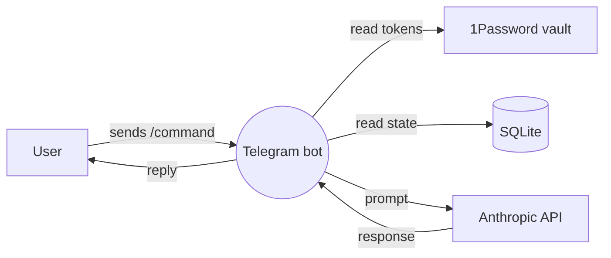

# threat-model-ref.md

Reference material for `/threat-model`. Loaded on demand by the skill.

---

## Stage 2 — Full Mermaid DFD example

---

## Stage 5 — Mitigation-patterns table

| Threat type | Mitigation |
|---|---|
| Spoofing | Multi-factor auth, signed tokens (JWT/HMAC), Telegram bot's `initData` verification |
| Tampering | HTTPS, parameterized SQL queries, input validation, content-hash on stored data |
| Repudiation | Append-only audit log, signed actions, tamper-evident logging |
| Info disclosure | Generic error messages, separate internal vs external errors, mask secrets in logs, principle of least privilege on data fields returned |
| DoS | Rate limiting (per-IP, per-user), input size caps, timeout on long operations, queue backpressure, circuit breakers |
| Elevation | Authorization check at every entry, deny-by-default, role check inside the handler not just middleware |

---

## Stage 6 — Workspace-specific threat patterns

### AI/LLM-specific threats
- **Prompt injection** — user input that overrides system prompt instructions
  - Mitigation: structured input/output, separate user content from instructions, validate model output before acting
- **Cost exhaustion** — adversarial input that triggers expensive long generations
  - Mitigation: max_tokens cap, request rate limit, per-user spend cap
- **Data leakage to model provider** — sensitive data sent in prompts
  - Mitigation: privacy-first design (your existing pattern), local models for sensitive data, redaction before send

### Telegram bot-specific threats
- **chat_id spoofing** — Telegram itself is trusted, but anyone with the bot token can impersonate any chat
  - Mitigation: keep bot token in vault (you're doing this), rotate on suspicion, use admin chat_id allowlist
- **Webhook vs polling** — webhook needs HTTPS endpoint authentication
  - Mitigation: webhook secret token, or polling (no inbound endpoint exposed)
- **File upload abuse** — user sends a 100MB file
  - Mitigation: filter on update type, refuse oversized files at the API layer

### SQLite-specific threats
- **Concurrent write corruption** — multiple writers without WAL mode
  - Mitigation: `PRAGMA journal_mode = WAL;`
- **Backup gap** — single-file database, single point of loss
  - Mitigation: scheduled backup to off-host storage; you mentioned this is a TODO

### VPS-specific threats
- **Docker inspect leaks env vars** — you already have a memory rule
  - Mitigation: documented (don't run `docker inspect` with env format)
- **Container escape** — privileged containers, mounted host paths
  - Mitigation: non-root containers, minimal volume mounts, read-only where possible
