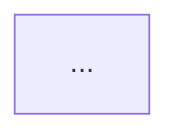

# wrap-up — reference detail

Templates and rules for `/wrap-up` steps 5, 6 and 8. Read the section you need when you reach that step; the skill body carries the instructions, this file carries the shapes.

---

## Step 5 — `docs/architecture.md`

Update or create with: a short paragraph describing what the project does and its stack, a Mermaid diagram of the current module structure, and a key-files table.

The diagram should use `graph TD` or `graph LR` and include key source directories and their role, major data flows (e.g. user → wizard → AI → results), and external dependencies (APIs, storage).

````markdown
# Architecture

<short description paragraph>

## Module Map



## Key Files

| File | Purpose |
|---|---|
| src/lib/ai.js | ... |
````

After updating it, check for a generator script:

- `scripts/gen-architecture.js` exists → run `node scripts/gen-architecture.js`
- `scripts/gen-architecture.ts` exists (no `.js`) → run `npx tsx scripts/gen-architecture.ts`
- Succeeds → note in the summary that `architecture.drawio` was regenerated
- Fails → put the error in the USER_ACTIONS.md deploy steps, including the message
- Neither exists → flag in USER_ACTIONS.md that `scripts/gen-architecture.js` should be created

---

## Step 6 — `project-status.yaml`

Tells the Claude Dashboard which external APIs this project uses. Must stay in sync with the codebase.

**Scan for external API usage:**
- `.env` / `.env.example` — variable names containing KEY, TOKEN, SECRET, PASSWORD, API, URL (for databases)
- `requirements.txt` / `package.json` — API client libraries (anthropic, openai, google-generativeai, boto3, telegram, praw, tavily)
- Python imports of API clients (`import anthropic`, `import openai`, `from telegram`)
- JS/TS imports (`@anthropic-ai/sdk`, `openai`)
- HTTP calls to external services (`requests.get`, `fetch`, `axios`, `httpx`)

**Classify each by tier:**

| Tier | Means | Examples |
|---|---|---|
| `paid` | Costs money per call | Anthropic Claude, OpenAI, AWS S3, Google Places |
| `free-tier` | Free with usage limits | Gemini free tier, Neon free tier, Reddit API |
| `free` | No cost or limits | Telegram Bot API, RSS feeds, web scraping |

```yaml
# project-status.yaml — <project-name>
# Generated by wrap-up skill. Do not edit manually.

last_updated: "<current ISO 8601 timestamp with timezone>"

apis:
  - name: <Human-readable API name>
    key_env: <ENV_VAR_NAME>
    tier: <paid|free|free-tier>
    modules:
      - <source file making the call>
    triggers:
      - <user action or schedule that triggers the call>
```

Rules:
- Existing file already accurate (same APIs, same tiers) → update only `last_updated` and stop
- No external APIs (offline-only project) → write `apis: []`
- No env var needed (public RSS, scraping) → `key_env: ~`
- Sort paid first, then free-tier, then free
- Do NOT include local-only dependencies (SQLite, local files, in-memory caches)
- Verify `.gitignore` includes `project-status.yaml`; append if missing

---

## Step 8 — `LEARNINGS.md`

Append to project root, creating the file if missing. Most recent first.

```markdown
# Learnings

Insights, surprises, and lessons accumulated across sessions. Most recent first.
This file feeds the teaching/sharing portfolio — the raw material for explaining
*why* things are the way they are.

---

## YYYY-MM-DD — <session feature name>

**Surprise/Lesson:** <user's one-sentence answer>

**Context:** <2-line setup — what we were trying to do>

**Why it matters:** <1-2 lines — what changes about how to approach similar work>

---
```
